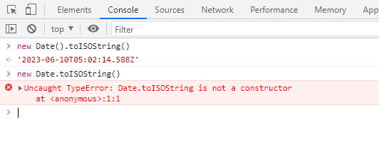
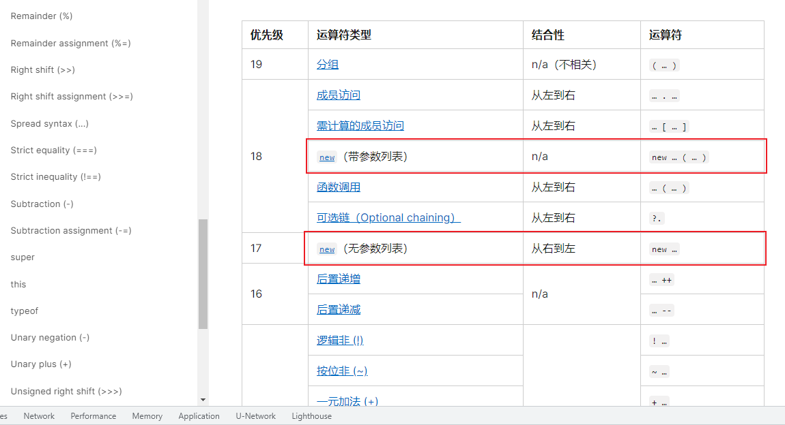

最近在工作中写日期格式化时，遇到一个问题，先来看下面的代码：

```ts
// 写法一
new Date().toISOString;

// 写法二
new Date.toISOString();
```

运行结果如下：



猜测是优先级的问题，然后在 MDN 找到了[答案](https://developer.mozilla.org/zh-CN/docs/Web/JavaScript/Reference/Operators/Operator_precedence#%E6%B1%87%E6%80%BB%E8%A1%A8)，它们确实是两个不同的优先级，如下图：



以上，方式一中的 `.` 优先级最高，但其左边需要先求值，因而先执行`new Date()`得到实例，再返回实例上的`toISOString`属性；而方式二中的 `. `优先级也是最高，但其左边不用求值，因而可以先执行`Date.toISOString`得到`toISOString`值(Date 上不存在该属性，因此该值为 undefined)，再尝试进行`new toISOString`操作时报错发生。

## 优先级

我印象中的运算符只有四十几个，没想到在 MDN 里面找到的有六十几个。说实话，上面的运算符以前真没注意过，趁着空闲我决定将这些运算符整理下，整理后总体分为下面的五大类：

### 一级运算符

大部分是一元操作符。

| 运算符   | 类型                        | 说明                                                                                               |
| :------- | :-------------------------- | -------------------------------------------------------------------------------------------------- |
| ( … )    | 分组                        | 优先级最高的运算符                                                                                 |
| … . …    | 成员访问                    | 静态访问                                                                                           |
| []       | 需计算的成员访问            | 动态访问                                                                                           |
| new xx() | new（带参数列表）           | 实例化                                                                                             |
| ()       | 函数调用                    | 函数调用                                                                                           |
| ?.       | 可选链（Optional chaining） | `a?.b`类似于`a === null \|\| a === void 0 ? void 0 : a.b;`                                         |
| new …    | new（无参数列表）           | 实例化                                                                                             |
| … ++     | 后置递增                    | 先返回再+1，例如 `let a = 1; const b = a++; // b: 1 a: 2`。比较常见的是在 for 循环中进行后置递增。 |
| … --     | 后置递减                    | 同上                                                                                               |
| ! …      | 逻辑非 (!)                  |
| ~ …      | 按位非 (~)                  |
| + …      | 一元加法 (+)                | 可用于把字符串转换为数值，例如`+'1'`将得到`1`。                                                    |
| - …      | 一元减法 (-)                | 同上                                                                                               |
| ++ …     | 前置递增                    | 与后置递增不同，先执行+1 再返回                                                                    |
| -- …     | 前置递减                    | 同上                                                                                               |
| typeof … | typeof                      | 返回值只有这几个：string \| number \| boolean \| undefined \| null \| function \| object           |
| void …   | void                        | 比较常见的是使用`void 0`代替 undefined，因为在以前 undefined 是可以作为变量名使用的。              |
| delete … | delete                      | 删除对象的属性                                                                                     |
| await …  | await                       | 等待某个 promise 执行成功                                                                          |

### 算符运算符

| 运算符           | 类型                      | 说明                                                                                                                              |
| :--------------- | :------------------------ | --------------------------------------------------------------------------------------------------------------------------------- |
| … \*\* …         | 幂 (\*\*)                 |
| … \* …           | 乘法 (\*)                 |
| … / …            | 除法 (/)                  |
| … % …            | 取余 (%)                  |
| … + …            | 加法 (+)                  |
| … - …            | 减法 (-)                  |
| … &lt;&lt; …     | 按位左移 (&lt;&lt;)       | 通常用于二进制数据的移位, 例如：`(4)<<1` 将得到`8`。过程：十进制`4`转换为二进制`100`, 左移一位得到`1000`，再转换为十进制即为`8`。 |
| … &gt;&gt; …     | 按位右移 (&gt;&gt;)       | 同上                                                                                                                              |
| … &gt;&gt;&gt; … | 无符号右移 (&gt;&gt;&gt;) | 同上                                                                                                                              |
| … &lt; …         | 小于 (&lt;)               | 对于数值，比较大小                                                                                                                |
| … &lt;= …        | 小于等于 (&lt;=)          |
| … &gt; …         | 大于 (&gt;)               |
| … &gt;= …        | 大于等于 (&gt;=)          |

### 比较运算符

| 运算符         | 类型                    | 说明                                                                                                                                    |
| :------------- | :---------------------- | --------------------------------------------------------------------------------------------------------------------------------------- |
| … in …         | in                      | 判断某个属性是否存在于对象上，会顺着原型链进行查找，可以用`Object.prototype.hasOwnProperty.call(obj, 'xx')`进行检测自身的属性是否存在。 |
| … instanceof … | instanceof              | 判断右边的对象，是否在左边对象的原型链上。                                                                                              |
| … == …         | 相等 (==)               | 左右两边的值可能会先做隐式转换，再进行比较，例如: `'1' == 1 //true`                                                                     |
| … != …         | 不相等 (!=)             | 同上                                                                                                                                    |
| … === …        | 一致/严格相等 (===)     | 左右两边的值不做隐式转换，直接比较，例如：`'1' === 1 // false`                                                                          |
| … !== …        | 不一致/严格不相等 (!==) | 同上                                                                                                                                    |

### 布尔运算符

| 运算符         | 类型                | 说明                                                                                                                        |
| :------------- | :------------------ | --------------------------------------------------------------------------------------------------------------------------- | --- |
| … &amp; …      | 按位与 (&amp;)      | 常用于对二进制数值进行操作                                                                                                  |
| … ^ …          | 按位异或 (^)        |
| … \| …         | 按位或 (\|)         |
| … &amp;&amp; … | 逻辑与 (&amp;&amp;) |
| … \|\| …       | 逻辑或 (            |                                                                                                                             | )   |
| … ?? …         | 空值合并 (??)       | 当左边的值不为 undefined 或 null 时，返回左边，否则返回右边， 具体代码可能是这样的\n: `a !== null && a !== void 0 ? a : b;` |

### 赋值运算符

| 运算符            | 类型               | 说明                                                                                                                                |
| :---------------- | :----------------- | ----------------------------------------------------------------------------------------------------------------------------------- |
| … ? … : …         | 条件（三元）运算符 | 可以在简单场景中代替 if/else 使用，不过自从出了??运算符，这个运算符用的比较少                                                       |
| … = …             | 赋值               |
| … += …            |
| … -= …            |
| … \*\*= …         |
| … \*= …           |
| … /= …            |
| … %= …            |
| … &lt;&lt;= …     |
| … &gt;&gt;= …     |
| … &gt;&gt;&gt;= … |
| … &amp;= …        |
| … ^= …            |
| …                 | = …                |
| … &amp;&amp;= …   |
| …                 |                    | = …                                                                                                                                 |
| … ??= …           |
| … , …             | 逗号 / 序列        | 优先级最低的运算符，由于其会返回最后一个值，在某些简短操作中也会用到，例如：`const map = items.reduce((m, i) => (m[i.id]=i,m), {})` |

## 结语

优先级的重要性不言而喻，往后还是要多多温习。
