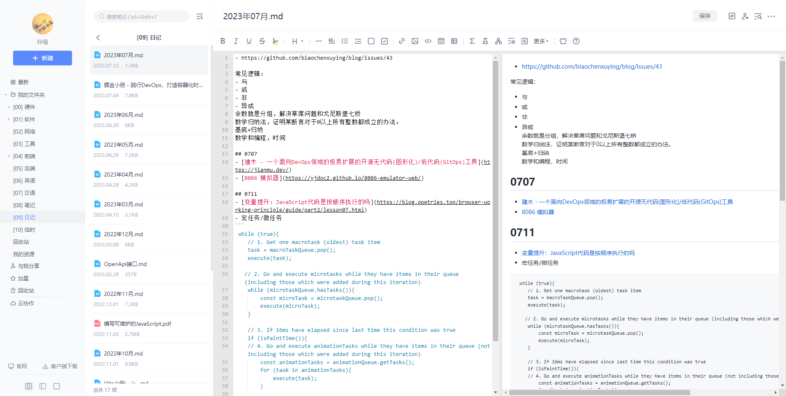
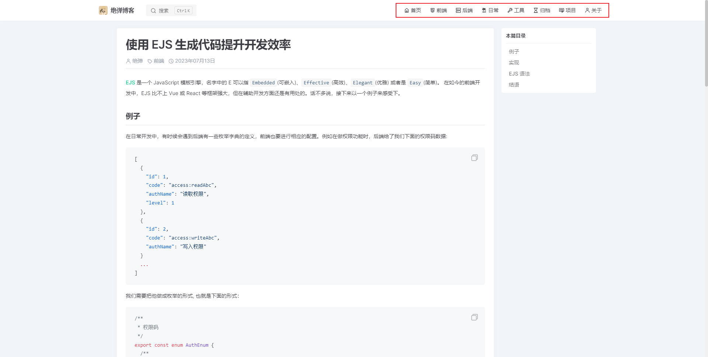
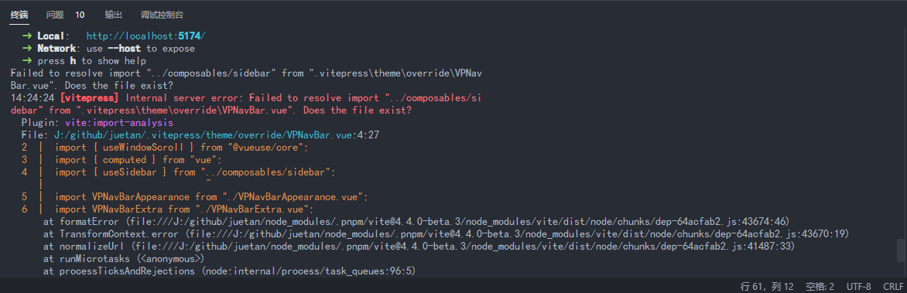
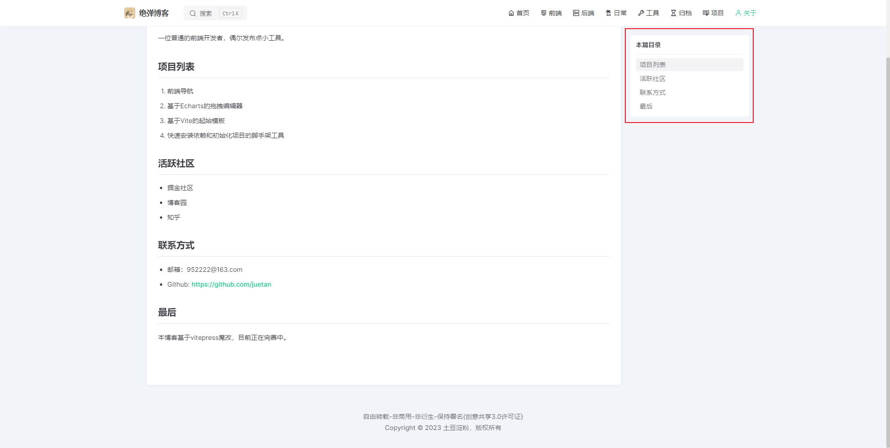
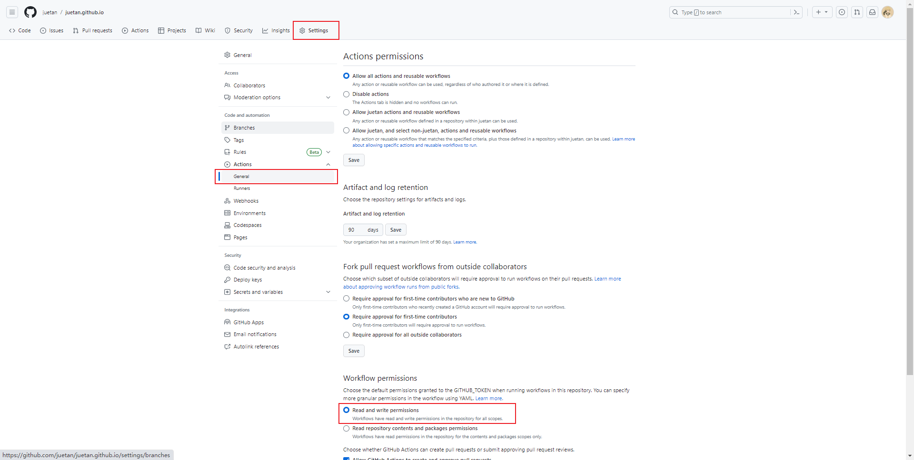
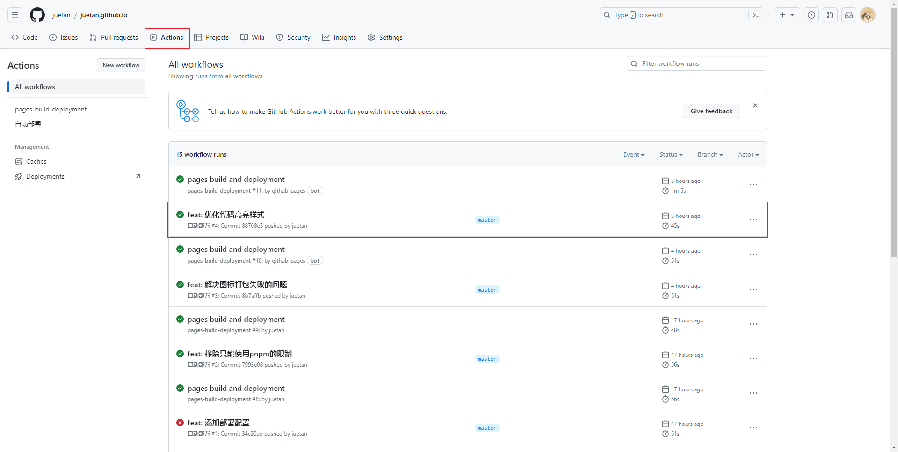
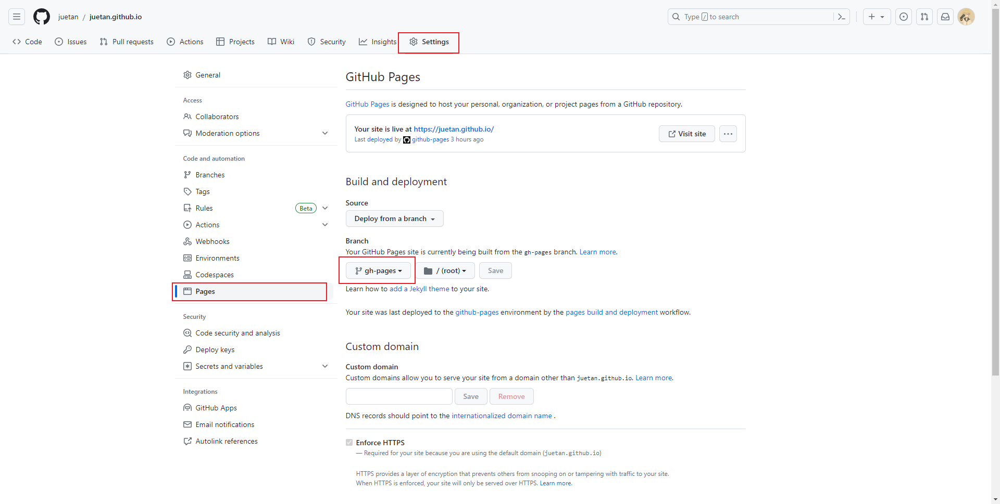
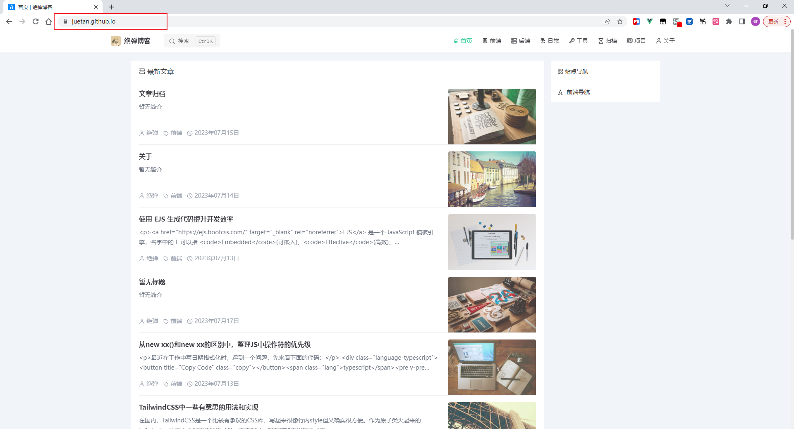

作为一名程序员，写日记是常有的事，日常我都是写在有道云笔记里面，可以看下我在有道上的记录：



但最近搞了不少小工具，遇到不少问题并想记录下来，各种方案搜下来最终决定使用 Vitepress 以静态博客形式写日记。

## 选择 Vitepress

在这之前，我是有一台 1 核 2G 的小水管服务器的，基于 Typecho 搭建了个博客，还购买了 Handsome 主题，但平常真的懒得上去加上经常遭到各种暴力入侵等原因，后来就慢慢闲置下来了。

为什么使用 Vitepress 呢，有以下几个原因：

- 整体是 vite + vue 技术栈，写起来比较熟悉且没有 hexo 那么陌生
- 可以很方便地插入各种示例和 vue 组件，本质上是个 vue 项目
- 可以集成到 Github Action 里，只要提交就自动部署了

但有好处也有问题，Vitepress 整体上是偏向文档风格的，改造成博客风格需要花费一番功夫。在改造过程中，遇到不少问题，但结果是比较满意的，以下是我的一些记录。

## 初始化项目

这一步比较简单，可以跟着官方教程来，有些不一样的列在了下面。

1. 初始化，参数根据自己喜好选择就行

```bash
npx vitepress init
```

2. 执行后会生成下面的目录结构

```
- docs
---.vitepress
--- index.md
```

3. 上面的目录形式，适合项目型文档，因此我改成了下面的目录结构。

```
- docs
---.vitepress
--- index.md
```

4. 目录结构改完之后，还要配置下 `.vitepress/config.ts` (如下)，其中 src 作为放置 .md 文件的目录，dist 作为打包后的目录，跟 vue 项目差不多的风格。

```ts
export default defineConfig({
  srcDir: 'src',
  outDir: 'dist',
});
```

## 添加图标和原子类样式

由于是个人博客且使用 markdown，使用原子类是比较方便的，这里使用 unocss 插件，而 unocss 本身支持图标的生成和按需打包。

1. 安装依赖，图标我使用的是 [Iconpark](https://iconpark.oceanengine.com/official)，可以 [点击这里](https://icon-sets.iconify.design/) 查看支持的图标集。

```bash
pnpm install unocss @iconify-json/icon-park-outline -D
```

2. 配置 `.vitepress/config.ts` 中的 vite 配置项

```ts
import Unocss from 'unocss/vite';
import { presetUno, presetIcons } from 'unocss';

export default defineConfig({
  vite: {
    plugins: [
      Unocss({
        content: {
          pipeline: {
            include: [/\.(vue|svelte|[jt]sx|mdx?|astro|elm|php|phtml|html|ts)($|\?)/],
          },
          filesystem: ['.vitepress/config.ts'],
        },
        presets: [presetUno(), presetIcons()],
      }),
    ],
  },
});
```

需要注意的是，unocss 默认不支持 .ts 文件的扫描，因此要手动加上。且 `.vitepress/config.ts` 不在 vue 的构建流中，需要作为文件进行扫描。

3. 添加完后，就可以按这样使用了，只会打包使用的 css 类和图标类，非常银杏化。

```html
<template>
  <!-- css类 -->
  <button class="text-blue-500">
    <!-- 图标类 -->
    <i class="i-icon-park-outline-home" />
    首页
  </button>
</template>
```

4. 最后贴一个图标的效果图



## 添加图片预览组件

默认生成的页面中，图片是不能放大的，这不太符合我的需求。研究了一下文档，绕了一些弯路，最终找到了一个理想的方案。

1. 预览组件使用的是 Arco Design 的 [图片组件](https://arco.design/vue/component/image)，这是考虑后面其他地方也会用到这个组件库。

```bash
pnpm install @arco-design/web-vue -D
```

2. 在 `.vitepress/theme/index.ts` 中，注册为全局组件。

```ts
import { Image } from '@arco-design/web-vue';

export default {
  enhanceApp({ app, router, siteData }: EnhanceAppContext) {
    app.component('Image', Image);
  },
};
```

3. 在 `.vitepress/config.ts` 中，改造一下 markdown-it 的渲染规则。

```ts
export default defineConfig({
  markdown: {
    config(md) {
      md.renderer.rules.image = (tokens, idx, options, env, self) => {
        const token = tokens[idx];
        const aIndex = token.attrIndex('src');
        const src = token.attrs![aIndex][1];
        return `<Image src="${src}" class="cursor-pointer hover:shadow shadow-blue-100"  />`;
      };
    },
  },
});
```

4. 上面做完后，本地就可以跑起来了，但打包是有问题的。问题在于 vue 默认支持 img，video 等原生标签 src 静态引用的打包，而 Image 组件的 src 没有被打包。这个可以配置下 @vitejs/plugin-vue 插件，还是 `.vitepress/config.ts` 文件。

```ts
export default defineConfig({
  vue: {
    template: {
      transformAssetUrls: {
        Image: ['src'],
      },
    },
  },
});
```

5. 最终效果如下：


## 替换默认主题的部分组件

我并没有从零开始写一个主题，而是基于默认主题修改，主要是大部分功能已经满足需求。而使用默认主题，难免有部分组件想要修改，这该怎么办呢？

官方提供有一个[解决方案](https://vitepress.dev/guide/extending-default-theme#overriding-internal-components), 通过设置别名进行替换。但试过之后，我发现包含有相对路径的引用就会报错，如下：



问题在于打包的时候，两个文件不在一个目录下，相对引用就会报错。这个也不是不能解决，可以自己写个 vite 插件，在加载的时候加载当前目录下的文件，这样路径就能保持了。

1. 在 `.vitepress/config.ts` 中写个简易插件。注意：带 ? 的是虚拟组件，需要过滤掉。

```ts
export default defineConfig({
  vite: {
    plugins: [
      {
        name: 'vite:pres',
        load(id) {
          const list = ['VPNavBarMenuLink.vue', 'VPDocOutlineItem.vue'];
          const path = (i: string) => fileURLToPath(new URL(`./theme/override/${i}`, import.meta.url));
          const item = list.find((i) => id.includes(i) && !id.includes('?'));
          if (item) {
            return readFileSync(path(item), 'utf-8');
          }
        },
      },
    ],
  },
});
```

2. 下面贴一个示例，原来的页内导航是没有任何选中标记，我改造了一下加入了选中类。



## 自定义样式和一些风格偏好

样式替换还是比较方便的，跟着官方提供的示例进行改造即可，这里说几个风格偏好的点。

- 自定义滚动条

```css
::-webkit-scrollbar {
  width: 8px;
  height: 6px;
}

::-webkit-scrollbar-track {
  background: #f1f1f1;
}

::-webkit-scrollbar-thumb {
  background: #99999980;
  border-radius: 4px;
}

::-webkit-scrollbar-thumb:hover {
  background: #55555580;
}
```

- 自定义选中样式

```css
::selection {
  background-color: var(--vp-c-brand);
  color: #fff;
}
```

- 自定义光标样式，可以在 [致美化](https://zhutix.com/tag/cursors/) 上面挑一套自己喜欢的光标主题。

```css
* {
  cursor: url(/cursor/Default.cur), auto;
}

img {
  cursor: url(/cursor/zoomin.cur), zoom-in;
}

a,
a > * {
  cursor: url(/cursor/normal.cur), pointer;
}
```

- 自定义动画，可以在 [Animista](https://animista.net/play/basic/scale-up) 上面调试好直接复制下来。

```css
.fade-in-fwd {
  -webkit-animation: fade-in-fwd 0.6s cubic-bezier(0.39, 0.575, 0.565, 1) both;
  animation: fade-in-fwd 0.6s cubic-bezier(0.39, 0.575, 0.565, 1) both;
}

@keyframes slide-in-bottom {
  0% {
    transform: translateY(1000px);
    opacity: 0;
  }
  100% {
    transform: translateY(0);
    opacity: 1;
  }
}
```

## 自动构建和部署在 GitHub 上面

写静态博客的好处之一，就是可以白嫖部署服务(这里指的是 GitHub Action)，省去部署的时间。在 Github 中，如果你的仓库名是 \<username>.github.io 格式，那么 master 分支下的内容会主动部署为静态网站，并可以通过 `https://<username>.github.io` 访问。

但日常操作中，我们的源码都在 master 分支，直接部署源码显然不对。此时，可以将打包后的内容放在别的分支，例如 gh-pages 分支。当然，这样做需要做额外的配置，但只需配置一次就行。

1. 新建 `.github/workflows/deploy.yml` 文件，写一个部署配置，这里用的是我以前使用的配置改过来的。

```yaml
# 工作流名称，可自定义
name: 自动部署

# 事件监听，决定什么时候触发该工作流内的任务
on:
  # 在master分支推动到github时触发
  push:
    branches: [master]

# 任务集合，可包含多个任务
jobs:
  # 任务名称
  build:
    # 运行的操作系统
    runs-on: ubuntu-latest

    # 步骤集合，可包含多个步骤
    steps:
      # 单个步骤，没有名称，直接使用一个action
      - uses: actions/checkout@v2

      # 单个步骤，带有名称，带有参数
      - name: build and deploy
        run: |
          npm install
          npm run build
          cd dist
          git config --global user.name "juetan"
          git config --global user.email "810335188@qq.com"
          git init
          git add -A
          git commit -m "自动构建和部署(Github Action)"
          git push -f "https://${{ github.actor }}:${{ secrets.GITHUB_TOKEN }}@github.com/${{ github.repository }}.git" master:gh-pages
```

大致内容是，当有提交推送到 master 分支时，在一个 Ubuntu 系统进行安装依赖和打包，再把 dist 目录下的内容，推送到 gh-pages 分支。

2. 上面的推送有可能失败，因为 `secrets.GITHUB_TOKEN` 是需要权限才能使用的，可以更改为如下的配置：



3. 写完配置就可以这个推送了，可以在这里看到运行状态。



4. 构建后应该能看到多出来一个 gh-pages 分支，此时还需要配置该分支作为部署分支即可。



5. 通常需要等待一会才生效，下面贴一张部署完的页面效果图。



## 组件演示功能

## 自定义域名

如果你想使用自己的域名，也是可以的。

## 评论系统

免费的评论系统有很多，例如:
- [Gitalk](https://github.com/gitalk/gitalk)：使用 Github Issues 作为存储
- [Giscus](https://giscus.app/zh-CN)：使用 Github Discussion 作为存储
- [Valine]()：使用密钥直连数据库
- [Waline](https://waline.js.org/)：Valine 的优化版，通过新建管理后台连接数据库。

## 最后

以上，想到什么写什么，可能存在遗漏或描述不全，后面根据情况在详细补充。
