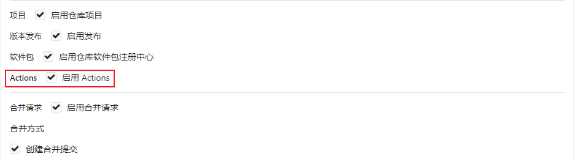
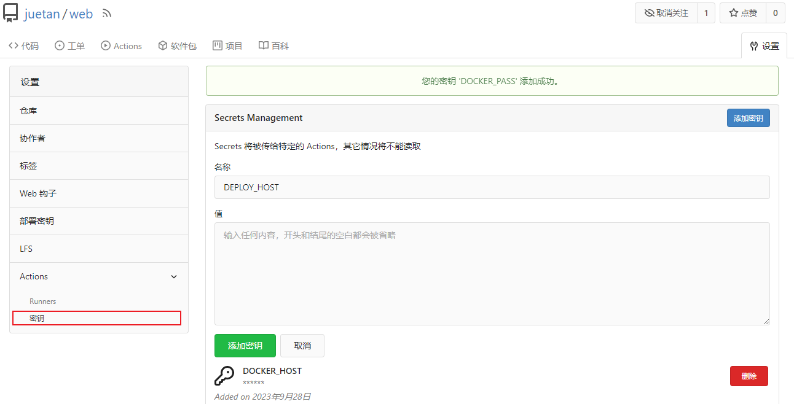

[前文](/tools/devops/) 说完如何搭建适用于个人的CICD系统，本文主要说说如何配置前后分离WEB应用的自动部署。接下来，将以 VueJS 作为前端框架，NestJS 作为后端框架，进行前后端的自动部署。

## 准备工作

在正式实践前，有不少准备工作要做。例如，配置一个部署服务器的账号，方便远程过去执行更新脚本；账号密码等敏感信息不能直接写到配置文件中，而是用密钥配置。接下来，我们先完成这些准备工作。

### 创建部署用户

我们需要在部署服务器上，创建一个用于远程更新的用户，登陆到服务器执行以下命令创建一个这样的用户。

```bash
# 创建用户
useradd <username> -m -s /bin/bash

# 创建密码
passwd <username>

# 加入docker用户组
usermod -a -G docker <username>

# 切换到该用户
su <username>

# 测试是否有docker的执行权限
docker service ls

# 修改ssh的配置
vim /etc/ssh/sshd_config

# 允许使用密码登录
PasswordAuthentication yes

# 重启ssh服务
service ssh restart
```

### 创建仓库

在 Gitea 上分别创建 web 和 server 两个仓库，由于 Gitea Actions 还是实验特性，我们需要在仓库设置面板勾选 actions 以启用该功能(如下)。



### 创建密钥

我们刚才创建的用户信息，不可以直接写在配置文件里，而是通过 Gitea Actions 的密钥机制进行使用，在仓库的设置面板里创建密钥如下：



### 迁移镜像

国内服务器访问 Github 还是比较慢的，用到的仓库可以做镜像迁移来加速访问，参考如下：

| 地址 |
| ---  |
| https://ghproxy.com/https://github.com/actions/setup-node
| https://ghproxy.com/https://github.com/actions/checkout
| https://ghproxy.com/https://github.com/appleboy/ssh-action

## 前端项目

以上作为准备工作，接下来需要创建前端项目，并额外添加 2 个配置文件。

### 新建项目

以 Vite 提供的模板创建一个 Vue3.x 的项目，步骤按提示来就行，我这里选的是 TS + Vue3 的组合。你也可以选择其他的模板，作为示例没那么多讲究。

```bash
npx create vite@latest
```

### 请求后端

修改 /src/App.vue 文件，写个请求调用下后端的接口，代码如下：

```html
<template>
  <div>
    {{ message }}
  </div>
</template>
<script>
import { onMounted, ref } from 'vue'

const message = ref("hello, world!");

onMounted(async () => {
  try {
    const res = await fetch("/api/message");
    message.value = res.string()
  } catch {
    message.value = "请求失败，后端接口无法访问"
  }
})
</script>
```

### 部署配置

新建 /.gitea/workflows/deploy.yaml 文件，看起来是不是跟 Github Actions 的配置差不多，实际上两个确实差不多，一个不开源另一个是开源实现。在文件中，添加配置如下：

```yaml
name: 自动部署

on:
  push:
    branches:
      - master

env:
  # docker 镜像仓库地址，例如： git.dev.juetan.cn
  docker_host: ${{ secrets.DOCKER_HOST }}
  # docker 镜像仓库用户名
  docker_user: ${{ secrets.DOCKER_USER }}
  # docker 镜像仓库密码
  docker_pass: ${{ secrets.DOCKER_PASS }}
  # docker 镜像仓库名称，例如： git.dev.juetan.cn/xxx/xxx
  docker_name: ${{ secrets.DOCKER_HOST }}/${{ gitea.repository }}

  # 部署服务器IP或域名, 例如: 1.1.1.1
  deploy_host: ${{ secrets.DEPLOY_HOST }}
  # 部署服务器端口, 例如: 22
  deploy_port: ${{ secrets.DEPLOY_PORT }}
  # 部署服务器用户名, 例如: root
  deploy_user: ${{ secrets.DEPLOY_USER }}
  # 部署服务器密码, 例如: 123456
  deploy_pass: ${{ secrets.DEPLOY_PASS }}
  # 要更新的 docker 服务名称, 例如: demo_web
  deploy_name: ${{ secrets.DEPLOY_NAME }}

jobs:
  build:
    runs-on: ubuntu-latest
    container:
      image: catthehacker/ubuntu:act-latest
    steps:
      - name: 检出代码
        id: checkout
        uses: https://gitea.com/actions/checkout@v3

      - name: 设置环境
        uses: https://gitea.com/actions/setup-node@v2

      - name: 安装依赖
        run: |
          npm install --registry https://registry.npmmirror.com/

      - name: 构建产物
        run: npm run build

      - name: 打印目录
        run: ls ./dist

      - name: 构建镜像
        run: |
          docker build -t ${{ env.docker_name }}:latest .

      - name: 登陆镜像
        run: |
          docker login -u "${{ env.docker_user }}" -p "${{ env.docker_pass }}" ${{ env.docker_host }}

      - name: 推送镜像
        shell: bash
        run: |
          docker push ${{ env.docker_name }}:latest

      - name: 标记镜像
        if: gitea.ref_type == 'tag'
        run: |
          echo "当前推送版本：${{ gitea.ref_name }}"
          docker tag ${{ env.docker_name }}:latest ${{ env.docker_name }}:${{ gitea.ref_name }}
          docker push ${{ env.docker_name }}:${{ gitea.ref_name }}

      - name: 更新服务
        uses: http://git.dev.juetan.cn/mirror/ssh-action@v1.0.0
        with:
          host: ${{ env.deploy_host }}
          port: ${{ env.deploy_port }}
          username: ${{ env.deploy_user }}
          password: ${{ env.deploy_pass }}
          script: |
            docker service ls | grep -q ${{ env.deploy_name }} || exit 0
            docker service update --image ${{ env.docker_name }}:latest ${{ env.deploy_name }}

```

相关语法可以查阅 Github Actions 的官方文件，这里简单解释下以上步骤：

- 只在推送到 master 分支时进行构建
- 构建时使用 ubuntu 起一个容器进行构建
- 构建完推送到 gitea 的成品库中
- 远程到部署环境执行更新脚本

### 构建配置

上面有一个 docker build 的步骤，需要用到 Dockerfile 配置进行构建。在项目根目录下新建 Dockerfile 文件，添加内容如下。

```dockerfile
FROM nginx:alpine
COPY ./dist /usr/share/nginx/html

EXPOSE 80
CMD ["nginx", "-g", "daemon off;"]
```

### 推送代码

本地添加远程仓库地址，推送后应该可以在仓库面板看到部署信息

### 启动容器


## 后端配置

### 创建项目

### 添加接口

### 部署配置

### 构建配置

## 结语