[Nginx](https://nginx.org/en/index.html) 是一款高性能的HTTP服务器和反向代理服务器。它的特点是轻量级、高并发、稳定性好，能够处理高负载的情况。后端服务虽然可以单独监听服务，但能力有限不如 Nginx 专业和高效，因此通常作为后端服务的前置中间件搭配使用。本文，记录下使用笔记。

## 快速上手

使用 Yum/Apt 等包管理器可以下载预编译的 Nginx，但通常还是推荐下载源码自行编译安装，其中一个好处是可以搭配自定义需求进行编译安装。

1. 从 [官网](https://nginx.org/en/download.html) 选择合适的版本，使用 Wget 或其他工具下载源码，例如：

```bash
wget https://nginx.org/download/nginx-1.22.1.tar.gz
```

2. 解压缩

```bash
tar zxvf nginx-1.22.1.tar.gz
```

3. 进入解压后的目录，配置所需的模块和参数，以下指定了前缀(即安装位置，在解析配置路径等时也会用到)，还可以添加 SSL 模块(提供 HTTPS 服务)等模块。

```bash
./configure --prefix=/usr/local/nginx
```

4. 进行编译和安装，会安装到前面 --prefix 参数指定的位置。

```bash
make && make install
```

5. 启动 Nginx，可执行文件位于 --prefix 地址的 sbin 目录下

```bash
# /usr/local/nginx/sbin
./nginx
```

6. 浏览器访问 IP 地址，能看到以下页面即表示安装成功。

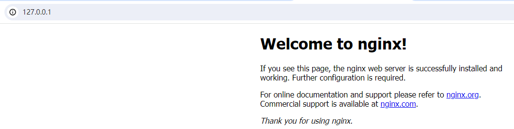

## 目录结构

在 Nginx 安装目录下包含很多子目录和文件，作为新手我们需要关注以下几个重点文件：

```tree
# /usr/local/nginx

├── client_body_temp
├── conf                             # 配置目录
│   ├── fastcgi.conf
│   ├── fastcgi.conf.default
│   ├── fastcgi_params
│   ├── fastcgi_params.default
│   ├── koi-utf
│   ├── koi-win
│   ├── mime.types
│   ├── mime.types.default
│   ├── nginx.conf                   # 配置文件
│   ├── nginx.conf.default
│   ├── scgi_params
│   ├── scgi_params.default
│   ├── uwsgi_params
│   ├── uwsgi_params.default
│   └── win-utf
├── fastcgi_temp
├── html                             # 站点目录
│   ├── 50x.html
│   └── index.html
├── logs
│   ├── access.log
│   ├── error.log
│   └── nginx.pid
├── proxy_temp
├── sbin
│   └── nginx                        # 可执行文件
├── scgi_temp
└── uwsgi_temp
```

### 可执行文件

即 sbin/nginx 文件，服务入口，这是我们启动 nginx 的可执行文件，下面是一些用法：

- 启动服务，不带任何参数

```bash
./nginx
```

- 关闭服务

```bash
./nginx -s stop
```

- 重启服务，适用于修改完配置的情况

```bash
./nginx -s reload
```

- 检查配置，检查 conf/nginx.conf 是否有误

```bash
./nginx -t
```

- 查看版本

```bash
./nginx -v
```

### 配置文件

即 conf/nginx.conf 文件，这里是需要关注的核心，里面的内容由指令组成，主要包含以下几个部分：

```nginx
# 全局配置，例如运行用户、日志位置等
user nginx;
worker_processes 1
error_log /var/log/nginx/error.log warn;

# 事件配置
events {
  worker_connections 1024;
}

# HTTP服务(重点)
http {
  include       /etc/nginx/mime.types;

  # 服务器配置
  server {
    # 监听端口
    listen       80;
    # 通常是域名，区分不同服务
    server_name juetan.cn;
    # URL匹配
    location / {
      # 网站所在的目录
      root   /usr/share/nginx/html;
      # 首页文件
      index index.html index.htm;
    }
  }

  # 可以有多个服务器配置
  server {
    # ...
  }
}
```

### 网站目录

即 html 目录，站点目录(使用其他目录也可以)，通常放的是静态文件，后端接口等动态内容通常不在这里。

当使用静态文件，也就是基于文件系统的站点访问时，通常使用 root 指定位置，如下：

```nginx
server {
  # 监听端口
  listen       80;
  # 通常是域名，区分不同服务
  server_name juetan.cn;
  # URL匹配
  location / {
    # 网站所在的目录
    root   /usr/share/nginx/html;
    # 首页文件
    index index.html index.htm;
  }
}
```

当使用后端服务时，通常使用 proxy_pass 进行代理转发，

## 配置参数

使用 Nginx 的核心就是使用配置文件，一个个讲参数有点乏味，我更喜欢通过案例来了解参数使用，接下来将通过几个典型案例了解其配置。

### 准备工作

以下实践均在 Windows 系统下进行，为了区分不同域名访问，先修改下 hosts 文件，添加 2 个自定义域名：a.com 和 b.com。这 2 个域名尚未启用，不用担心有啥问题。如下：

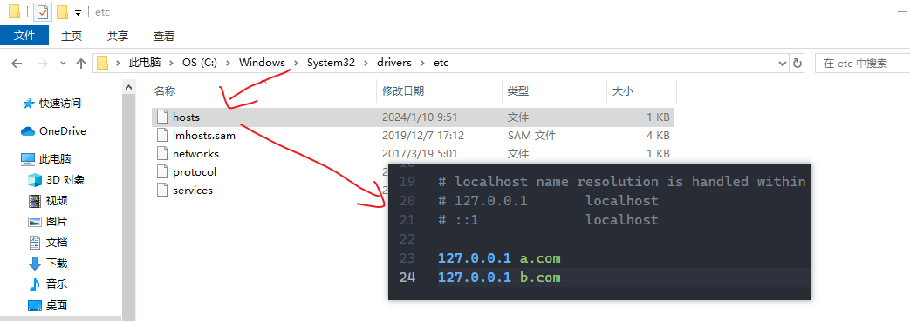

### 域名匹配

一个服务器是可以绑定多个域名的，例如 a.com 和 b.com 都指向 10.10.10.10 时。但在浏览器访问时，域名都会解析成 IP 再发送，也就是 a.com 和 b.com 都往 10.10.10.10:80 发请求，那么 Nginx 如何区分这些服务呢？

这依赖于一个 HTTP 请求头：Host，该字段由浏览器自动携带，表明当前域名或IP，如下：

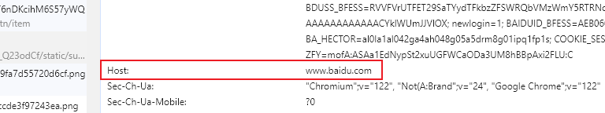

在 Nginx 配置中，可以配置 2 个监听同一端口的服务，Nginx 会根据 server_name 对应的域名或IP进行匹配，如下：

```nginx
server {
  listen 80;
  server_name a.com;
  root html/a;
  index index.html;
}

server {
  listen 80;
  server_name b.com;
  root html/b;
  index index.html;
}
```

在 html 目录下，创建如下文件：

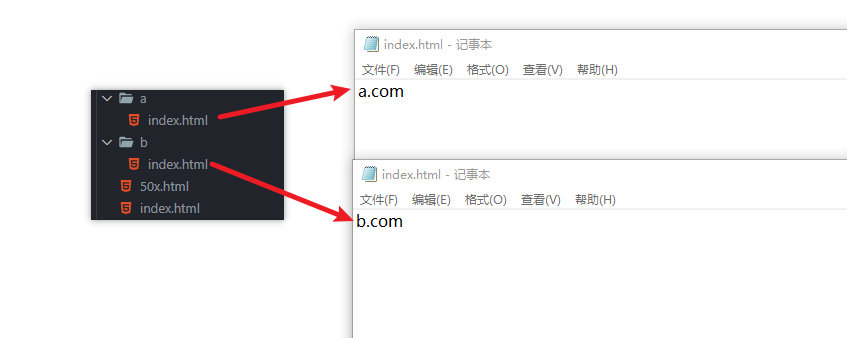

重启 Nginx 后，分别访问 a.com 和 b.com ，效果如下：


以上是在浏览器访问的情况，我们在 Postman 等工具下测试下 Nginx 是不是根据 Host 请求头来区分，以下是正常访问：

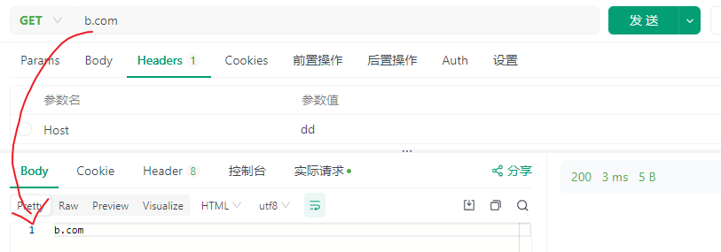

修改 Host 为任意值再访问，如下：

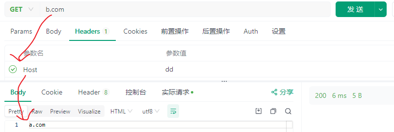

可以看到修改后不再返回 b.com 字样而是 a.com 字样，证明 Host 对 Nginx 的服务匹配是有影响的。

### 文件匹配

静态访问，指一个 URL 对应具体的静态文件(如.html文件)，而不是像 API 接口这种返回动态内容。我们来看下，一个 URL 是如何对应到具体文件上的，如下：

```
# Nginx配置
location / {
  root html/b
}

# URL匹配
https://b.com/code.html => html/b/code.html
```

以上，我们指定了 root 属性，那么可以在查找时 URL 中的 https://b.com 会被替换为 html，再把 URL 中的 code.html 拼接上，最终也就是 nginx-path/html/b/code.html 这个路径。访问效果如下：

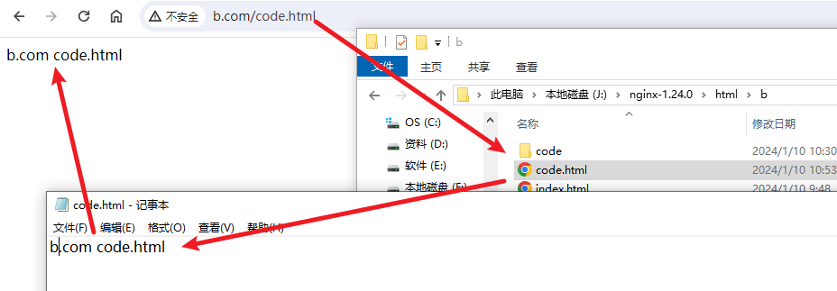

### 目录匹配

当 URL 不以斜杠结尾时表示读取的是文件，而以斜杠结尾时表示读取的是目录。当读取目录时，默认会返回该目录下的 index.html 文件，此设置可以通过 index 指令进行修改：

```nginx
location / {
  index index.html index.htm;
}
```

访问效果如下：

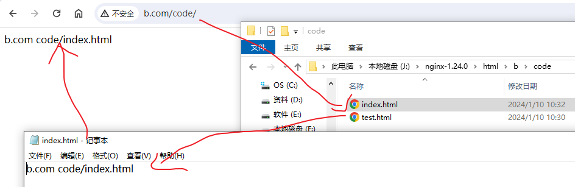

此外，当 URL 不以斜杠结尾时，没有这个文件却有这个目录时，会自动 301 重定向到带斜杠结尾的 URL，如下：

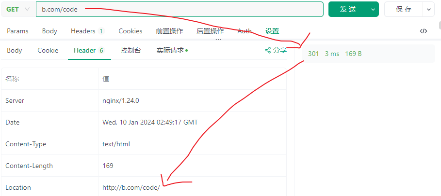

### 单页应用

当部署基于 webhistory 路由的单页应用时，通常会希望除静态文件外的 URL 都指向 index.html 文件。这可以通过 Nginx 的 try_files 指令进行，如下：

```nginx
location / {
  try_files $uri $uri/ /index.html;
}
```

以上，访问时会先尝试匹配文件，然后是目录，最后是 index.html 文件。例如，存在的情况下：

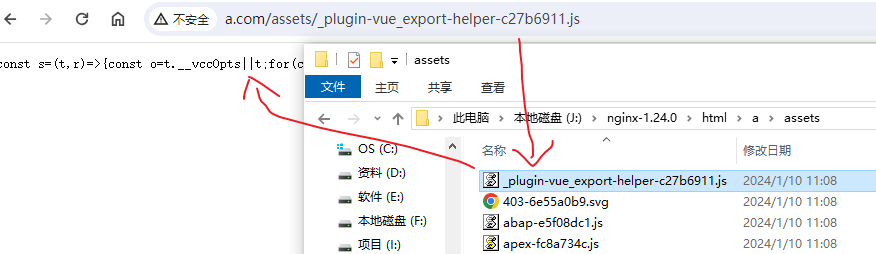

不存在的情况下(如下)，访问 /xxx (不存在)，返回 /index.html 的内容：

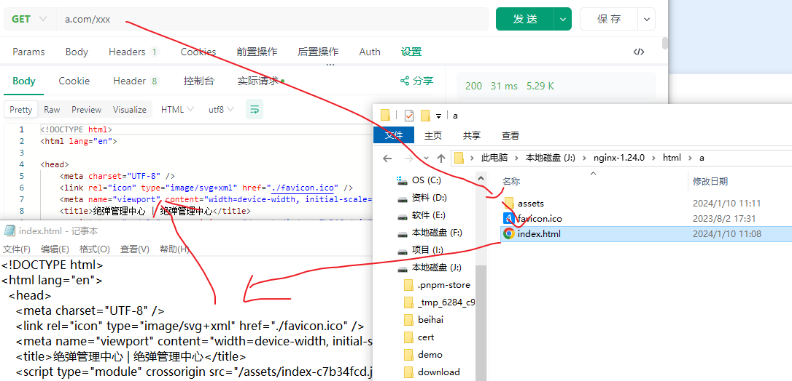

### 反向代理

所谓代理，简单来说就是这事我不亲自干，我找别人代表我干，那这个人就是代理。所谓正向/反向，其实是站在用户的角度来看的，正向就是代表用户发起请求，反向就是代表服务器返回响应。

在 Nginx 中反向代理主要通过 proxy_pass 这个指令进行配置。例如，把 所有请求都转向 http://127.0.0.1:3000 这个地址：

```nginx
location / {
  proxy_pass http://127.0.0.1:3000
}
```

注意：location 是否以斜杠结尾和 proxy_pass 是否以斜杠结尾会影响最终的转发地址。来看下以下几种转发例子：

- 拼接完整路径到代理路径后面。这种比较常见，如下：

```nginx
# 情况1：拼接在域名后面
location /api {
  proxy_pass http://127.0.0.1:3000
}

# 情况2：拼接在路径后面
location /api {
  proxy_pass http://127.0.0.1:3000/systema
}
```

那么，实际效果会如下：

```
# 情况1
http://a.com/api/v1/users => http://127.0.0.1:3000/api/v1/users

# 情况2
http://a.com/api/v1/users => http://127.0.0.1:3000/systema/api/v1/users
```

- 拼接剩余路径到代理路径后面

```nginx
location /api/ {
  proxy_pass http://127.0.0.1:3000/apiv1/
}
```

效果：

```
http://a.com/api/users => http://127.0.0.1:3000/apiv1/users
```

## 结语

TODO