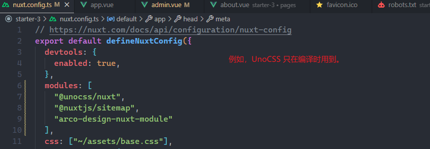

[NuxtJS](https://nuxt.com/) 是基于 VueJS 的全栈式框架，不仅支持 CSR/SSR/SSG/SWR/ISR 等渲染模式，还支持文件路由/自动导入/布局管理等额外功能。

> 注意：[NextJS](https://nextjs.org/) 是基于 ReactJS 的全栈式框架，[NestJS](https://nestjs.com/) 是基于 NodeJS 的后端框架，切勿混淆。

粗略翻过一遍官方文档，总结一些我比较关注的点。

## 快速上手

### 创建项目

Nuxi 是 Nuxt 提供的命令行工具，用来初始化项目，按如下操作快速上手：

```bash
# 创建目录并拉取模板文件
npx nuxi@latest init nuxt-demo

# 进入目录
cd nuxt-demo

# 安装依赖
pnpm install

# 启动开发并自动打开浏览器
pnpm dev --open
```

### 项目结构

Nuxt 采用约定式的目录结构，特定目录会自动加载，先来看一眼官方推荐的目录结构：

```bash
.
├── .nuxt
├── .output
├── assets
├── components
├── composables
├── content
├── layouts
├── middleware       # Nuxt中间件
├── modules          # Nuxt模块
├── node_modules
├── pages
├── plugins          # Nuxt插件
├── public
├── server           # 接口服务
├── utils
├── .env
├── .gitignore
├── .nuxtignore
├── app.config.ts
├── app.vue
├── error.vue
├── nuxt.config.ts
├── package.json
└── tsconfig.json
```

当基于 Vite 打包时，Vite 的配置可以在 nuxt.config.ts 进行添加。此外，index.html 在 Nuxt 中不存在，但提供了很多方法添加/修改其中的标签；src 目录存在，采用扁平化的结构。

## 渲染模式

渲染，主要指的是 HTML 的渲染，这关系到 SEO 收录和首屏加载等内容。随着前端框架的繁荣，如今已出现很多花里胡哨的渲染模式，这里简单了解下：

### CSR

即 Client Side Render(客户端渲染)，HTML 在客户端动态生成，典型的就是 VueJS 单页面应用。如下：


### SSG

即 Server Side Generate(服务端生成)，HTML 在服务端已生成好，加载 JS 后会自动注水(Hydrate)，完成静态到动态的转换，典型的就是 Vitepres 静态应用。SSG 算是 SSR 的一种，即 HTML 不是在客户端生成的。


### SSR

即 Server Side Render(服务端渲染)，HTML 在服务端动态生成，页面加载 JS 后自动注水，典型的就是官网首页等需要 SEO 的地方。


### SWR

即 Stable-Whilte-Revalidate(返回过时内容同时重新生成)。实际上，这是一种缓存策略：设置一个缓存时间，用户首次访问时返回新内容，用户在缓存期访问时返回缓存，用户在缓存期后访问时返回缓存并在后台更新缓存，再下次访问时就可以获取到最新内容。

### ISR

类似于 SWR，但可以配合 CDN 和边缘计算实现不错的缓存效果。目前只有少数云服务商支持，例如 vercel。此外，本地开发时是看不到效果的，需部署到 vercel 等平台才能看到效果。

在 NuxtJS 中，SSR 是默认的渲染模式，可以在 nuxt.config.ts 中通过 ssr: false 配置为 CSR 模式。此外，还可以指定部分页面使用 CSR 模式，部分页面使用 SSR 模式。

## 运行环境

从源码到浏览器代码，Nuxt 会在不同地方运行，在不同地方能使用的资源和可访问的环境也不同。已 SSR 为例，大体分类以下几种：

### 构建端

执行源码转服务端代码的过程，可使用 Nuxt 模块参与过程。



### 服务端

执行服务端代码，并生成客户端代码的过程，可使用 Nuxt 插件或 Nuxt 中间件参与过程。


### 客户端

执行客户端代码，可使用 Nuxt 插件参与过程。

## 开发区别

在同样使用 vite 作为构建工具的情况下，Nuxt 要比 Vue 复杂得多，毕竟同时涉及服务端和客户端。正式开始前，了解开发模式上的一些区别：

### 打包配置

Vue:

- vite.config.ts

Nuxt:

- nuxt.config.ts： 取代 vite.config.ts，但还可以在里面配置 vite。
- app.config.ts：应用配置，通常在编译时使用

### 首页模板

Vue：

- index.html

Nuxt

- 无，可使用 Nuxt 模块和其他方法修改

### 入口文件

Vue：

- src/main.ts

Nuxt：

- 无，如果要修改 vue 实例，需要使用 Nuxt 插件

### 根组件

Vue：

- src/App.vue

Nuxt:

- app.vue 这点到是没多大区别

### 构建命令

Vue：

- vite build

Nuxt：

- nuxt generate：SSG 模式，生成的是纯静态文件，丢到 nginx 就能跑
- nuxt build：SSR 模式，生成的是 NodeJS 文件，需丢到 NodeJS 环境里跑

### 构建产物

Vue：

- dist：纯静态

Nuxt：

- .output 实际内容取决于 generate 还是 build 命令，

## 配置文件

### 环境变量

环境变量，本事是 Vite 支持的，但 Nuxt 额外添加到 runtimeConfig 配置中

| 功能                 | runtimeConfig | app.config |
| -------------------- | ------------- | ---------- |
| 客户端是否可用       | Hydrated      | Bundled    |
| 包含环境变量         | ✅ Yes        | ❌ No      |
| 响应式               | ✅ Yes        | ✅ Yes     |
| 类型提示             | ✅ Partial    | ✅ Yes     |
| 每次请求都配置       | ❌ No         | ✅ Yes     |
| 热更新               | ❌ No         | ✅ Yes     |
| 支持复杂类型(如函数) | ❌ No         | ✅ Yes     |

总的来说，runtimeConfig 适用于 JSON 对象，appConfig 适用于 JS 对象。

## 结语

体验下来，Nuxt 是非常不错的全栈式框架，有很多优秀的改良。特别是打包后的 node_modules 目录，经过 treeshaking 和优化后，只有几 M 大小，令人非常惊喜。此外，发现不少与 serverless 相关的类库，例如 nitro 和 zod 等，不仅构建产物小，还与 vercel 等平台集成非常好。
