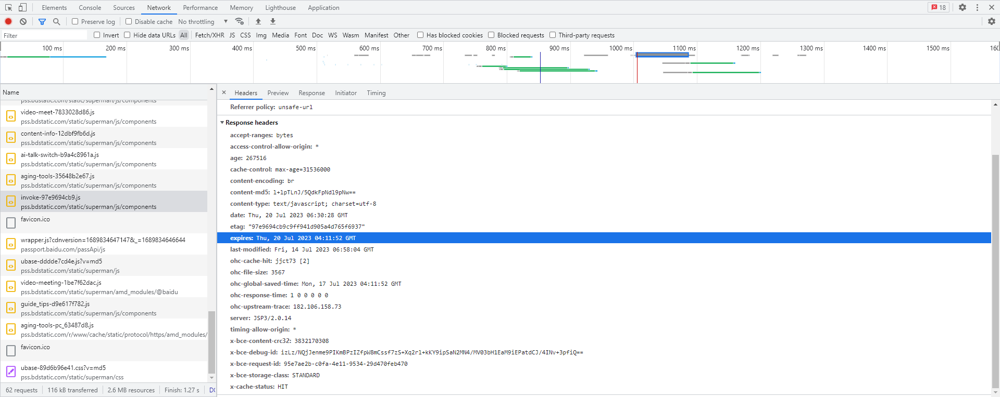
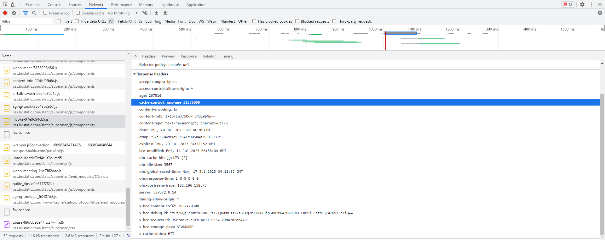
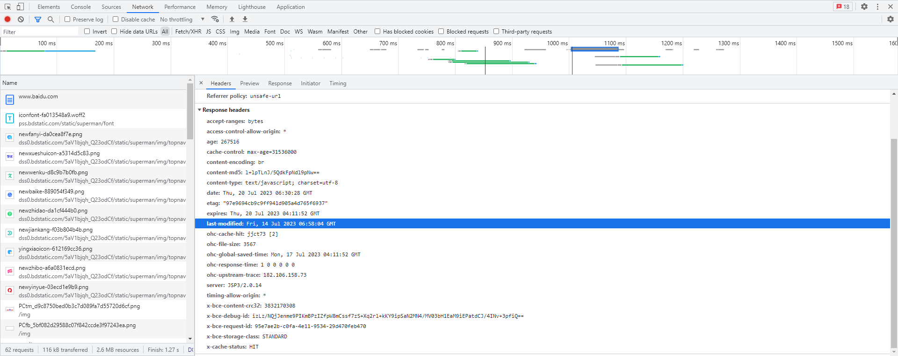
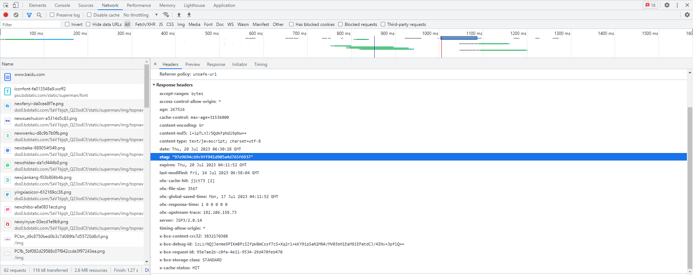
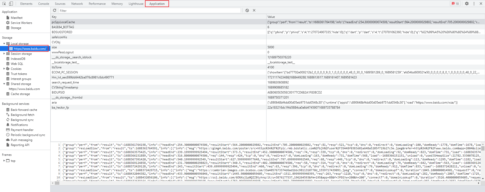
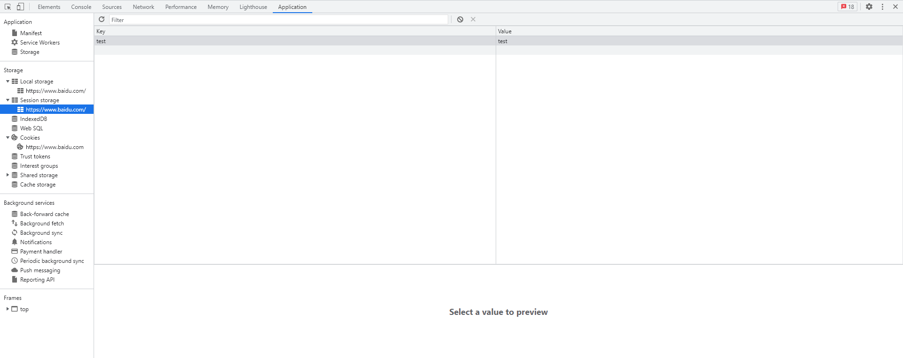
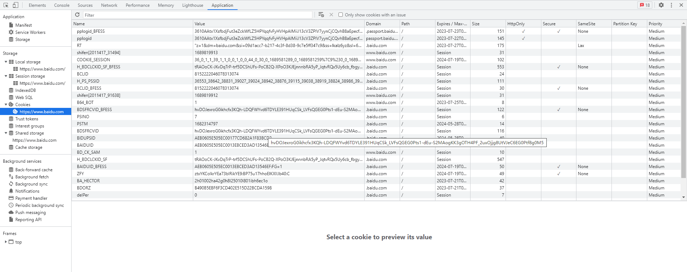

当一个网站有成千上万用户访问的时候，为避免并发导致的服务拥挤，使用缓存是一种非常常见的手段。例如，用户 A 请求了 B 图片，服务器返回了图片内容并告知这张图片要缓存起来，一个月后过期，浏览器接收后检测到缓存设置就会缓存在本地磁盘，后面用户 A 再访问 B 图片时，浏览器检查到 B 图片已经有缓存且还在缓存期内，就会直接从磁盘中加载，不会向服务器请求，如此一来就大大缓解了服务器的压力。

在 HTTP 协议中，定义了与强缓存和协商缓存相关的请求头字段和响应头字段，而浏览器遵循这些规范实现了这个机制。除了浏览器实现了 HTTP 中的缓存，其自身也提供有可缓存的技术和机制。接下来，将聊聊这两块的内容。

## HTTP 缓存

这里的缓存指的是客户端缓存，不包括代理服务器等其他缓存。通过来说，缓存包括两类：强缓存和协商缓存。

### 强缓存

强缓存，指强制缓存，只要缓存没到期就不会向服务器发起请求。不发请求，意味着服务器没有处理压力，但同时也意味着服务器对缓存失去了控制，即不能在过期前清理缓存，只能通过替换资源达到让缓存失效的目的。

### 响应头：Expires

最早可以通过 `expires` 响应头，指定过期时间, 如下：



由于 expires 字段是个绝对值，有时候会导致缓存提早或延后失效，为什么呢？

这是因为，服务端和客户端的日期是有可能不一样的，例如当深圳的用户访问纽约的服务器时，由于两者不在同一时区，各自按当地时区计算就会导致缓存失效。

### 响应头：Cache-Control

后来就有了 `cache-control` 字段，这是个相对时间，如下：



通过 `max-age=xxx` 值，可以指定多少秒后过期，这里的 31536000 秒即为一年。相对于 expires 的绝对时间，cache-control 的相对时间显得非常友好。同时，当两者同时出现时，后者的优先级更高。

综上，强缓存适合某些固定且不经常更新的静态资源，例如 css 文件、js 文件以及图片文件等资源。

### 协商缓存

前面说到，强缓存会导致服务器无法更新客户端的缓存，这对一些时长更新的资源不太友好。于是，协商缓存就派上了用场。

所谓协商缓存，指浏览器下载完也会缓存起来，但下次访问会发请求，询问服务器该资源有没有过期，如果没过期浏览器就加载磁盘中的缓存文件，过期了就重新请求资源。好处在于可以方便地更新资源，虽然多发一次请求，但与重新加载带来的下载带宽比非常划算。

### 响应头：Last-Modified

当请求资源时，服务器会返回 `Last-Modified` 响应头，告知该资源最近的修改时间，如下：



当下次访问时，浏览器会通过 `If-Modified-Since` 请求头携带上一次返回的 Last-Modified 值，服务器收到后会比对是否修改过。如果没修改的话，通常会通过 `304` HTTP 状态码告知自上次以来没有修改过，反之则返回新的资源。

### 响应头：ETag

除了这个，`Etag` 也是用来进行协商缓存的，如下：



这是一个哈希值，通常是根据文件内容计算得到的。当下次访问时，浏览器会通过 `If-None-Matched` 请求头携带这个值，服务器收到后会比对是否一样。如果没修改的话，通常会通过 `304` HTTP 状态码告知自上次以来没有修改过，反之则返回新的资源。

## 浏览器缓存

上面说的HTTP相关的缓存，通常是针对静态资源类型的文件。如果是一些代码数据要缓存的话该怎么办呢？此时，可以使用浏览器提供的相关存储接口。

### Local Storage

`Local Storage`直译为本地存储，提供一个持久化的存储控件，大小约为5MB，不主动删除的话不会过期。在浏览器开发者工具中，可通过 `Application` 面板看到，如下：



常用的API调用如下：

```ts
// 设置，会覆盖同名
localStorage.setItem('key', 'value');
// 获取
localStorage.getItem('key');
// 请求某项
localStorage.removeItem('key');
// 清除所有
localStorage.clear();
```
需要注意的是，存储的值为字符串。如果要存储对象，通常需要先通过 `JSON.stringify()` 进行序列化再存储，取出时通过 `JSON.parse()` 还原。

### Session Storage

`Session Storage` 直译为会话存储，跟上面差不多，但存储周期只在当前浏览器选项卡内。也就是说，你在浏览器打开一个页面，再新开一个选项卡打开同样的页面是访问不到上一个选项卡的值的。换句话说，新建一个选项卡就会跟着新建一个`Session Storage` 实例，同时在浏览器关闭的时候他们就会被清空。



相关API如下：

```ts
// 设置，会覆盖同名
sessionStorage.setItem('key', 'value');
// 获取
sessionStorage.getItem('key');
// 请求某项
sessionStorage.removeItem('key');
// 清除所有
sessionStorage.clear();
```

### Web SQL

这是以前谷歌推出的本地数据库存储方案，目前已经过时且不推荐使用，这里就不做介绍了。

### IndexedDB

这是一个 No SQL 非关系型本地数据库，暂不介绍。

### Cookies

`Cookies` 直译为小饼干，通常用于存储用户相关的小数据，有以下几个特点：

- 存储大小约为4KB
- 浏览器每次请求都会自动携带，不用手动管理

最常见的就是保存用户登陆后的会话ID。例如：当服务器接受并验证用户的登陆账号和密码后，会保存一个key/value的键值对，key为唯一ID，value为用户相关的信息，然后通过 `Set-Cookie` 响应头把key返回为浏览器。浏览器接收后，自动把该字段的值保存下来，下载有请求时就会通过 `Cookie` 请求头携带上这个值。服务端接收后，再根据key获取对应的value，存在则证明用户是有效的，否则就是无效的。

在浏览器中，可查看存储的 Cookies



## 结语

以上，后面有想到的再补充。
