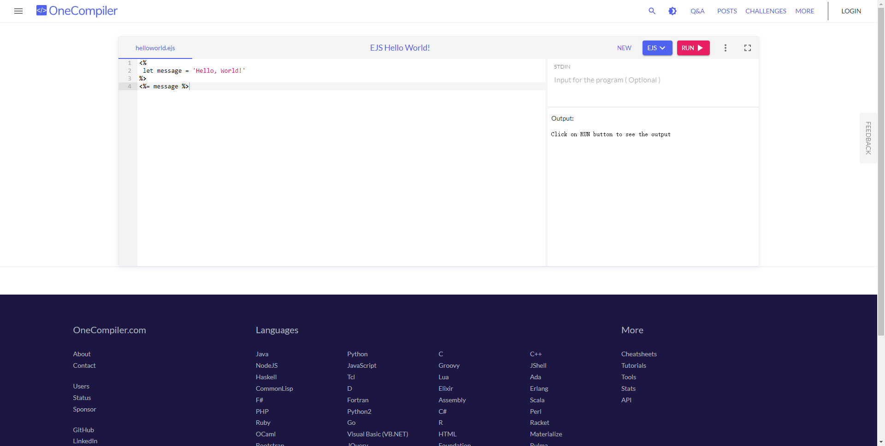

<script lang="ts" setup>
import { useData } from 'vitepress';
import { dayjs } from '../.vitepress/theme/dayjs'
import { data as posts } from '@app/data/posts.data.ts'

const data = useData();
console.log(data, posts, 1)
</script>

[EJS](https://ejs.bootcss.com/) 是一个 JavaScript 模板引擎，名字中的 E 可以指 Embedded(可嵌入)、Effective(高效)、Elegant(优雅) 或者是 Easy(简单)。 在如今的前端开发中，EJS 比不上 Vue 或 React 等框架强大，但在辅助开发方面还是有用处的。话不多说，接下来以一个例子来感受下。

## 例子

在日常开发中，有时候会遇到后端有一些枚举字典的定义，前端也要进行相应的配置。例如在做权限功能时，后端给了我们下面的权限码数据:

```json
[
  {
    "id": 1,
    "code": "access:readAbc",
    "authName": "读取权限",
    "level": 1
  },
  {
    "id": 2,
    "code": "access:writeAbc",
    "authName": "写入权限"
  }
  ...
]
```

我们需要把他做成枚举的形式, 也就是下面的形式：

```typescript
/**
 * 权限码
 */
export const enum AuthEnum {
  /**
   * 读取权限
   */
  ReadAbc = "access:readAbc",
  /**
   * 写入权限
   */
  WriteAbc = "access:writeAbc",
  ...
}
```

那么如何从这项无聊的工作中解放出来呢，这可以使用 EJS 的模板生成能力。

## 实现

先来看下如何快速得到我们的目标代码。

1.  打开一个能编译 EJS 的在线网站， 例如 [OneCompiler](https://onecompiler.com/ejs)。



2.  根据目标数据结构，编写一丢丢逻辑和模板代码，点击 `RUN` 按钮即可。

```typescript
<%
 let items = [
  {
    "id": 1,
    "code": "access:readAbc",
    "authName": "读取权限",
  },
  {
    "id": 2,
    "code": "access:writeAbc",
    "authName": "写入权限",
  },
 ]
 items = items.map(item => {
   let key = item.code.substring(7);
   key = key.charAt(0).toUpperCase() + key.slice(1)
   return { ...item, key }
 })
-%>
/**
 * 权限码
 */
export const enum DaEnum {
  <% items.forEach((i, index) => { -%>
  /**
   * <%= i.authName %>
   */
  <%= i.key %> = '<%= i.code %>',
  <%_ }) -%>
}
```

## EJS 语法

上面涉及 EJS 的一些语法，我们来简单了解下。<%= name %> 是 EJS 的模板语法，用于执行 JS 代码并输出字符串(部分标签有该功能，看下面)。其中，<% 表示执行一段代码的开始，可以带有修饰符执行特殊功能，包括:

| 标签 | 说明                                                                                                                                   |
| :--: | -------------------------------------------------------------------------------------------------------------------------------------- |
|  <%  | 只执行代码，不包含任何输出                                                                                                             |
| <%=  | 执行表达式，并输出转义后的内容到模板中。转义指对 HTML 标签进行转义，例如 `<%= '<div>ABC</div>' %>` 将输出 `&lt;div&gt;ABC&lt;/div&gt;` |
| <%-  | 同上，但不进行转义。                                                                                                                   |
| <%\_ | 类似于 `<%` , 但会删除前面的空格，例如 `  <%_ 123 %>`， `<%_` 前面有 2 个空格但不会输出，上面第 29 行就用到了这个标签                  |
| <%#  | 注释，后面的内容将会当成注释处理。与 `<!-- ABC -->` 相比，前者不会输出任何内容，后者会保留输出。                                       |
| <%%  | 输出字符串 `<%`                                                                                                                        |

而 %> 表示一段代码的结束，同样可以带有修饰符表示特殊功能，包括：

| 标签  | 说明                                                                                                                            |
| :---: | ------------------------------------------------------------------------------------------------------------------------------- |
|  %\>  | 普通的结束标签，没什么特殊功能                                                                                                  |
| -%\>  | 删除随后的换行符，比较常用的是纯执行的代码块。例如，在上面的第 19/24/29 行 代码中我们就用到了这个标签，不然那里都会有一个空行。 |
| \_%\> | 删除后面的空格符，例如 `<%= 'ABC' _%>  `，`_%>` 后面有 2 个空格但不会输出。                                                     |

此外，任何在 <% 和 %> 标签之外的内容都将会原样输出，更多语法可以参考官方文档。

## 结语

以上这是一个简单的例子，更多用途需要你结合实际多多思考，用好了提效效果明显。除了 EJS，[HandleBars](https://handlebarsjs.com/zh/) 也是一个很流行的 JS 模板引擎，它使用 `{{ }}`语法，对 vue 等框架的用户比较友好。这类模板引擎，在命令行工具进行页面模板的生成方面可能用得比较多，例如 [release-it](https://github.com/release-it/release-it) 就使用 HandleBars 定义 CHANGELOG 的生成模板。
