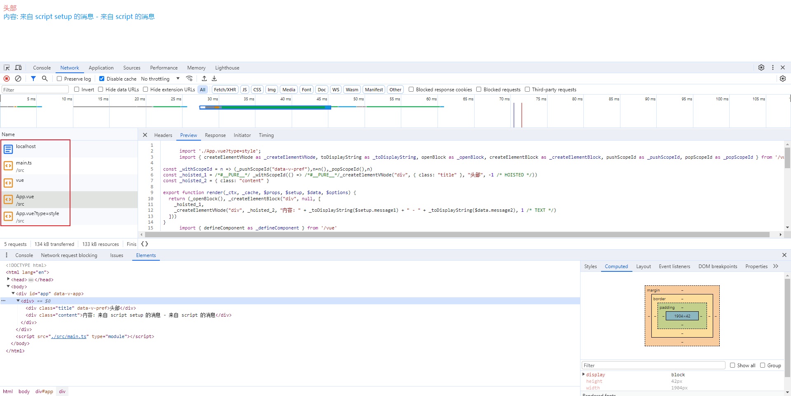

Vite 是一个与前端框架无关的打包工具，既可以打包 Vue 也可以打包 React、Solid 等其他框架。在打包 Vue 的 SFC(Single File Component, 单文件组件)时，主要是借助 [@vitejs/plugin-vue](https://github.com/vuejs/core/tree/main/packages/compiler-sfc) 这个插件，该插件主要的作用是把 .vue 文件编译为 .js 文件。

今天，主要模拟并记录下：当浏览器请求 .vue 文件时，服务器是如何解析并返回相关内容的。由于是模拟过程，因此不少代码都是写死的，主要目的是了解流程即可。

## 创建项目

创建一个项目，并安装以下依赖，其中：Vite 使用 connect 作为后端服务，我们简单点使用 express 即可。此外，sfc 的编译器已内置到 vue 这个包中。tsx 是一个运行 Typescript 的工具，使用 Esbuild 因而非常快。

```bash
npm i express vue tsx -D
```

## 项目结构

在开始之前，我们先创建一个 Vite 和 Vue 最小环境的目录结构，仅需 5 个文件，如下：

```
.
├── src/
│   ├── App.vue
│   └── main.ts
├── index.html
├── package.json
└── server.ts
```

## 页面代码

我们先来补全以上几个文件的代码，除 server.html 文件，其他几个文件内容与普通 vite 项目无异。

### index.html

依赖 ./src/main.ts 文件

```html
<!DOCTYPE html>
<html lang="en">
  <head>
    <meta charset="UTF-8" />
    <meta http-equiv="X-UA-Compatible" content="IE=edge" />
    <meta name="viewport" content="width=device-width, initial-scale=1.0" />
    <title>Vue Development Server</title>
  </head>
  <body>
    <div id="app">app</div>
    <script src="./src/main.ts" type="module"></script>
  </body>
</html>
```

### main.ts

依赖 vue 和 ./App.vue 文件

```ts
import { createApp } from 'vue';
import App from './App.vue';

const app = createApp(App);
app.mount('#app');
```

### App.vue

依赖 vue，包含 1 个template标签，2 个 script 标签(普通和setup)，2 个 style 标签(普通和scoped)。

```vue
<template>
  <div>
    <div class="title">头部</div>
    <div class="content">内容: {{ message1 }} - {{ message2 }}</div>
  </div>
</template>

<script setup lang="ts">
import { ref } from 'vue';

const message1 = ref('来自 script setup 的消息');
</script>
<script lang="ts">
export default {
  data() {
    return {
      message2: '来自 script 的消息',
    };
  },
};
</script>

<style scoped>
.title {
  color: red;
}
</style>
<style>
.content {
  color: blue;
}
</style>
```

## 核心代码

接下来是 server.ts 中的内容，主要是启动一个服务器，接收请求路径和返回转换过的内容，先看一眼最终代码：

```ts
import express from 'express';
import fs from 'fs/promises';
import { parse, compileScript, compileTemplate, compileStyle, SFCTemplateCompileOptions } from 'vue/compiler-sfc';

const replaceVue = (content: string) => content.replace(/from ('|")vue('|")/, `from '/vue'`);
const app = express();

app.get('/', async (req, res) => {
  const content = await fs.readFile('./index.html', 'utf-8');
  res.header('Content-Type', 'text/html');
  res.end(content);
});

app.get('/src/main.ts', async (req, res) => {
  const content = await fs.readFile('./src/main.ts', 'utf-8');
  res.header('Content-Type', 'text/javascript');
  res.end(replaceVue(content));
});

app.get('/vue', async (req, res) => {
  const content = await fs.readFile('../node_modules/vue/dist/vue.esm-browser.prod.js', 'utf-8');
  res.header('Content-Type', 'text/javascript');
  res.end(content);
});

app.get('/src/App.vue', async (req, res) => {
  res.header('Content-Type', 'text/javascript');
  const content = await fs.readFile('./src/App.vue', 'utf-8');
  const { descriptor } = parse(content);

  const templateOptions: SFCTemplateCompileOptions = {
    id: 'pref',
    filename: 'App.vue',
    isProd: true,
    source: descriptor.template.content,
    scoped: true,
    slotted: true,
    compilerOptions: {
      scopeId: 'data-v-pref',
    },
  };

  const script = compileScript(descriptor, {
    id: 'pref',
    templateOptions: {
      compilerOptions: {
        ...templateOptions.compilerOptions,
      },
    },
  });

  const template = compileTemplate({
    ...templateOptions,
    compilerOptions: {
      ...templateOptions.compilerOptions,
      bindingMetadata: script.bindings,
    },
  });

  let styles = '';
  for (const style of descriptor.styles) {
    const css = compileStyle({
      id: 'data-v-pref',
      filename: 'App.vue',
      source: style.content,
      scoped: style.scoped,
    });
    styles += css.code;
  }

  if (req.query.type === 'style') {
    return res.end(`
      const style = document.createElement('style');
      style.innerHTML = ${JSON.stringify(styles)};
      document.head.appendChild(style);
    `);
  }

  res.end(
    replaceVue(`
      import './App.vue?type=style';
      ${replaceVue(template.code)}
      ${replaceVue(script.content.replace('export default', 'const _default_ ='))};
      _default_.render = render;
      export default _default_;
    `)
  );
});

app.listen(3000, () => {
  console.log('Server started at http://localhost:3000');
});
```

以上，对于以 ./ 或 ../ 开头的文件，解析实际路径并转换返回即可；对于 vue 这种模块，要先将其转换为 /vue 之类的路径格式，再返回 node_modules 目录下对应的文件内容；对于 .vue 文件，执行如下过程：

- 使用 parse 解析 .vue 中的内容，得到组件描述符(descriptor)
- 使用 compileScript 编译，得到脚本内容，在此过程中会整合 script 和 setup
- 使用 compileTemplate 编译，得到 render 函数
- 使用 compilerStyle 编译，得到 css 字符串

在 @vitejs/plugin-vue，template 和 script 在一起的，style 是单独的，估计是热更新好处理，以上代码也遵顼了这种逻辑。

## 启动服务

在项目根目录下，运行 `npx tsx ./server.ts` 命令后，浏览器打开即可。贴一张运行效果和具体网络请求吧，如下：



## 最后

以上，通过一个简单的例子，模拟 @vitejs/plugin-vue 在 Vite 开发环境下的处理流程。此外也可以看到，通过解析/转换这种思路，Vite 理论上可以支持非常多的自定义请求。