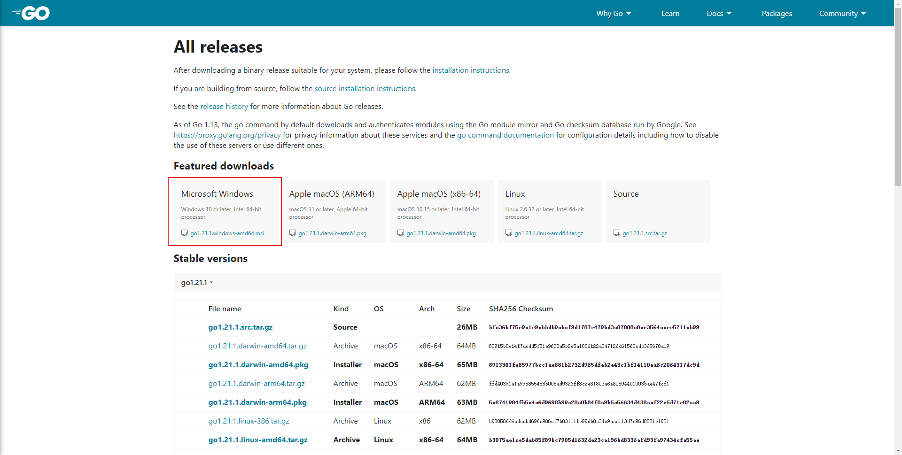
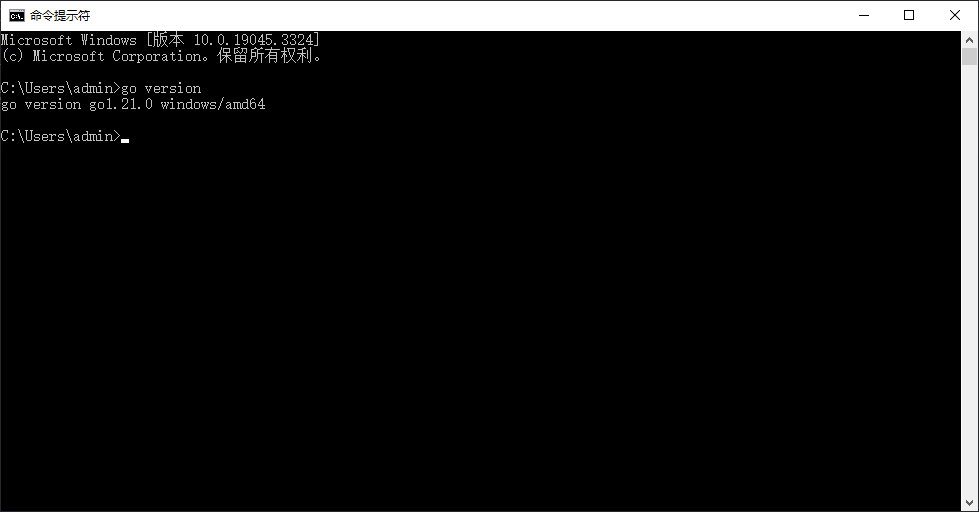
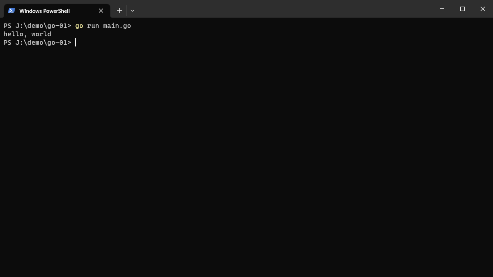

## 下载安装

1. 打开 [官网](https://golang.google.cn/dl/) 下载，如下：



2. 按照指示安装，安装完打开CMD输入 `go version` 命令并回车，应该有如下输出：



## 上手运行

Go 是一门编译型语言，需要先编译在运行，接下来写个小示例。

1. 新建文件夹，以及一个 `main.go` 文件。

```bash
mkdir go-01
cd go-01
touch main.go
```

2. 修改 `main.go` 文件，写个hello, world。

```go
package main;

import "fmt";

func main() {
  var msg string = "hello, world";
  fmt.Println(msg);
}
```

以上代码中：

- 使用 `package` 语法声明包的名字，每个文件都是单独的包，层级类似文件目录
- 使用 `import` 语法导入包，fmt 是 format 的简写
- 使用 `func` 语法声明函数，当函数名为 main 时作为命令行程序的入口，func 是 function 的简写
- 使用 `var` 声明变量，var 是 variable 的简写
- 类型 `string` 跟在变量名后面，以空格分隔
- 使用 `Println` 打印字符串，并在字符串末尾添加换行符，ln 是 line 的简写

3. 运行 `go run main.go` 命令，没有意外的话输出如下：



命令 `go` 是 Go 语言的管理命令，执行编译、运行等任务，其中：

- 命令 `build` 将代码构建成可执行文件，在 Windows 上会打包成 `.exe` 文件
- 命令 `run` 会临时构建并运行代码

## 基本概念

不用语言之间有很多共同概念，这里简单过一下 Go 的一些特点，如下：

- 使用 unicode 作为字符集
- 语句末尾的分号可有可无，除非语义不明
- 使用 var 声明变量
- 使用 C 语言风格的注释，即 `// 注释内容` 格式

## 备注
- 根目录下的文件不能在main.go中直接调用，应 `go run .`或`go run main.go test.go`
- go get 在项目中安装依赖
- go install 全局安装命令