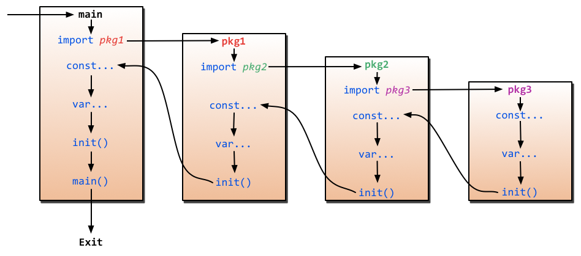

Go 语言的创建者也是 C 语言的创建者之一，因此不少语法都有 C 语言语法的影子。例如，程序入口为 main 函数，函数 printf 命名，注释使用 // 开头等。此外，GO 语言也有自己的特殊语法，例如使用 := 声明短变量，函数支持多返回值，公有函数首字母大写等。

## 注释

Go 使用 C 语言风格的注释，其中单行注释使用双斜杠开头，如下：

```go
// 单行注释
var name = "juetan"
```

多行注释使用斜杠和星号开头，如下：

```go
/*
* 多行注释
*/
var name = "juetan"
```

## 变量

变量，变指可以改变，量指作用域(在 Go 中作用域只有函数作用域和全局作用域)，语法如下：

```go
var <name> <type> = <value>
```

其中，变量类型和初始值至少提供一个即可。当只提供类型时，默认值为零值(字符串的零值为 ""，整型的零值为 0，布尔的零值为 false)。如下：

```go
var name string;                     // 提供类型，初始值值为：""
var age = 18;                        // 提供初始值，类型推导为 int
var email string = "1@exmple.com";   // 同时提供
```

变量声明可以分组，使用圆括号包裹声明内容，等号左边是变量名和类型，多个变量名以逗号隔开，可同时为多个变量指定同一类型，等号右边是变量值，多个变量值以逗号隔开，如下：

```go
var ( x, y int );        // 同类型
var (z, z1 = 1, "1");    // 带默认值
```

在函数内部，可使用 name := value 语法声明短变量，因而 var 常用于声明全局变量，而 := 用于声明函数内的变量，同时声明多个短变量时可覆盖同名变量，但至少得有一个新变量，如下：

```go
in, err := os.Open(infile)
out, err := os.Create(outfile) // out 是新变量，err 覆盖前面的同名变量
```

_ 是一个特殊变量，任何赋予它的值都会被丢弃。

## 常量

常量，常指禁止改变，量指作用域(同变量)，语法如下：

```go
const <name> <type> = <value>
```

以上，语法类似于变量，但名字通常大写，值必须指定，类型可以忽略(编译器推断)，通常用于固定值的声明，示例如下：

```go
const PI = 3.131492654
const (                   // 分组
  x uint16 = 100
  y                       // y 和 x 相等
  z = 10
)
```

iota 是一个特殊的关键字，在常量表达式中使用会自动递增，如下：

```go
const (
  MAN = iota      // 0
  FAMA            // 1
  UNKNOWN         // 2
)
```

## 简单类型

简单变量，指的是存储在栈结构上，长度相对固定且占用内存不大的数据结构，例如字符串、数字和布尔等数据类型。简单变量是基础，复杂变量如数组等也是由这些类型封装而成的。

### 字符串

使用单引号(`'`)进行声明字符，使用双引号(`"`)或反引号(```)声明字符串，使用双引号会处理字符串中的转义符，而反引号会原样输出，此外反引号还可以声明多行字符串。

```Go
var s1 = "hello, \n world"  // \n 会转译为换行符
var s2 = `hello, \n world`  // 原样输出
var s3 = `行1
行2
`                           // 多行字符串
```

输出如下：

```
hello,
 world
hello, \n world
行1
        行2
```

### 整型

整型，分为 无符号(uint) 和 有符号(int) 两种。其中，符号指的是正负符号，无符号不包含负数，而有符号类型包含负数，u 是 unsinged 的简写，int 是 integer 的简写，示例如下：

```go
var x int8 = 1      // 有符号8位，范围：-128 ~ 127
var y uint8 = -1    // 无符号8位，范围：0 ~ 255
```

长度有 8、16、32、64 和 int 五种，其中 int 取决于操作系统，在 32 位操作系统上 int 长度为 32，在 64 位操作系统上 int 长度为 64。两两组合，共有如下类型：

| 符号   | 8 位        | 16 位  | 32 位       | 64 位  | 系统位 |
| ------ | ----------- | ------ | ----------- | ------ | ------ |
| 有符号 | int8        | int16  | int32(rune) | int64  | int    |
| 无符号 | uint8(byte) | uint16 | uint32      | uint64 | uint   |

### 浮点型

浮点型，分为 float32(单精度) 和 float64(双精度) 两种，浮点数都是有符号的。其中，点指的是小数点，浮点指小数点的位置是浮动的。示例如下：

```go
var x float32 = 0.1
var y float64 = 0.1
```

### 布尔型

包含两个值：true(真) 和 false(假)，示例如下：

```go
var t bool = true
var f bool = false
```

## 复杂变量

### 数组

语法如下：

```go
var <name> [<length>]<type>{<index>:<init-value>, ...}
```

其中 length 可以指定为 ... 表示长度根据后面的初始值声明进行推断；cap 方法用于获取数组的容量，len 方法用于定义数组的长度，如下：

```go
var a1 [5]int;

a1[0] = 1;
a1[1] = 2;

fmt.Println(cap(a1));
fmt.Println(len(a1));
```

除了可以使用 for index 遍历数组，也可以使用迭代器进行遍历，如下：

```go
var a2 = [...]int{1:3,4:6};
for index, value := range a2 {
	fmt.Println(index, value)
}

// 结果：
// 0 0
// 1 3
// 2 0
// 3 0
// 4 6
```

### 切片

切片与数组类似，区别在于数组是定长的，切片是变长的，因此在数组长度的语法上不指定长度接口，如下：

```go
var s1 []init            // 空切片
var s2 = make(int, 3, 5) // 长度为3，容量为5的切片

s3 := arr[2:3]
```

备注：new 和 make 都是用于创建和初始化对象的内置函数，区别如下：new 用于各种类型的内存分配，将其初始化为零值返回内存指针；make用于内建类型的分配(map/slice/channel)，(make(type, len, cap)) 返回已初始化的值。

> 值类型：string int float boolean array struct; 引用类型：slice map chan pointer

### map

语法：

```go
// 方式1：不能直接使用，默认为nil
var m1 map[int]string
if (m1 == nil) {
  m1 = make(map[int]string)
}

// 方式2
var m2 = make(map[int]string, 0)
```

使用迭代器进行遍历，但顺序无法保证，如下：

```go
var m1 = make(map[int]string)
m1[1] = "A"
m2[2] = "B"
m3[3] = "C"

for key, value := range m1 {
  fmt.Println(key, value)
}
```

map 不是并发安全的，因此 Go 在 v1.9 版本推出并发安全的 sync.Map，如下：

```go
var m1 sync.Map

m1.Store("A", 97)
m1.Load("A")
m1.Delete("A")
m1.Range(func(k, v interface{}) bool {
    fmt.Println(k, v)
    return true
})
```

### 函数

函数，需要声明好参数类型和返回值类型，且与其他语言不一样的是，Go 的函数支持多返回值，语法如下：

```go
func <name>(<name> <type>, ...) (<name> <type>, ...) {
  // 函数体
}
```

返回声明中的名字可以在函数体中使用，如下：

```go
func SumAndProduct(A, B int) (add int, Multiplied int) {
	add = A+B
	Multiplied = A*B
	return
}
```

参数支持可变参数，如下：

```go
func print(c ...string) {
  for k,v = range c {
    fmt.Println(v)
  }
}
```

参数默认是按值传递，无论是简单变量还是复杂变量都会复制一份。 如果要修改原值，需要传递指针类型的变量，如下：

```go
type P struct {
	age int
}

var p = P{age: 1}

func increaseAge(p P) P {
	p.age += 1
	return p
}

func main() {
	fmt.Println("age: %i", p.age)         // 1
	p1 := increaseAge(p)
	fmt.Println("p age: %i", p.age)       // 1
	fmt.Println("p1 age: %i", p1.age)     // 2
}
```

函数可以延迟执行，使用 defer 会在在函数结束时逆序执行，如下：

```go
func ReadWrite() bool {
	file.Open("file")
	defer file.Close()

	if A {
		return false
	}

	if B {
		return false
	}

	return true
}
```

函数也是变量，可以作为参数传递，如下：

```go
type add func (x int, y int) int

func run(fn add) int {
  return fn(1, 2)
}
```

在 Go 中，异常是返回值的一部分，当发生未处理的异常时，会触发 panic 中断程序退出，panic 可以使用 recover 拦截，但必须在defer函数中使用，如下：

```go
func throwsPanic(f func()) (b bool) {
	defer func() {
		if x := recover(); x != nil {
			b = true
		}
	}()
	f() //执行函数f，如果f中出现了panic，那么就可以恢复回来
	return
}
```

Go里面有两个保留的函数：init函数（能够应用于所有的package）和main函数（只能应用于package main）。程序的初始化和执行都起始于main包。如果main包还导入了其它的包，那么就会在编译时将它们依次导入。如下：



### 指针

指针，是一种特殊变量，保存的是普通变量的内存地址。使用 & 获取变量的地址，使用 \* 获取指针变量指向地址的值，示例如下：

```go
var s1 = "字符串"
var s2 = &s1

fmt.Println(*s2)
```

### 结构体

结构体类似于类，有属性和方法，属性一开始就在结构体中声明，但方法需要单独声明。使用结构体，先声明好类型，然后再实例化(没有 new)，示例如下：

语法：

```go
// 1. 声明属性类型
type Persion struct {
  Name string `json: "name"`
  Age  int    `json: "age"`
}

// 2. 实例化
var p2 = Persion {
  Name: "A",
  Age: 1
}
```

以上，第 1 步的声明语法有些奇怪，要分成两部分理解：type 是一个用于声明的关键字(类似于 var 和 const)，语法为 `type <alias> <name>`。

标签(tag)

匿名字段，即只提供类型，不提供字段名。当匿名字段是一个struct的时候，那么这个struct所拥有的全部字段都被隐式地引入当前struct。如下：

```go
type Human struct {
  name string
  age int
  weight int
}

type Student struct {
  Human
  int
  speciality string
}

var p = Human {}

p.Human.name // 正常访问
p.name       // 直接访问
p.int = 3    // 普通类型
```

方法，方法就是特殊的函数，它的第1个参数是结构：A method is a function with an implicit first argument, called a receiver.如下：

```go
func (p *Persion) say() {
  fmt.Pringln("my name is %s", p.name)
}
```

为什么要单独写呢，因为要考虑接收者既可以是普通变量，也可以是指针类型。

接收者可以是普通类型或指针类型，方法也可以继承和重写。


### 反射

反射(类似于镜子)，输入是变量，输出是反射信息，例如变量类型或变量值等信息。

```go
import (
  "fmt"
  "reflect"
);

func main() {
  n1 := 8
  fmt.Println(reflect.TypeOf(n1))
  fmt.Println(reflect.ValueOf(n1))
}

// 输出：
// int
// 8
```

### 协程

协程(routine)，概念上类似线程(thread)，核心不同点在于：线程(或进程)是操作系统级别的概念，而协程只是语言层次上的概念。

可以理解为，协程是 Go 语言内部对线程的虚拟实现，目的是利用物理机的多核优势，实现并发处理。优点是启动快，占用资源少。

## 结语

总体而言，比较通俗且容易上手，但比较奇怪的是多变量声明语法和短变量语法。多变量声明语法，可能对于声明多个同类型的变量比较实用，其他暂时想不到其便捷性是怎么设置的。而短变量语法，感觉略显随意且会覆盖同名变量，是优点也算是缺点吧。
