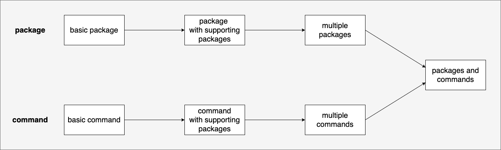

一开始，Go 是支持依赖管理的，但支持得并不友好，后来才逐渐完善起来。此外，与 NodeJS 依赖管理有几个不同点：

- NodeJS 依赖是从统一的中心源(npm)下载的，Go 没有中心源，从 git 仓库下载，常见第三方库都托管在 GitHub 上面
- NodeJS 下载依赖到项目的 node_modules 下，Go 下载依赖到全局目录(GOPATH/pkg)下，也就是说每个项目都共享依赖

## 管理历史

依赖管理的变化，主要经历以下 3 个阶段：

- 第一阶段：GOPATH

`GOPATH` 是一个环境变量，表示 GO 代码的保存路径。 项目和依赖都要在 GOPATH 目录下，于是产生一些问题：项目必须在 GOPATH 目录下创建，不够灵活；依赖只能存一个版本，如果不同项目依赖不同版本的库会很麻烦。

- 第二阶段：VENDOR

从 v1.5 版本起，GO 引入 Vendor 模式：如果项目根目录下有 vendor 目录，那么会优先使用该目录下的库。对于 vendor 的管理，社区中有些一些便捷工具，如 godep 和 dep 等。

- 第三阶段：GO MODULE

从 v1.11 版本起，GO 引入 Module 模式，从 v1.13 起， GO MODULE 称为默认的依赖管理工具。项目中保存 2 个特殊文件：

- go.mod：类似于 package.json 文件，记录项目名、GO 版本和依赖信息
- go.sum：类似于 package-lock.json 记录依赖的哈希值，确保项目在不同环境中下载到的依赖是一致的，该文件由 GO 更新无须手动操作。

## GO MODULE

### GO1111MODULE

GO111MODULE 是一个环境变量，表示是否开启 GO MODULE 模式，有 3 个可选值：

- off ：禁用，将从 GOPATH 和 vendor 中查找依赖
- on  ：启用，将从 go.mod 中查找依赖
- auto：自动，项目在 GOPATH/src 目录外且存在 go.mod 文件时启用

设置命令为：

```bash
go env -w GO1111MODULE=on
```

### GOPROXY

`GOPROXY` 是一个环境变量，表示下载依赖时使用的代理地址，需要设置代理地址主要是因为：GO 没有自己的中心源，很多库的开发者将代码托管在 Github 上，而国内因为墙的原因访问 Github 是很困难的。从 v1.13 起，GO 的默认代理地址为：https://proxy.golang.org，该地址在国内无法访问，可以设置国内代理，
命令如下：

```bash
go env -w GOPROXY=https://goproxy.cn,direct
```

### 管理命令

启用 GO MODULE 后，便可以使用 `go mod <cmd>` 开头的命令管理，命令中的 mod 指 module(模块)。常用的命令有如下：

| 命令 | 描述 |
| --- | ---
| go mod init [name] | 初始化：在项目中创建 go.mod 文件，其中 name 可选，默认使用文件夹的名字
| go mod tidy | 同步依赖：根据代码中的引用关系，删除或更新 go.mod 和 go.sum 中的信息
| go mod download | 下载全部依赖：适用于首次下载项目。、
| go mod vendor | 将依赖复制到当前项目的 vendor 目录下

### 下载依赖

启用 GO MODULE 后，可以使用 `go get` 命令下载依赖，依赖会下载到 GOPATH/pkg 目录下，如果有二进制命令也会安装到 GOPATH/bin 目录下，同时更新 go.mod 文件和 go.sum 文件的信息。示例命令如下：

```bash
go get github.com/xx

go get -u

go get -u=patch
```

## 包(package)

在 Go 语言中，模块是按文件夹为基本形态的，这与 NodeJS 按文件为基本形态有很大不同。

### Package 语法

Package 是以文件夹为基本形态的，这与 NodeJS 以文件为基本形态有很大不同。每个 .go 文件都必须使用 package xx 声明所处的包。

同一文件夹内的 .go 文件需要声明为同一 package，但 package 的名字不必跟文件夹名字相同，但通常情况下都建议保持一致。同一 package 内的变量可随意调用且无需引入，即使在不同文件中。例如：

```go
// a/b.go
var name string = "juetan"

// a/c.go
fmt.Println(name)
```

此外，每个 .go 文件都有2个特殊的函数：

init 函数：在导入时执行，相当于声明周期钩子，一个文件内可多次声明该函数，示例如下：

```go
func init() {
  fmt.Println("load xx package xx file")
}
```

main 函数：仅能在 package main 中声明且只能有 1 个，如下：

```go
func main() {
  fmt.Println("call by cmd")
}
```

### Import 语法

使用 import 时，导入的是路径，使用的是包名。例如 a/b/b.go 文件内：

```go
package c

func Run() {}
```

则在使用时，应该是这样：

```go
package xx

import "a/b"

c.Run()
```

默认使用的是声明包名，但也支持其他使用方式，如下：

1. 这个点操作的含义就是这个包导入之后在你调用这个包的函数时，你可以省略前缀的包名，也就是前面你调用的fmt.Println("hello world")可以省略的写成Println("hello world")

```go
import(
  . "fmt"
)
```

2. 别名操作顾名思义我们可以把包命名成另一个我们用起来容易记忆的名字

```go
import(
  f "fmt"
)
```

3. _操作其实是引入该包，而不直接使用包里面的函数，而是调用了该包里面的init函数。

```Go
import (
  "database/sql"
  _ "github.com/ziutek/mymysql/godrv"
)
```


## 项目目录

参考：https://zhuanlan.zhihu.com/p/659823790

在 Go 语言中，项目有 2 种类型：package(构建第三方类库), command(构建可执行命令)。根据复杂度的不同，可划分为以下类型：



### Basic Package

作为第三方库，根目录下须有同名.go文件，基本的结构如下：

```
go.mod
<name>.go
<else>.go
```

使用时，可：

```go
import "<name>"
```

### Package with supporting packages

如果期望有内部包，但又不希望导出时，可放置在 internal 目录下。从 v1.14 起，internal 仅能被同级或上级package使用且不会被导出。结构如下：

```
go.mod
<name>.go
<else>.go
internal
  auth
    auth.go
```

项目导出与前面以上。在 name.go 文件中，可以按如下方式使用内部包：

```go
import "<name>/internal/auth"
```

### Multiple packages

如果要导出多个包，可在根目录下创建文件夹作为子包，如下：

```
go.mod
name.go
auth
  auth.go
```

此时，将可以使用如下方法使用：

```go
import "<name>"
import "<name>/auth"
```

### Basic command

创建命令行，根目录须有 main.go 文件且包名为 main，其目录如下：

```
go.mod
main.go
```

安装时，使用如下命令：

```bash
go install <name>
```

### Command with supporting packages

同样地，如果需要内部包，结构如下：

```
go.mod
main.go
internal
  auth
    auth.go
```

### Mupltiple commands

如果要导出多个命令，在根目录下创建文件夹即可，如下：

```
go.mod
main.go
auth
  main.go
```

安装时，可以选择安装，如下：

```bash
go install <name>
go install <name>/auth
```

### Multiple packages and commands

终极形态，如果既要导出类库也要导出命令，通常是在 package 的基础上，将命令统一放置在 cmd 目录下，如下：

```
go.mod
<name>.go
auth
  main.go
internal
  hash
    hash.go
cmd
  run
    main.go
```

以上，将导出两个包和一个命令，使用如下：

```bash
go get <name>
go get <name>/auth
go install <name>/cmd/run
```

## 结语

以上，了解 GO 对于依赖的管理，同时知道：

- GOPATH 表示 GO 代码的引用地方
- GO111MODULE 表示是否启用 GO MODULE 模式
- GOPROXY 表示代理地址
- go mod xx 用于管理 GO MODULE
- go get 用于下载依赖

特殊目录名：

- internal 内部包
- vendor 第三方依赖
- cmd 命令
- pkg 类库

根目录下的特殊文件：
- go.mod
- go.sum
- <name>.go
- main.go