Rust 是一门高性能、高安全性的系统级编程语言，最初旨在作为 C 和 C++ 的更安全替代品。Rust 直译为铁锈，起名来源于一种特别健壮的真菌，这种真菌 "为了生存而过度设计"。


## 为什么学习

要说理由的话，大概有以下几个：

- 想学一门偏底层的语言
- 部分概念跟NodeJS类似，let/const关键字，包管理器等

## 历史

Rust 算是一门比较年轻的语言，因而没什么历史包袱，学习到的概念不至于太模糊。

- 2006 年：
  作为 Mozilla 开发者 Grayon Hoare 的个人项目开始，灵感来源于霍尔公寓楼里的一部坏电梯，这些设备的软件通常是 C 或 C++ 写的，这些语言需要手动管理大量内存，存在崩溃的可能，因此 Hoare 开始研究一种即紧凑又没有内存错误的语言。

- 2009 年：
  Mozilla 赞助该项目。

- 2010 年：
  Mozilla 正式宣布 Rust 项目。

- 2015 年：
  Rust 1.0 发布。

## 安装 Rust

在不同操作系统上，安装的方式和步骤略有差异，这里以 Windows 操作系统为例。在 Windows 上，Rust 的安装分为两部分：c++依赖的安装，rustup 的安装。

### 安装 C++ 依赖

Rust 依赖于 c++ 环境，因此需要提前安装相关依赖，这里选择通过 VS 安装。

1. 通过 [官网](https://visualstudio.microsoft.com/zh-hans/downloads/) 下载 VS 社区版并安装。


2. 选择 `使用C++的桌面开发` 选项

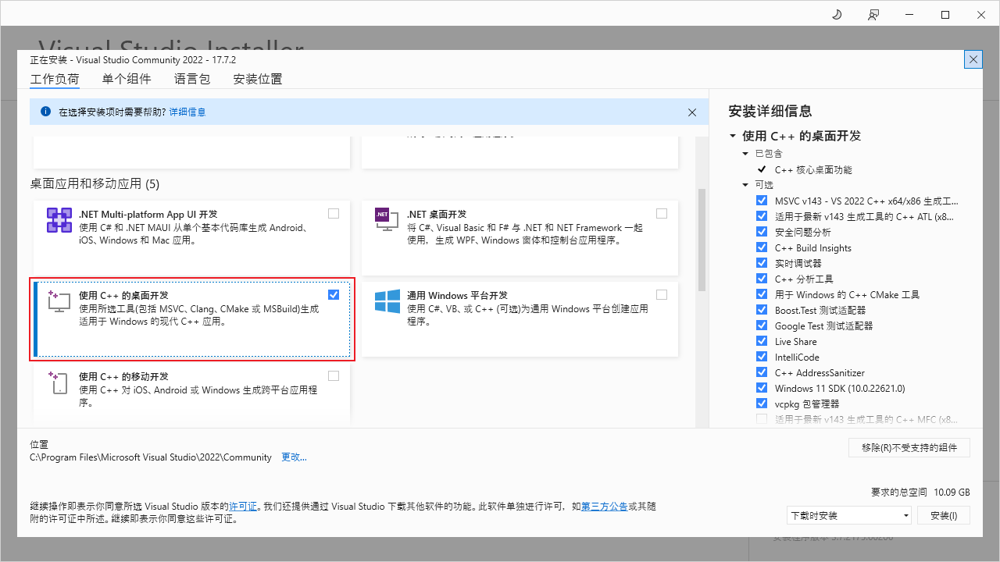

3. 选择对应操作系统的开发组件

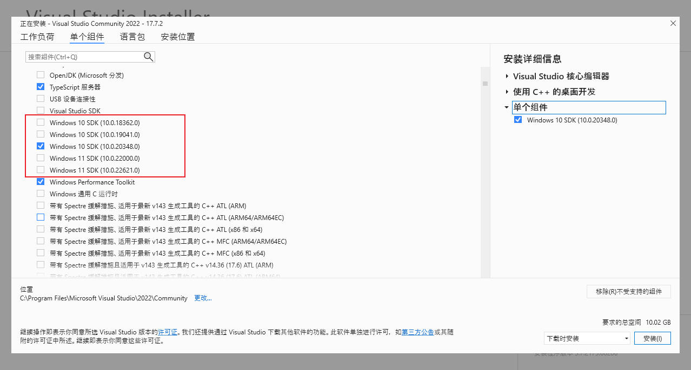

4. 选择英文语言包及其他语言包

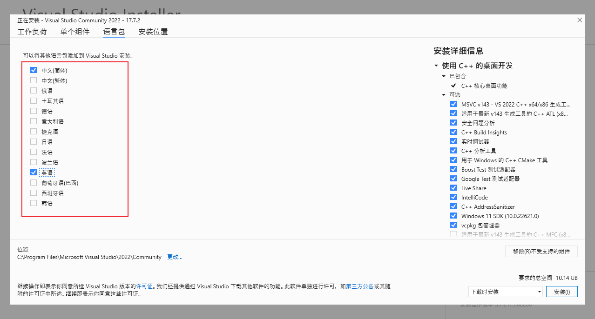

点击 `安装` 等待下载和安装，我所选的依赖有 2G+大小，网络不好的话得等好一会儿。

### 安装 Rustup

Rust 的安装有[很多方式](https://forge.rust-lang.org/infra/other-installation-methods.html)，这里以官方推荐的 Rustup 为例，Rustup 是 Rust 的版本管理和命令行工具。

1. 通过 [官网](https://www.rust-lang.org/tools/install) 下载 Rustup 并安装。

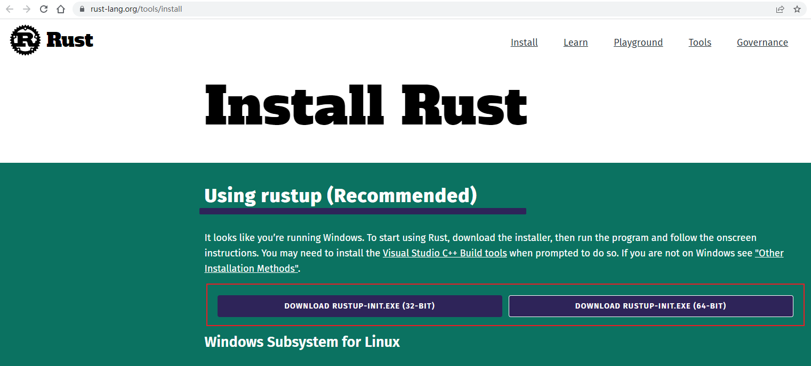

2. 选择默认方式即可，等待依赖下载和安装.

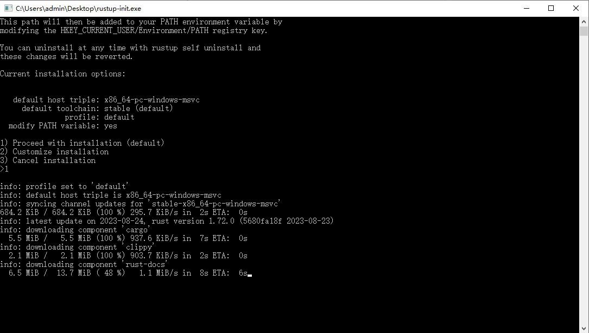

3. 安装完重新打开命令行，输入 `rustc --version` 应该有输出，代表安装成功。

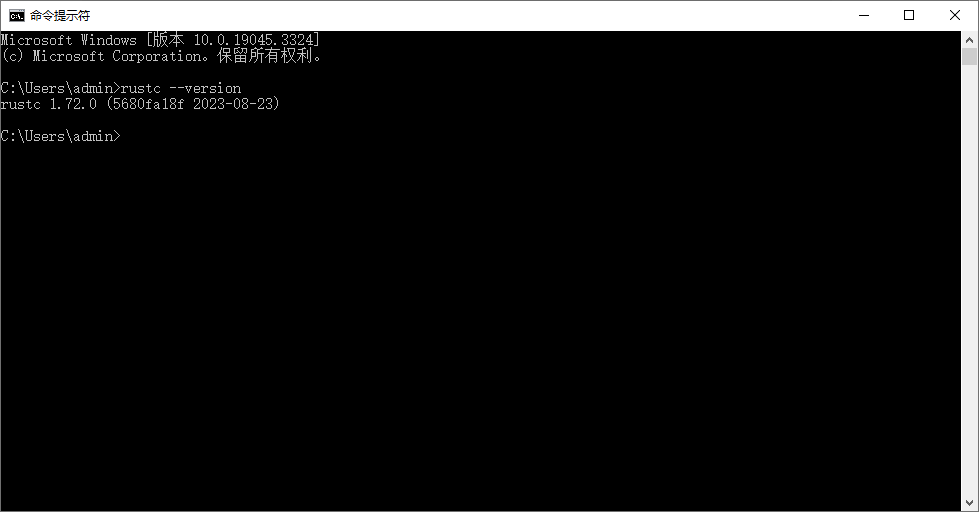

至此，Rust 安装已完成。

## 编译和执行

Rust 是一门编译型语言，需要先编译再运行。接下来写个小示例看看，请上最经典的 `hello, world`。

1. 在任意目录下，新建 `main.rs` 文件

```rust
fn main() {
  println!("Hello, world!")
}
```

以上代码中：

- `fn` 是 function 的缩写，表示声明一个函数
- `main` 是函数名，当名字为 main 时作为命令行程序的入口
- `println` 用于打印带换行符的字符串，`!` 表示这是个编译宏。

2. 运行 `rustc ./main.ts` 命令，然后你应该能看到当前目录下多出两个文件：`main.exe` 和 `main.pdb`

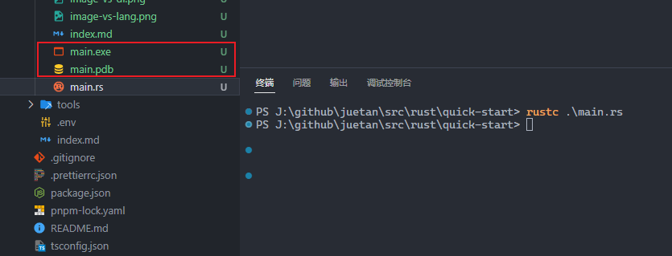

其中：

- `rustc` 是 Rust 的编译命令，类似于 `javac`，其中的 `c` 是 compile 的缩写，这个命令是跟随 `rustup` 安装的。
- `.exe` 是 Windows 平台下可执行文件的后缀名
- `.pdb` 是一个包含调试信息的文件

3. 运行 `./main.exe` 命令，不出意外的话能看到如下的输出

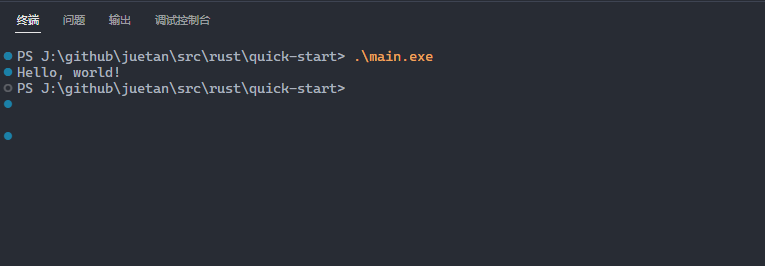

## 包管理工具

类似于 NodeJS 有 npm 工具，Rust 也有自己的包管理工具：`cargo`(直译为货物)。通常来说，别人写好并发布出来的代码包，叫第三方库，但在不同语言间也有不同叫法。例如，在 NodeJS 中第三方库称为 `package`，而在 Rust 中称为 `crate`(直译为运货用的大木箱)。

接下来，写个小项目感受下：系统生成一个随机数，我们输入一个数，然后系统会提示我们大了、小了还是相等。在生成随机数时，会用到一个叫 `rand` 的 crate(第三方库)

1. 运行 `cargo new <name>` 命令，此时会生成如下的目录和文件

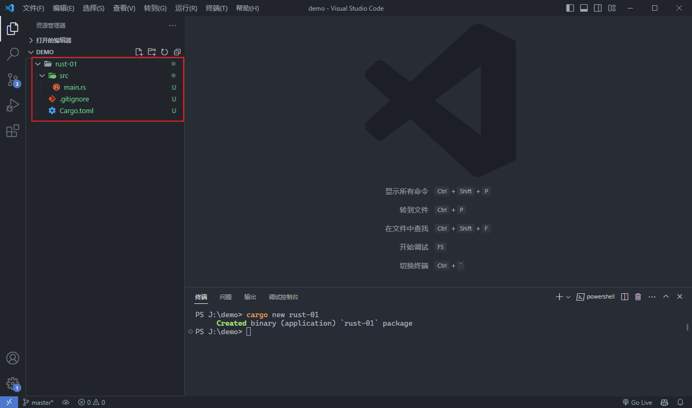

其中：

- `cargo` 是 Rust 的包管理命令，同时也是构建命令，这个命令是随 `rustup` 安装的
- `Cargo.toml` 是 Cargo 的配置文件，类似于 NodeJS 中的 package.json 文件
- `src/main.rs` 是 Cargo 项目的入口

2. 打开 `Cargo.toml` 文件，添加 rand 依赖，.toml 是一种类似于 json/yaml 的文件格式。

```toml
#...

[dependencies]
rand = "0.8.5"

#...
```

3. 打开 `src/main.rs` 文件，编写我们的代码

```rust
use std::io;
use rand::Rng;
use std::cmp::Ordering;

fn main() {
    println!("欢迎来到猜数游戏");
    let secret_number = rand::thread_rng().gen_range(1..=100);
    println!("请输入你的猜数：");
    let mut guess = String::new();

    io::stdin()
        .read_line(&mut guess)
        .expect("Failed to read line");

    let guess: u32 = guess
        .trim()
        .parse()
        .expect("请输入一个数字");

    match guess.cmp(&secret_number) {
        Ordering::Less => println!("小了, 数字是: {}", secret_number),
        Ordering::Greater => println!("大了, 数字是: {}", secret_number),
        Ordering::Equal => println!("相等"),
    }
}
```

上面的代码，涉及的语法有点多，我们来慢慢看下，首先是顶部的声明：

```rust
use std:io
```

- `use` 表示使用某个模块，类似于 NodeJS 的 import 语法
- `std` 表示内置的标准库，std 是 standard 的缩写
- `::` 表示子成员，在对象上表示其静态成员
- `io` 是输出输出库，io 是 input/output 的缩写

接下来是：

```rust
let secret_number = rand::thread_rng().gen_range(1..=100);
let mut guess = String::new();
```

- `let` 用于声明一个变量，听起来可变但默认是不可变的，允许用 `mut` 标识为可变
- `1..=100` 表示 1 到 100 范围(左闭右闭)，如果是 1..100 就是 1 到 99(左闭右开)。
- `mut` 表示该可修改，mut 是 mutable 的缩写

再接下来是

```rust
io::stdin().read_line(&mut guess).expect("Failed to read line");
```

- `&` 表示对某个变量的引用
- `&mut` 表示可修改的变量引用
- `expect` 表示期望有值，否则报错并将传入的参数设为异常消息

最后是

```rust
match guess.cmp(&secret_number) {
  Ordering::Less => println!("小了"),
  Ordering::Greater => println!("大了"),
  Ordering::Equal => println!("相等"),
}
```

- `match` 用于匹配某个值，类似于 switch 语法
- `cmp` 方法用于比对两个数字，返回一个枚举(即 Ordering)。cmp 是 compare 的缩写
- `Ordering` 是一个枚举值，包含 Less/Greater/Equal 成员

4. 运行 `cargo run` 命令，此时会先下载我们刚写入的 rand 依赖，然后再编译执行，如下：

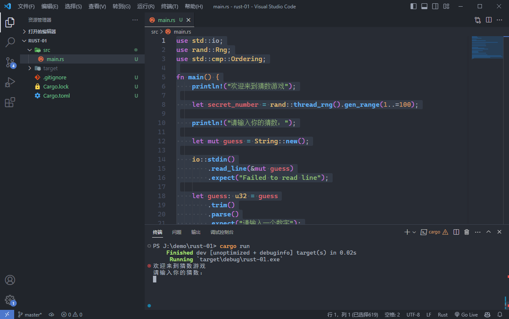

5. 同时，当前目录下多个 `target` 目录，默认是debug模式，`debug` 目录放着我们刚才编译好的文件。可以通过 `--release` 参数指定为release模式，生成好的文件将在 `target/release` 目录下。

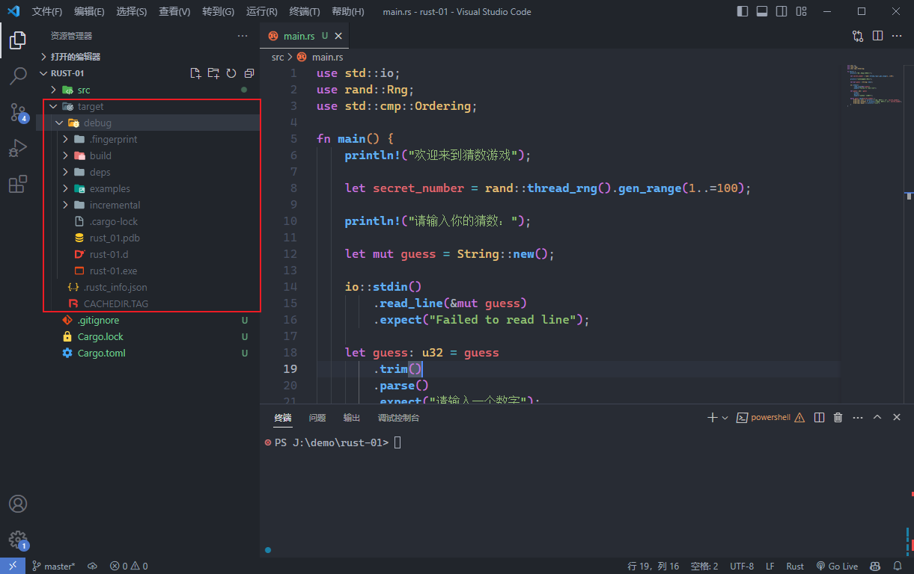

## 学习资料
- [Rust语言圣经](https://course.rs/about-book.html)
- [Rusty Book-常用库和代码片段](https://rusty.course.rs/about.html)
- [Cargo 官方文档](https://doc.rust-lang.org/cargo/index.html)

## 结语

以上简单了解了几个关于 Rust 的重要概念：

- rustup 是 Rust 的版本管理工具，如同 NodeJS 中的 nvm。
- rustc 是 Rust 的编译命令
- cargo 是 Rust 的包管理和构建命令
- crate 是 Rust 对于第三方库的叫法
