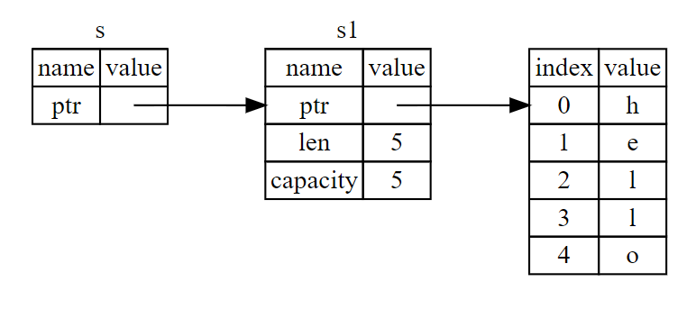

当我们声明变量时，每个变量都会被分配一片内存空间，这片内存空间要在适当的时机回收，否则会造成内存泄漏。不同的语言有不同的回收机制，部分语言手动回收，如 C 语言等；部分语言使用垃圾回收机制自动回收，如 JavaScript 等；Rust 选择的是不同路线：使用所有权机制进行半自动回收。

## 所有权

所有权(ownership)，指的是变量值的所有权，变量值被赋值给了谁谁就拿到其所有权。通常针对的是，像字符串这样存储在堆上面的复杂类型变量，对于整数这样的简单类型变量没什么影响。

当使用 = 表达式时，我们通常会说某个值/变量被赋值给另一个变量，但在 Rust 中却有不同的说法：移交所有权。对于简单类型和复杂类型，使用 = 表达式有着不同的行为，举个例子如下：

```rust
fn main() {
  let x = String::from("hello");
  let y = x; // x 移交所有权给 y
  // 在这里无法访问 x，这里的x是复杂类型

  let a = 1;
  let b = a;
  // 在这里可以访问 a，这里的a是简单类型
}
```

除 = 表示式外，其他隐式赋值的行为也会导致所有权移交，比较典型的就是函数调用时的参数传递，如下：

```rust
fn main() {
  let msg = String::from("hello");
  say(msg);
  // 这里无法访问 s
}

fn say(message: String) {
  println!("{}", message);
}
```

上面的代码中，我们创建了变量 msg, 然后传入 say 函数中。此时， msg 已将所有权移交给 message，msg 变得不再有效，而 message 则会随着 say 函数的结束而销毁。

## 克隆

如果我们想深克隆堆上的数据，可以使用 `clone` 函数，如下：

```rust
let s1 = String::from("hello");
let s2 = s1.clone();

// false
println!("s1 = {}, s2 = {}", s1, s2);
```

## 引用

引用(reference)，指的是对变量的引用，包含两类：不可变引用和可变引用。不可变引用的作用是，让我们可以只给予访问权，而不移交所有权。而可变引用的作用是，让我们只给予访问权和修改权，而不移交所有权。

举个不可变引用的例子，某个函数需要需要使用参数，根据所有权规则我们传入值时也移交了这个值的所有权，而引用规则让我们可以传值时不用担心所有权。示例如下：

```rust
fn main() {
  let s1 = String::from("hello");
  let len = calculate_length(&s1);

  println!("The length of '{}' is {}.", s1, len);
}

fn calculate_length(s: &String) -> usize {
  s.len()
}
```

以上代码，在函数 calculate_length 的声明中，参数 s 声明为 &String 类型，其中 & 表示不可变引用。在调用函数时，使用 &s1 传入变量 s1 的不可变引用。如果要使用可变引用，使用 &mut s1 的格式，此时注意入参和实参类型要一致，示例如下：

```rust
fn main() {
  let mut s = String::from("hello");
  change(&mut s);
  println!("{s}")
}

fn change(some_string: &mut String) {
  some_string.push_str(", world");
}
```

以上，引用指向变量，变量指向变量值，关系链如下：



## 借用

借用(borrow)，暂时没找到太具体的解释，个人理解指的是套在引用上的一系列规则，目的是限制对引用的野蛮使用避免导致安全问题。有以下规则：

- 不可变引用可同时创建多个
- 可变引用只能同时创建一个
- 同一时刻，只能存在可变引用或不可变引用；
- 引用与生命周期有关，引用失效后可重新创建引用；

以上，前三条应该比较清晰，第四条中的生命周期是个新概念。这里的生命周期，指的是引用的生命周期，目的是确保引用在生命周期内有效，且不与其他引用冲突。举个例子如下：

```rust
let mut x = String::from("hello")
let y = &x;
let z = &mut x;
println!("{y}");
```

以上代码无法编译，因为引用 y 的生命周期范围在第 2 行到第 4 行之间(println 使用到 y)，而 z 的生命周期只有第 3 行(没有被使用)，因此在不可变引用 y 的生命周期内(范围大)，创建一个可变引用 z 是不允许的。再来看看下面这个例子

```rust
let mut x = String::from("hello")
let y = &x;
println!("{y}");
let z = &mut x;
```

以上代码可以编译，因为不可变引用 y 的生命周期在第 2 和第 3 行之间，而可变引用 z 的生命周期在第 4 行，两者没有冲突。

## 切片

切片(slice)，是一种数据类型，是对数据值的部分引用。使用切片可以访问已有变量而不用开辟新内存存放复制而来的数据，更灵活地访问部分值并确保引用安全。举个字符串的例子，看看普通写法和切片写法哪个更省内存，如下：

```rust
fn main() {
  let s = "Hello, world!";
  let t = "Hello";
  println!("原字符串：{}", s); // 输出：Hello, world!
  println!("子字符串：{}", t); // 输出：Hello
}
```

以上代码中，我们声明变量 s 和变量 t，其中变量 t 内容正好与 变量 s 的前 5 位相同。此时，变量 s 占据一份内存空间，而变量 t 也占据一份内存空间，且 s 和 t 存在重复的内容，这种重复是可以避免的。使用切片写法如下：

```rust
fn main() {
  let s = "Hello, world!";
  let slice = &s[0..5];
  println!("原字符串：{}", s); // 输出：Hello, world!
  println!("子字符串：{}", slice); // 输出：Hello
}
```

以上代码中，变量 slice 是对 s 的切片引用，最终指向的是 s 的部分内存空间，因为 slice 不存具体值因此比 t 占用的内存更小。这种引用方式，在处理大量数据时非常有帮助。

## 结语

Rust 的所有权和一揽子机制，在某种程度上确保了内存安全。在 JavaScript 等高级语言中，这些概念非常陌生，但在这里你需要关注你声明的每个变量，并确保它们被安全使用。个人理解，如有错误欢迎批评指出!
