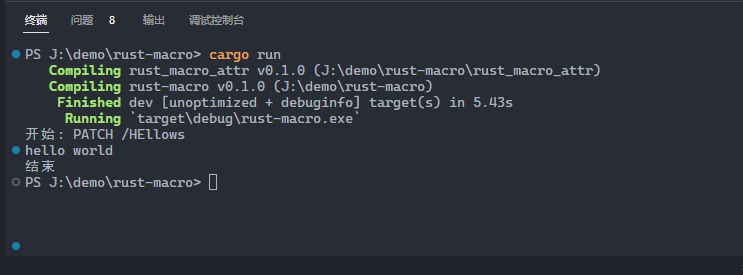

宏(macro)，是一种扩展功能和语法的自定义规则，目的是减少重复代码的书写。在 Rust 中， 宏包含 声明宏 和 过程宏，而过程宏又分为 派生宏、属性宏和函数宏三种。宏在编译期进行处理，可以操作代码和以及 AST，然后替换生成新的代码和 AST，这样就可以减少运行期的额外工作，提高性能。

宏的目标是减少重复性的代码编写，尽管函数也可以做到，但宏更为灵活和自由。例如，println! 是一个声明宏，可以接收不同类型且长度不定的参数，使用函数编写就没办法做到。

## 声明宏

声明宏，是将一种声明替换为另一种声明的代码替换，类似于正则替换。例如，内置的 vec! 宏用起来是这样的：

```rust
let nums = vec![1,2,3];
```

其中，vec 是宏的名称，! 表示这是宏调用并与普通的函数调用区分开，[xx]用来包裹内容，可以是 (xx)、[xx] 或 {xx} 格式。 以上代码，在编译时会被替换成类似如下的内容：

```rust
let nums = {
  let mut temp = Vec::new();
  temp.push(1);
  temp.push(2);
  temp.push(3);
  temp
}
```

而宏的实现是这样的：

```rust
macro_ruls! vec {
  ($($x:expr),*) => {
    // 按如下模板进行替换
    {
      let mut temp = Vec::new();
      $(
        temp.push($x);
      )*
      temp
    }
  }
}
```

以上的代码中，涉及宏的一些语法：

- `macro_ruls!` 定义声明宏，这种语法后面可能会淘汰
- `vec` 是宏的名称
- `( 模式匹配 ) => { 替换内容 }` 是宏的分支语法，这里只有一个分支
- `$()` 用于重复性匹配
- `$<name>:<type>` 定义宏变量，$ 表示这是宏变量而非普通变量，type 指令牌类型
- `,*` 中的`*`表示匹配零个或多个

上面中的 type 指令牌类型，常见的如下：
| 关键字 | 说明 |
| -- | -- |
| item | 一个项目，例如函数、结构体，模块等
| block | 代码块
| stmt | 声明，stmt 是 statement 的简写
| expr | 正则表达式
| typ | 类型
| ident | 标识符
| path | 路径，例如 foo, ::std:menm:replace 等
| meta | 元数据，包含在 `#[...]` 和 `#![...]` 里面的内容
| tt | 令牌树，tt 是 token tree 的简写
| vis | 可能为空 `Visibility` 的限定符

## 过程宏

过程宏(Procedural Macros)，是宏的高级版本，允许你扩展 Rust 的现有语法。名字中的过程，指的是编译过程，我们可以在编译过程中修改已解析过的代码，从而达到扩展的目的。写一个过程宏将需要两个 crate 的配合，如下：

- 主包：用于导出宏和 trait 等数据结构，
- 宏包：用于导出宏。

原因在于，派生宏只能定义在声明有 proc-macro = true 的 crate 里，且这个 crate 只能导出宏，不能导出 trait 等其他数据结构。在主包中，可以将宏这个包作为依赖再导出，这个限制在以后可能放开。在编写过程宏之前，我们需要先做一点准备。

### 前提准备

开始之前先建好项目结构，并安装好相关依赖。过程宏接收代码流，返回一个修改过的代码流，手动操作是比较麻烦的，好在社区已经有封装好的 crate，接下来新建项目以及安装这几个依赖：

1. 新建宏项目，用于导出宏，派生宏项目必须以 derive 结尾，任何导出的宏都被视为派生宏。

```bash
cargo new demo_derive
```

2. 修改 demo_macro/cargo.toml 文件，将其声明为宏项目，并添加两个依赖：syn 库用于解析代码流为 AST 结构，quote 库将代码转换为代码流。

```toml
[lib]
proc-macro = true

[dependencies]
syn = "1.0"
quote = "1.0"
```

3. 新建主项目，用于导出模块

```bash
cargo new demo
```

4. 修改 demo/cargo.toml 文件，将宏项目声明为依赖，如下：

```toml
[dependencies]
demo_marcro = { path = "../demo_macro" }
```

以上，我们创建了两个项目，一个用于声明过程宏，另一个作为主模块进行调用。接下来，我们开始以派生宏作为示例进行具体的实操。

### 派生宏

派生宏(Derive Macro)，指在已有类型上派生(添加)额外的代码，只适用于结构体和枚举。最常见的是为结构体实现某个 trait，接下来实现一个派生宏：为结构体实现一个包含 hello 方法的 trait，调用时打印 "hello"。

1. 修改 demo_derive/src/lib.rs 文件，添加一个名为 HelloPrint 的派生宏，代码如下：

```rust
use proc_macro::TokenStream;

#[proc_macro_derive(HelloPrint)]
pub fn hello_print_erive(input: TokenStream) -> TokenStream {
  // 解析为AST
  let ast = syn::parse(input).unwrap();

  // 生成代码
  let name = &ast.ident;
  let code = quote::quote! {
      impl HelloPrint for #name {
          fn hello() {
              println!("hello from HelloPrint macro");
          }
      }
  }

  // 转为 TokenStream 并返回
  code.into()
}
```

以上代码中，只有名为 `HelloPrint` 的宏导出，函数 hello_print_derive 并没有导出。尽管我们已经添加 `pub` 关键字，这会被 Rust 忽略掉。

2. 有了宏还不能直接使用，我们还缺少名为 `HelloPrint` 的 trait，现在修改 `demo/src/lib.rs` 文件，声明这个 trait，并把宏导入再导出，如下：

```rust
// demo/src/lib.rs
pub use demo_macro::HelloPrint;

pub trait HelloPrint {
  pub fn hello();
}
```

以上代码中，存在两个 `HelloPrint`，但这是可以的。因为，上面的那个是宏，下面那个是数据类型，两个不冲突，并且上面的宏需要用到下面的 trait。

3. 此时，修改`demo/src/main.rs` 文件，使用我们定义好的宏，如下：

```rust
// demo/src/main.rs
use demo::HelloPrint;

#[derive(HelloPrint)]
struct MyStruct;

fn main() {
  MyStruct::hello();
}
```

3. 以上代码展开后，类似如下：

```rust
struct MyStruct;

impl HelloPrint for MyStruct {
  fn hello() {
    println!("hello from HelloPrint macro" );
  }
}

fn main() {
  MyStruct::hello();
}
```

### 属性宏

属性宏，指在已有类型上添加额外的属性或内容，类似于派生宏但可以接收参数，且适用于结构体、枚举、函数和模块等结构。接下来，实现这样一个示例：

```rust
use route_macro::route;

#[get("/hello")]
fn hello_handler() {
  print("hello, world");
}

fn main() {
  hallo_handler();
}
```

在运行时，除了 hello, world 还会输出额外的内容，这些内容由 route 属性宏添加，最终输出如下：

```
开始：GET /hello
hello, world
结束
```

1. 新建一个项目

```bash
cargo new rust_attr --lib
```

2. 修改 `rust_attr/cargo.toml` 文件，声明为宏项目并添加依赖。大部分内容跟之前一样，值得留意的是多了 proc_macro2 依赖。

```toml
[lib]
proc_macro = true

[dependencies]
proc-macro2 = "1.0.66"
quote = "1.0.33"
syn = { version = "2.0.31", features = ["full"] }
```

2. 修改 `rust_attr/src/lib.rs` 文件，添加我们的宏代码，如下：

```rust
// rust_attr/src/lib.rs
use proc_macro::TokenStream;
use syn::LitStr;

struct Args {
    path: syn::LitStr,
}

impl syn::parse::Parse for Args {
    fn parse(input: syn::parse::ParseStream) -> syn::Result<Self> {
        let path = input.parse::<LitStr>().unwrap_or(syn::LitStr::new("/", proc_macro2::Span::call_site()));
        Ok(Args { path })
    }
}

#[proc_macro_attribute]
pub fn get(_input: TokenStream, item: TokenStream) -> TokenStream {
    let function = syn::parse_macro_input!(item as syn::ItemFn);
    let function_name = &function.sig.ident;
    let function_body = &function.block;

    let args = syn::parse_macro_input!(_input as Args);
    let path = args.path;

    let code = quote::quote! {
      fn #function_name() {
        println!("开始: GET {}", #path);
        #function_body
        println!("结束");
      }
    };

    code.into()
}
```

以上代码中：

- 使用 `proc_macro_attribute` 声明为属性宏
- 属性宏需满足 `(TokenStream, TokenStream) -> TokenStream` 接口
- 其中，第一个 TokenStream 为宏的参数，第二个 TokenStream 为函数声明
- 使用 `parse_macro_input` 宏解析 TokenStream 为 AST 结构
- 使用 `Args` 结构体存放传递给 get 宏的参数
- 节点 `LitStr` 表示 Literal String (字面量字符串)
- 使用 `unwrap_or` 提供默认参数

4. 修改 `rust_demo/cargo.toml` 文件，将我们写的宏添加为依赖，如下：

```toml
[dependencies]
rust_macro_attr = { path = "./rust_macro_attr" }
```

5. 修改 `rust_demo/src/main.rs` 文件，引入并使用我们写的宏，如下：

```rust
use rust_macro_attr::route;

#[route("PATCH", "/HEllows")]
fn hello_handler() {
  println!("hello world");
}

fn main() {
  hello_handler();
}
```

6. 运行结果如下：



### 函数宏

函数宏，指功能与函数类似，只不过函数在运行期执行，函数宏在编译器执行，因而函数宏更多的是对代码进行检查并对代码进行替换、更新等操作。

## 结语

写宏感觉在写编译，输入是代码，输出也是代码。宏的另一个作用，是减少运行时的开销，尽量把能确定的内容在编译器搞定。并且，宏遵循编译语法，这样更容易在编译器识别潜在的风险。
