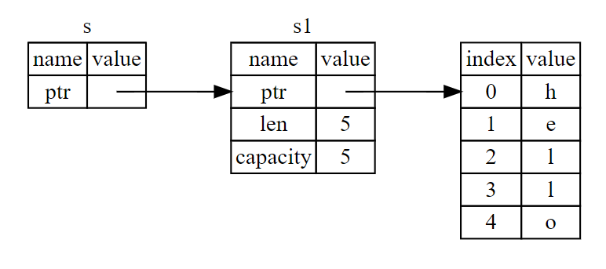

所有权，是 Rust 的核心功能之一，是垃圾回收机制外另一种控制内存回收的机制。通常，在低级语言中，内存通常需要手动释放，如 C 语言；在高级语言中，内存使用垃圾回收机制自动回收；而 Rust 则是第三种。

## 所有权

所有权，指的是变量值的所有权，变量值被赋值给了谁谁就拿到其所有权。通常针对的是，像字符串这样存储在堆上面的复杂类型变量，对于整数这样的简单类型变量没什么影响。

但当一个变量被赋值给另一个变量时，我们通常会说这是浅复制，但在 Rust 中称为移动所有权。

```rust
fn main() {
  let x = String::from("hello");
  let y = x;
  // 在这里无法访问 x

  let a = 1;
  let b = a;
  // 在这里可以访问 a
}
```

所有权也可以跨作用域传递，如下：

```rust
fn main() {
  let msg = String::from("hello");
  say(msg);
  // 这里无法访问 s
}

fn say(message: String) {
  println!("{}", message);
}
```

上面的代码中，我们创建了变量 `msg`, 然后传入 `say` 函数中。此时， `msg` 已将所有权移交给 `message`，`msg` 变得不再有效，而 `message` 则会随着 `say` 函数的结束而销毁。

## 克隆

如果我们想深克隆堆上的数据，可以使用 `clone` 函数，如下：

```rust
let s1 = String::from("hello");
let s2 = s1.clone();

println!("s1 = {}, s2 = {}", s1, s2);
```

## 引用

如果我们只想修改变量的值，而不移交所有权，可以只传入引用地址，允许其使用变量值但不移交所有权，如下：

```rust
fn main() {
  let s1 = String::from("hello");
  let len = calculate_length(&s1);

  println!("The length of '{}' is {}.", s1, len);
}

fn calculate_length(s: &String) -> usize {
  s.len()
}
```

变量指向如下图：



正如变量默认是不可改变的，引用的值默认也不允许改变，但可以将其声明为可修改，如下：

```rust
fn main() {
  let mut s = String::from("hello");
  change(&mut s);
  println!("{s}")
}

fn change(some_string: &mut String) {
  some_string.push_str(", world");
}
```

注意：同一时间可变引用只能创建一个，但可以分作用域创建，只要相互不影响就行。

## 借用

顾名思义，借来使用，只有使用权没有修改权，也就是定义一个不可变引用。定义不可变引用后，在其失效前不能再定义可变应用，如下：

```rust
let mut x = String::from("hello")

// 以下不可行
let y = &x;
let z = &mut x;
println!("{y}");

// 以下可行
let y = &x;
println!("{y}");
let z = &mut x;
```

## 结语
