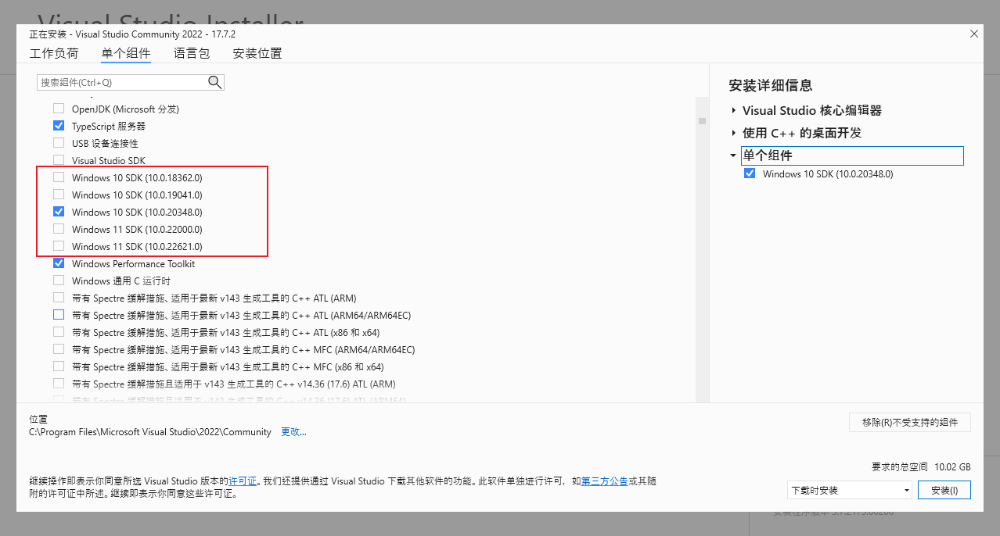
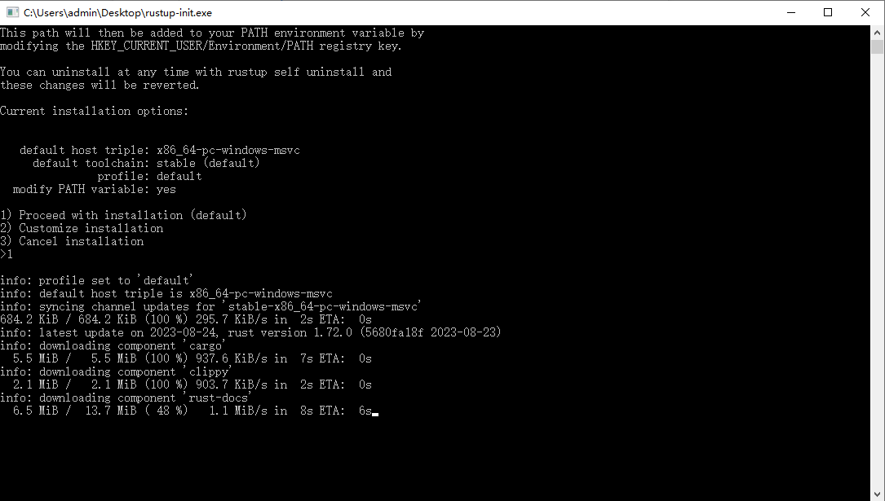
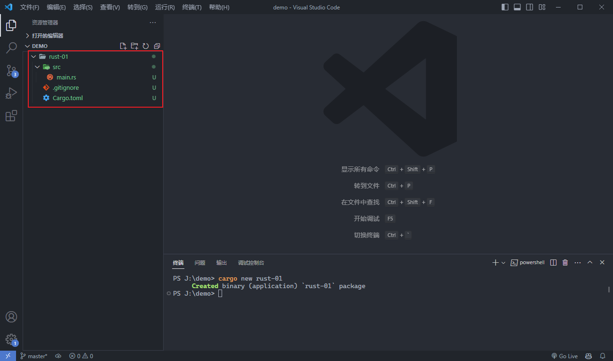

Rust 是一门内存安全的语言。

## 安装 Rust

在不同操作系统上，安装的方式和步骤略有差异，这里以 Windows 操作系统为例。在 Windows 上，Rust 的安装分为两部分：c++依赖的安装，rustup 的安装。

### 安装 C++ 依赖

Rust 部分功能依赖于 c++，因此需要提前安装相关依赖，最便捷的办法就是通过 VS 安装。

1. 通过 [官网](https://visualstudio.microsoft.com/zh-hans/downloads/) 下载 VS 社区版并安装。


2. 选择 `使用C++的桌面开发` 选项


3. 选择对应操作系统的开发组件



4. 选择英文语言包及其他语言包


点击 `安装` 等待下载和安装，我所选的依赖有 2G+大小，网络不好的话得等好一会儿。

### 安装 Rustup

Rust 的安装有[很多方式](https://forge.rust-lang.org/infra/other-installation-methods.html)，这里以官方推荐的 Rustup 为例，Rustup 是 Rust 的版本管理和命令行工具。

1. 通过 [官网](https://www.rust-lang.org/tools/install) 下载 Rustup 并安装。


2. 选择默认方式即可，等待依赖下载和安装.



3. 安装完重新打开命令行，输入 `rustc --version` 应该有输出，代表安装成功。


至此，Rust 安装已完成。

## 编译和执行

Rust 是一门编译型语言，需要先编译再运行。接下来写个小示例看看，请上最经典的 `hello, world`。

1. 在任意目录下，新建 `main.rs` 文件

```rust
fn main() {
  println!("Hello, world!")
}
```

以上代码中：

- `fn` 是 function 的缩写，表示声明一个函数
- `main` 是函数名，当名字为 main 时作为命令行程序的入口
- `println` 用于打印带换行符的字符串，`!` 表示这是个编译宏。

2. 运行 `rustc ./main.ts` 命令，然后你应该能看到当前目录下多出两个文件：`main.exe` 和 `main.pdb`


其中：

- `rustc` 是 Rust 的编译命令，类似于 `javac`，其中的 `c` 是 compile 的缩写，这个命令是跟随 `rustup` 安装的。
- `.exe` 是 Windows 平台下可执行文件的后缀名
- `.pdb` 是一个包含调试信息的文件

3. 运行 `./main.exe` 命令，不出意外的话能看到如下的输出


## 包管理工具

类似于 NodeJS 有 npm 工具，Rust 也有自己的包管理工具：`cargo`。别人写好并发布出来的代码包，通常叫第三方库，但在不同语言间也有不同叫法。例如，在 NodeJS 中第三方库称为 `package`，而在 Rust 中称为 `crate`。

接下来，写个小项目感受下：系统生成一个随机数，我们输入一个数，然后系统会提示我们大了、小了还是相等。在生成随机数时，会用到一个叫 `rand` 的第三方库(crate)

1. 运行 `cargo new <name>` 命令，此时会生成如下的目录和文件



其中：

- `cargo` 是 Rust 的包管理工具，同时也是构建工具，随 `rustup` 安装
- `Cargo.toml` 是 Cargo 的配置文件，类似于 NodeJS 中的 package.json 文件
- `src/main.rs` 是 Cargo 项目的入口

2. 打开 `Cargo.toml` 文件，添加 rand 依赖

```toml
#...

[dependencies]
rand = "0.8.5"

#...
```

3. 打开 `src/main.rs` 文件，编写我们的代码

```rust
use std::io;
use rand::Rng;

fn main() {
    println!("欢迎来到猜数游戏");

    let secret_number = rand::thread_rng().gen_range(1..=100);

    println!("请输入你的猜数：");

    let mut guess = String::new();

    io::stdin()
        .read_line(&mut guess)
        .expect("Failed to read line");

    match guess.cmp(&secret_number) {
        Ordering::Less => println!("小了"),
        Ordering::Greater => println!("大了"),
        Ordering::Equal => println!("相等"),
    }
}
```

上面的代码，涉及的语法有点多，我们来慢慢看下:

首先是顶部的声明：

```rust
use std:io
```

- `use` 表示使用某个模块，类似于 NodeJS 的 `import xx from xx`语法
- `std` 表示内置的标准库，std 是 standard 的缩写
- `::` 表示子成员，在对象上表示其静态成员
- `io` 是输出输出相关的库，io 是 input/output 的缩写

接下来是：

```rust
let secret_number = rand::thread_rng().gen_range(1..=100);
let mut guess = String::new();
```

- `let` 用于声明一个变量
- `1..=100` 表示一个范围
- `mut` 表示该变量可修改(默认不可修改)，mut 是 mutable 的缩写

再接下来是

```rust
io::stdin().read_line(&mut guess).expect("Failed to read line");
```

- `&` 表示对某个变量的引用地址
- `&mut` 表示传入一个可修改的变量
- `expect` 用于捕获异常

最后是

```rust
match guess.cmp(&secret_number) {
  Ordering::Less => println!("小了"),
  Ordering::Greater => println!("大了"),
  Ordering::Equal => println!("相等"),
}
```

- `match` 用于匹配某个值，类似于 switch 语法
- `cmp` 用于比对两个值，返回一个枚举(即 Ordering)。cmp 是 compare 的缩写
- `Ordering` 是一个枚举值，Less/Greater/Equal 都是其成员
