[Web Scraper](https://chromewebstore.google.com/detail/jnhgnonknehpejjnehehllkliplmbmhn) 是一个浏览器扩展，用于从页面中提取数据(网页爬虫)。对于简单或偶然的需求非常有用，例如正在写代码缺少一些示例数据，使用此插件可以很快从类似的网站提取内容作为模拟数据。从 Chrome 的插件市场安装后，页面 F12 打开开发者工具会多出一个名 Web Scraper 的面板，接下来以此作为开始。

## 快速上手

写个例子：提取百度首页底部几个导航按钮的文字，了解下 Web Scraper 是如何工作。

### 创建任务

创建任务，即创建 SiteMap(这词不常用，还是用我们熟悉的词吧，意思大致一样就行)。打开 [百度首页](https://baidu.com)，再打开开发者面板如下操作，其中URL可以使用特殊语法，这个后面再谈。

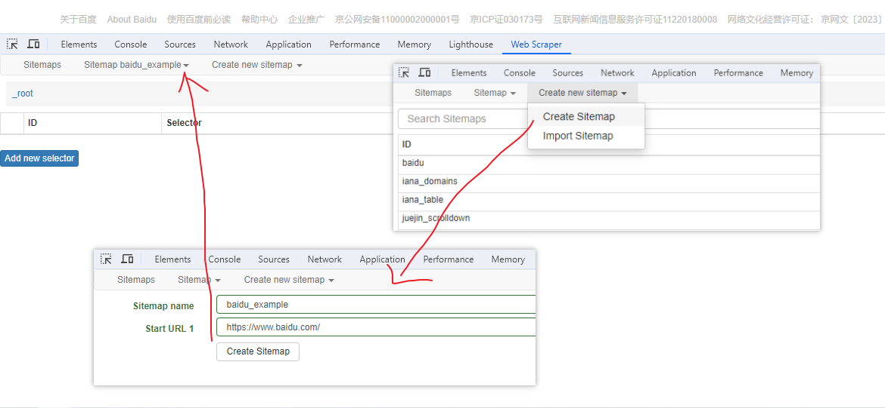

### 选择内容

使用选择器，选择网页中的内容，我们此次只提取文本，如下。值得注意的是，插件的选择不一定准确，有时需要手动调整。

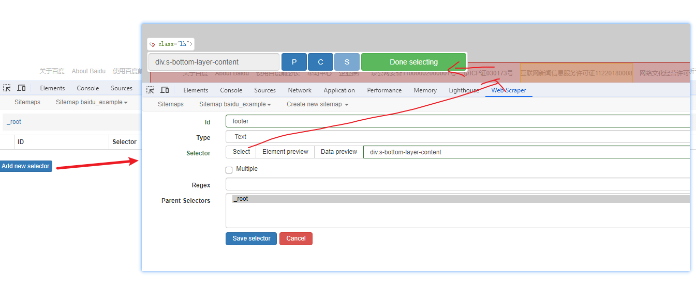

### 开始抓取

抓取时有 2 个参数，一个是指定页面加载多少毫秒后开始抓取，如果数据是ajax返回的话需要注意这点；另一个是请求间隔，如果页面跳转到新地址会用到这个。

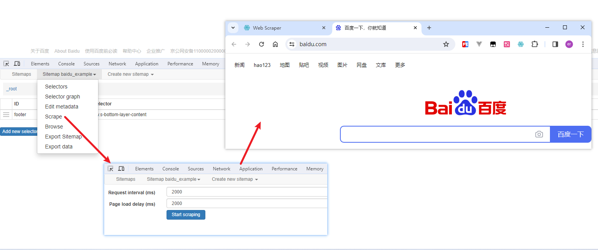

### 浏览数据

抓取完肯定要确认数据是否正确，格式不正确需要重新调整选择器，浏览数据的步骤如下：

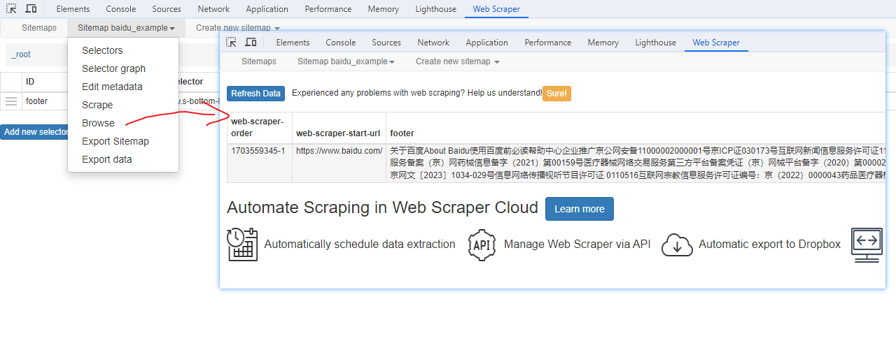

### 保存数据

确认无误后，就可以进行保存(如下)。目前只能导出 excel 或 csv 格式，json 需要充值(会员)，不过也不是啥大问题，随便找个在线网站转一下就行。

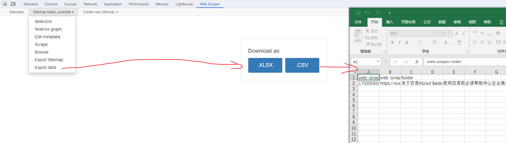

### 小结

以上，就是 Web Scraper 的主要使用流程：创建-选择-抓取-浏览-保存。对于不懂编程的非常友好，对于程序员也算是一个不错的工具。接下来，介绍下选择器的分类和使用示例。

## URL语法

抓取的URL支持特殊语法，如果页面分页体现在URL上的话还是非常有用的。如下：

```
https//a.com/pages/[001-100:10]
```

其中，其中 001-100 为起始值和终点值，001 表示始终添加前缀 0，而 10 表示每次叠加的值(默认1)，效果类似于 for 循环，如下：

```ts
for(let i = 1; i <= 100; i += 10) {
  // ...
}
```

## 选择器

Scraper 的选择器类似于 CSS 选择器，但添加有额外功能，例如只提取文本，只提取属性，分页加载和子页加载等。

### 文本选择器

提取文本，相当于 innerText 的值，以 [百度首页](https://baidu.com) 为例， 如下：

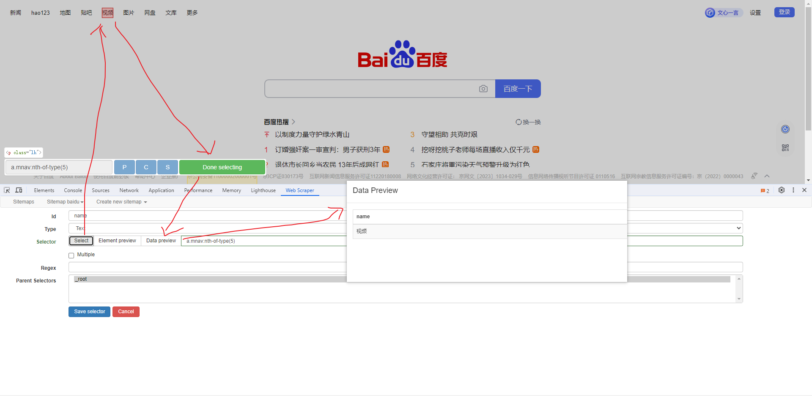

### 图片选择器

提取图片地址，以 [百度首页](https://baidu.com) 为例， 如下：

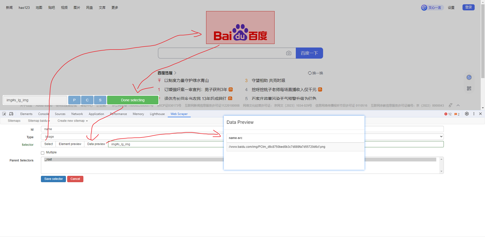

### 表格选择器

提取表格数据，以 [IANA的域名列表](https://www.iana.org/domains/root/db) 为例，如下：

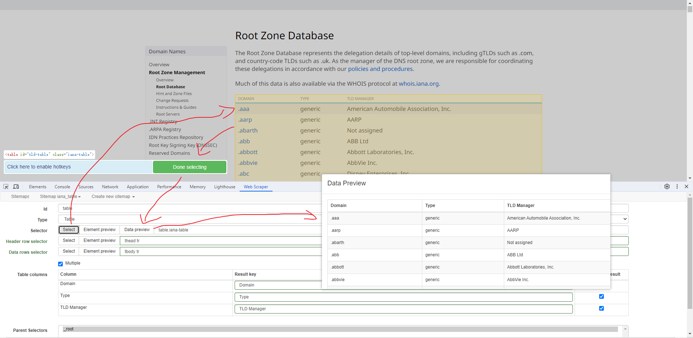

### 链接选择器

提取链接名字和地址，以 [百度首页](https://baidu.com) 为例， 如下：

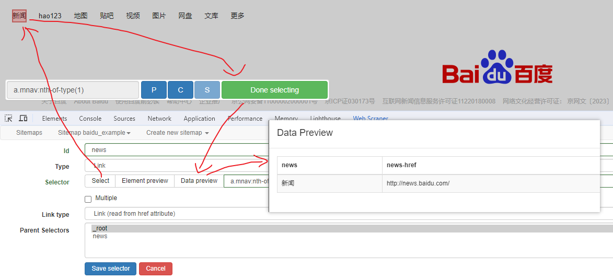

### 属性选择器

提取属性值，以 [百度首页](https://baidu.com) 为例， 如下：

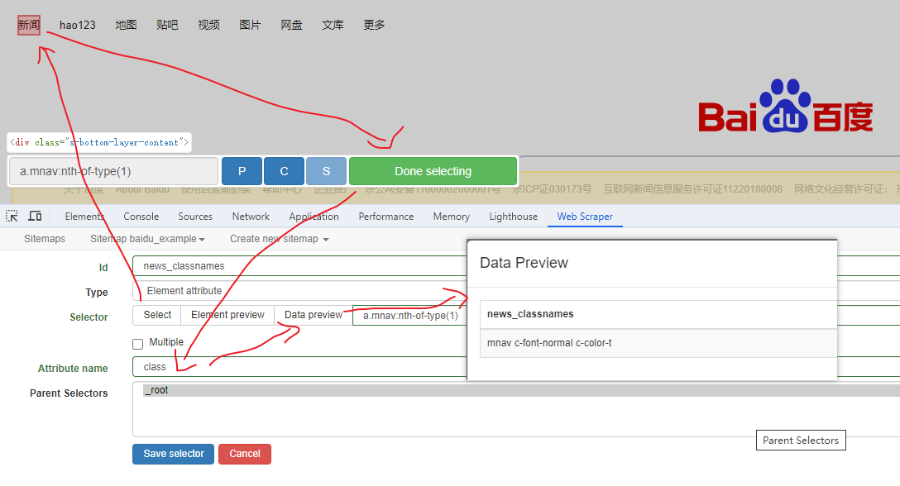

### HTML选择器

提取HTML代码(即innerHTML)，以 [百度首页](https://baidu.com) 为例， 如下：

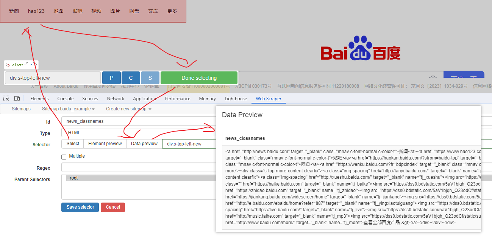

### 元素选择器

提取元素，实际是个分组功能。例如，有个列表，每个子项都有名字、链接地址等属性，元素就是包裹这些属性的盒子，可以理解 JS 中的对象。以 [百度首页](https://baidu.com) 为例，首先创建一个元素选择器：

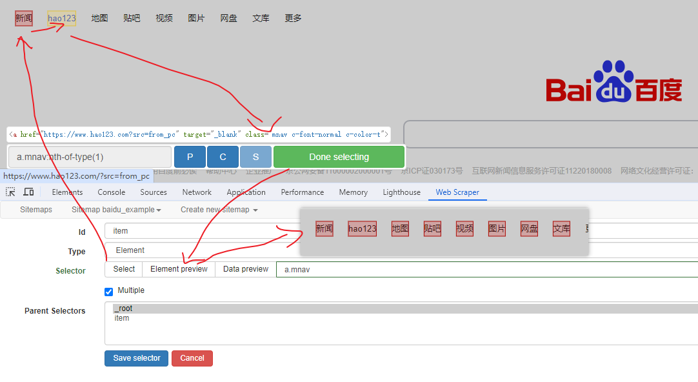

以上只是选择元素，还没有选择里面的内容，接下来选择里面的内容：

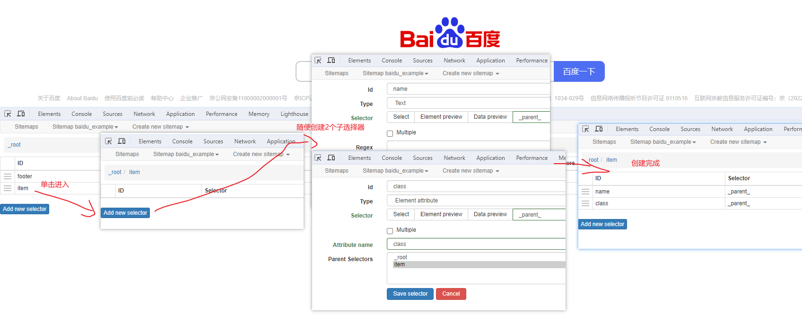

元素和子选择器创建好就可以了，以下是预览到的数据：

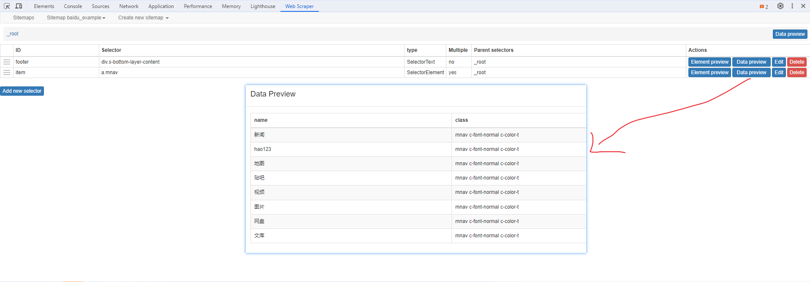

### 元素滚动选择器

一种特殊的元素选择器，附带滚动功能，适用于滚动加载数据的页面。当页面当前内容抓取完毕后，会自动滚动到底部，等待新的数据加载，然后按前面步骤抓取。以 [掘金首页](https://juejin.cn/) 为例，如下会抓取50条数据：

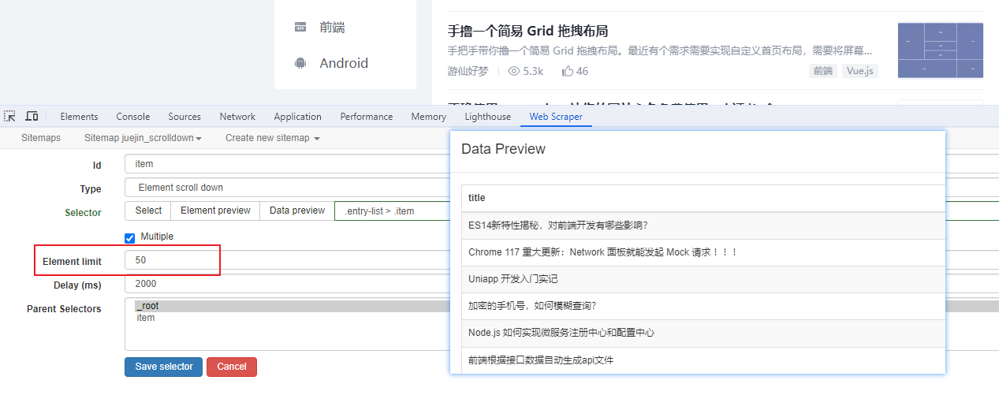

### 元素点击选择器

另一种特殊的元素选择器，附带点击加载的功能，适用于点击按钮加载更多的页面。当页面当前内容抓取完毕后，会自动点击特定按钮，等待新的数据加载，然后按前面步骤抓取。以 [博客园WEB分类页](https://www.cnblogs.com/cate/web/#p2) 为例，如下：

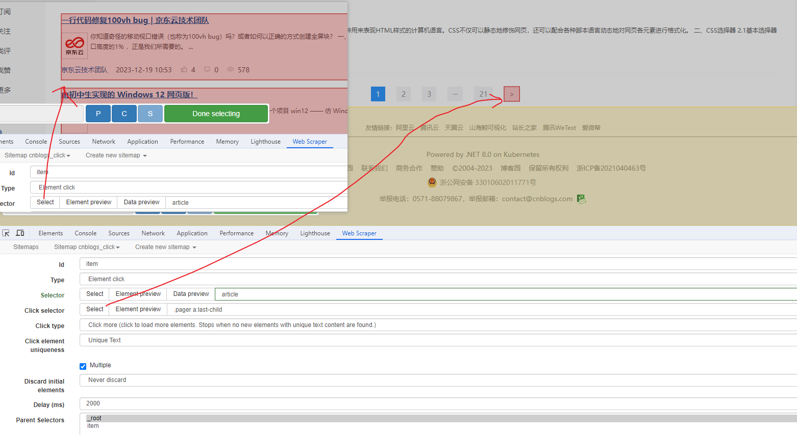

### 分组选择器

相比于元素选择器会平铺成多个属性，分组会把数据序列化只赋值给 1 个属性，如下：

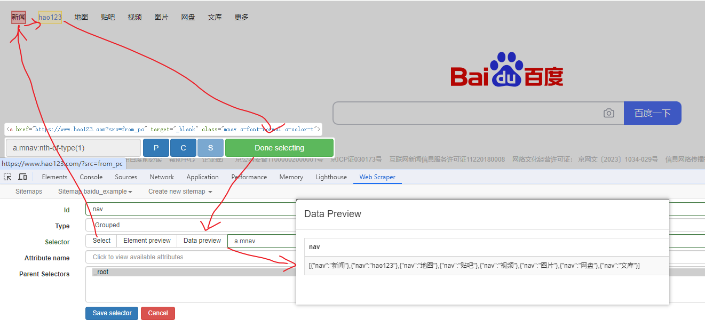

### 分页选择器

分页查询数据，支持多种类型，比元素滚动选择器、元素点击选择器更强大。值得注意的是，子选择器需放在分页选择器内部。以 [博客园WEB分页](https://www.cnblogs.com/cate/web/#p2) 为例，模拟上面元素点击选择器的效果，如下：

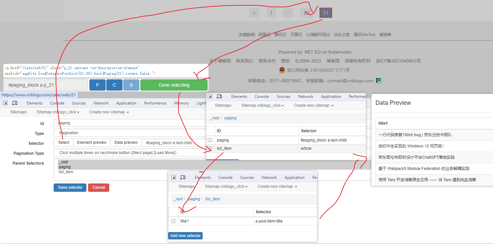

### 站点地图选择器

这几个比较简单，输入 sitemap.xml 的地址即可，如下：

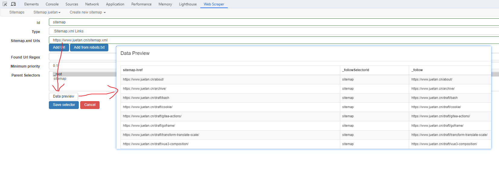

## 结语

官方文档给的示例其实不是很多，还是要靠实践慢慢摸索，但总的来说还是非常实用的一个插件。对于非专业人员来说，是个非常有用的工具。