之前写过一篇搭建CI/CD系统的文章，技术栈与标题所述差不多，但最近查看 Gitea 文档时发现更新一个名为 Gitea Actions 的功能，略作了解后发现与 Github Actions 是类似的东西，且可以直接使用复用 Github Actions 的配置，于是兴趣满满地实践了一番并有了这篇文章。

先说下为什么是这套技术栈，可能很多人会想到用 Gitlab/Jenkins 之类的工具来实现，对于企业级管理来说没问题，但上手配置却是不低。以 Gitlab 为例，动辄 4G 的起步运行内存，加上 CI/CD 等额外的运行内存，足以劝退很多人。

选择 Gitea 是因为运行内存很低(Go 语言写的)，标题中所有工具+CI/CD任务运行在一个 2 核 4 G的腾讯云服务器完全没问题，对于个人实践来说是非常具有性价比的，且可以接触到 Github Actions 的相关内容，并反过来在 Github Actions 上实践和应用。

## 目标

一句话概括就是：提交代码自动部署。以前端为例，本地运行 git push 命令后，几分钟后可以访问到最新页面，免去手动构建/部署等繁琐的工作。主要流程如下：

- 本地提交代码到 Gitea 仓库后，Gitea 自动调度 Runner 执行任务。
- Runner(运行器)拉取代码，设置环境(例如NodeJS环境)，安装依赖，构建产物
- Runner(运行器)以产物构建docker镜像，推送到私有仓库，并远程到部署服务器执行更新脚本

## 技术栈

以容器形式部署，可视化管理。主要包含以下技术栈：

### Docker

一个开源的容器平台，可以将程序及依赖打包到一个轻量级、可移植的容器中运行。内置有 Swarm 集群模式，可以理解为 K8S 的简单版(官方实现)，可以同时管理和调度多台服务器上的资源。

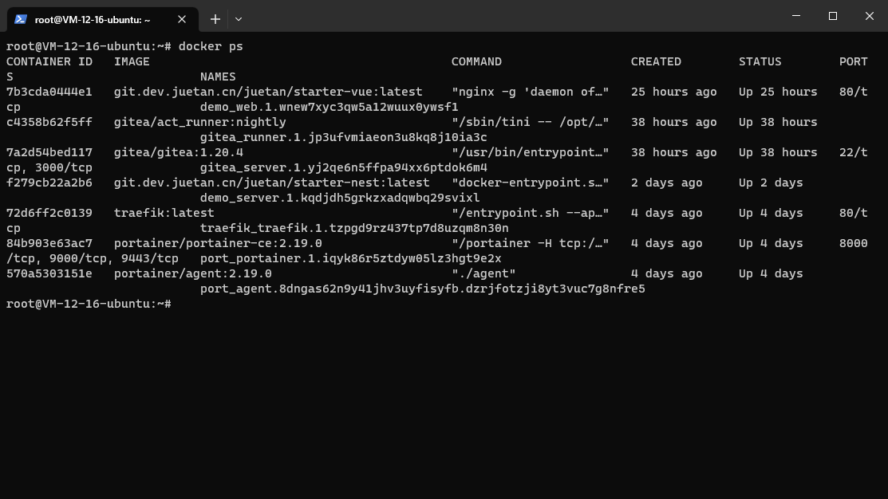

### Portainer

一个可视化的docker容器管理工具，手动管理 docker 是非常麻烦的，通过 portainer 可以很方便地管理容器/镜像/网络/数据卷等内容，且支持 docker swarm 模式。

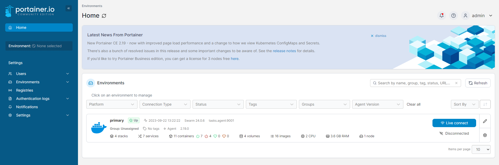

### Traefik

一个类似于 nginx 但更适用于容器的反向代理工具，支持域名和证书的动态配置，同时支持 docker swarm 模式。

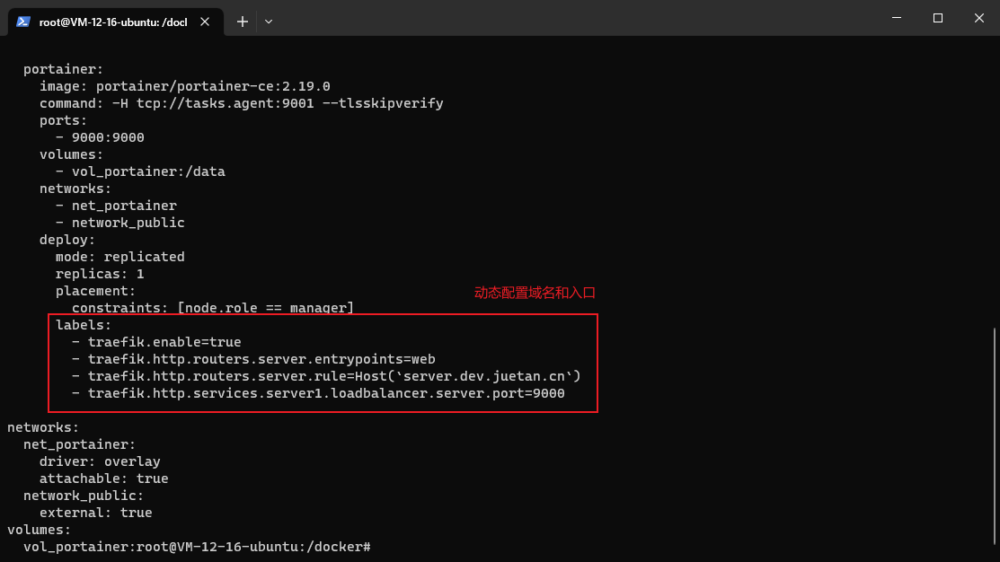

### Gitea

一个git 管理平台，有两个很关键地功能：Gitea Actions 可以让我们运行等价于 Github Actions地自动化任务，例如构建产物/构建镜像等；软件包可以让我们管理上传内容，例如npm包，docker镜像等。

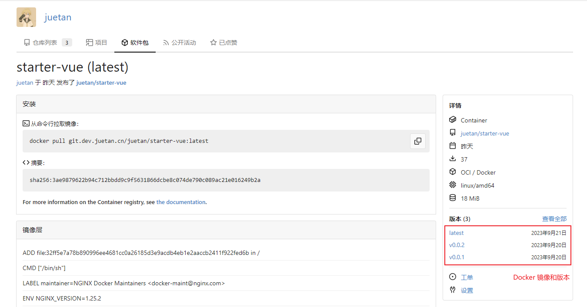

## 准备工作

简单概括为：你需要一台服务器和一个域名。尽管可以在本地实现，但建议在云服务器上实践，主要是因为云服务有独立IP，可以配置域名区分访问和管理。

### 云服务器

推荐 2核4G 配置，理论上 1核2G 也能勉强跑得动。以我个人为例，我这里选择的是腾讯云、带容器镜像的 ubuntu 系统，后续将不再描述 docker 的描述。

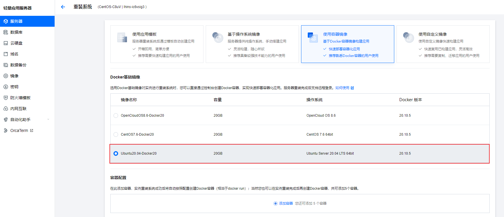

### 域名解析

登陆你的域名管理平台，解析名为 *.dev 的 A 记录到你的云服务器IP上，以我个人为例如下。注意：如果域名解析的是国内服务器那么域名是要备案的，备案内容自行查阅这里不再描述。

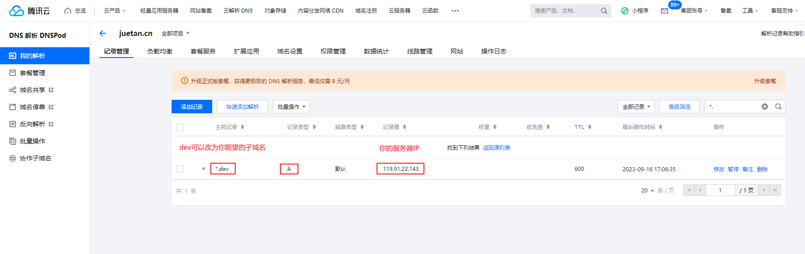

## 安装Portainer

登陆你的服务器，可以使用云服务商提供的 web 面板登陆，或者配置SSH以及使用 VS Code 插件进行远程等，总而言之方法比较多此处不做过多描述具体查看相关文档。

### 启用集群模式

 执行 docker swarm init 命令启用 swarm 模式，会输出加入令牌和加入命令，只有单台服务器的话可以忽略这些输出。

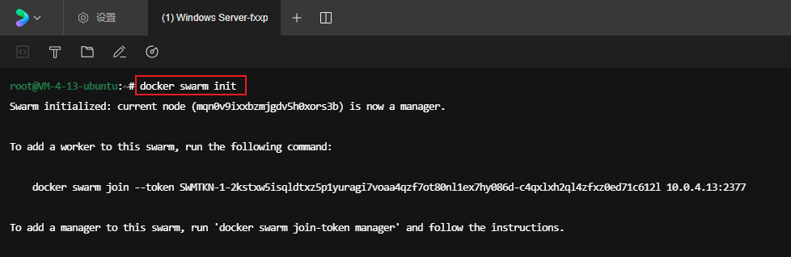

### 创建公共网络

执行 docker network create -d overlay public 命令创建一个名为 public 的公共网络，其中 overlay 类型可以让我们与其他服务器的容器在一个内部网络内通信。

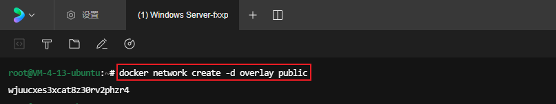

### 创建数据卷

执行 docker volume create portainer 命令创建一个名为 portainer 的数据卷，保存你在运行 portainer 时产生的数据，避免容器重启后数据丢失的问题。

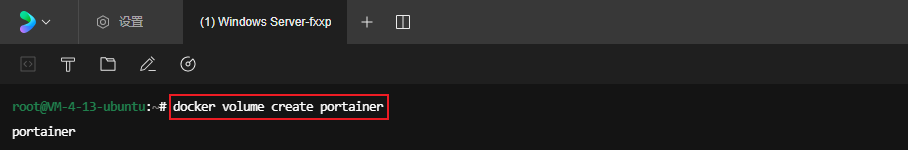

### 编写配置文件

新建 /docker/portainer.yaml 文件，编写 portainer 配置并保存。说明：包含一个主服务和若干个子服务，其中子服务会在每台服务器上都安装，并通过主服务管理。

```yaml
version: '3.2'

services:
  agent:
    image: portainer/agent:2.19.0
    volumes:
      - /var/run/docker.sock:/var/run/docker.sock
      - /var/lib/docker/volumes:/var/lib/docker/volumes
    networks:
      - public
    deploy:
      mode: global
      placement:
        constraints: [node.platform.os == linux]

  core:
    image: portainer/portainer-ce:2.19.0
    command: -H tcp://tasks.agent:9001 --tlsskipverify
    volumes:
      - portainer:/data
    networks:
      - public
    ports:
      - 9000:9000
    deploy:
      mode: replicated
      replicas: 1
      placement:
        constraints: [node.role == manager]
      labels:
        - traefik.enable=true
        - traefik.http.routers.server.entrypoints=web
        - traefik.http.routers.server.rule=Host(`docker.dev.juetan.cn`)
        - traefik.http.services.server1.loadbalancer.server.port=9000

networks:
  public:
    external: true

volumes:
  portainer:
    external: true

```

### 启动服务

执行 docker stack deploy -c /docker/portainer.yaml portainer 命令启动服务，其中使用 -c 指定配置文件的位置，最后的 portainer 为名字。

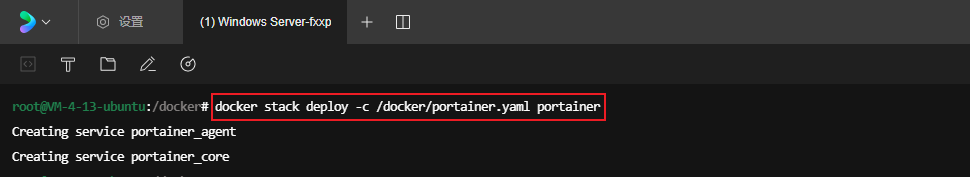

### 访问页面

在浏览器输入 http://ip:9000 并回车，页面中是以下安装页面即代表安装成功。注意：尽快安装完，否则2分钟后 Portainer 会出于安全考虑禁止安装，那时便要重启才能再操作。

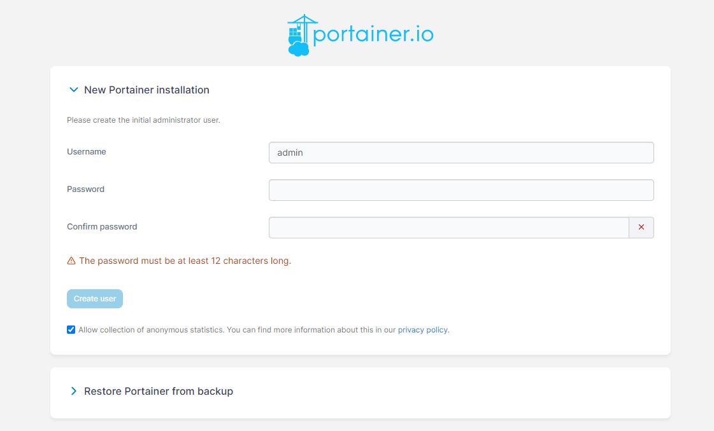

## 安装Traefik和Gitea

安装完 Portainer 后，我们就可以在管理面板中进行操作而不用不停地敲命令执行。现在，登陆你的 Portainer 面板，接下来的操作都将在这里进行，你甚至不用登陆服务器敲命令。

### 创建数据卷

进入 Volumes 面板，分别创建 gitea 和 gitea_runner 数据卷，用于保存 gitea 和 gitea runner 在运行时产生的数据，创建时其他配置保持默认即可。

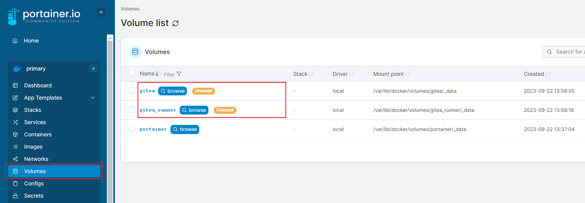

### 添加配置

进入 Stacks 面板，新建名为 core 的 Stack 并编写如下配置(具体请根据自身情况修改)，配置包含 3 个部分：Traefik + Gitea + Gitea Runner。

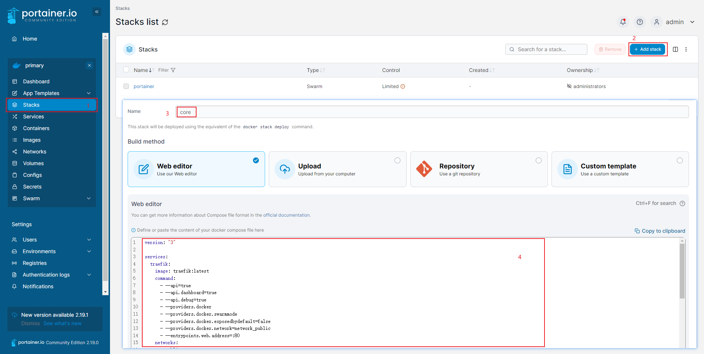

配置如下，注意注释的内容，我们尚未登陆 Gitea 没有注册令牌所以暂时留空。

```yaml
version: "3"

services:
  traefik:
    image: traefik:latest
    command:
      - --api
      - --api.debug
      - --api.dashboard
      - --providers.docker
      - --providers.docker.swarmmode
      - --providers.docker.exposedbydefault=false
      - --providers.docker.network=public
      - --entrypoints.web.address=:80
    networks:
      - public
    ports:
      - 80:80
      - 443:443
    volumes:
      - /var/run/docker.sock:/var/run/docker.sock
    deploy:
      mode: replicated
      replicas: 1
      placement:
        constraints: [node.role == manager]
      labels:
        - traefik.enable=true
        - traefik.http.routers.dashboard.rule=Host(`router.dev.juetan.cn`)
        - traefik.http.routers.dashboard.entrypoints=web
        - traefik.http.routers.dashboard.service=api@internal
        - traefik.http.services.api@internal.loadbalancer.server.port=8080

  gitea:
    image: gitea/gitea:1.20.4
    restart: always
    networks:
      - public
    volumes:
      - gitea:/data
    deploy:
      mode: replicated
      replicas: 1
      placement:
        constraints: [node.role == manager]
      labels:
        - traefik.enable=true
        - traefik.http.routers.gitea.rule=Host(`git.dev.juetan.cn`)
        - traefik.http.routers.gitea.entrypoints=web
        - traefik.http.services.gitea1.loadbalancer.server.port=3000

  runner:
    image: gitea/act_runner:nightly
    restart: always
    depends_on:
      - gitea
    # environment:
    #   - GITEA_INSTANCE_URL=http://git.dev.juetan.cn/
    #   - GITEA_RUNNER_REGISTRATION_TOKEN=MjSd8azK2819F8Wb4sNmZYp3FhuDBXUeVYkQb1Jy
    networks:
      - public
    volumes:
      - gitea_runner:/data
      - /var/run/docker.sock:/var/run//docker.sock
    deploy:
      mode: replicated
      replicas: 1
      placement:
        constraints: [node.role == manager]

volumes:
  gitea:
    external: true
  gitea_runner:
    external: true

networks:
  public:
    external: true
```

### 部署服务

点击底部的 Deploy the action 按钮，稍等片刻便可以从列表中点进去查看运行状态。如果出现异常，可点击查看具体运行日志，或返回去检查下语法或配置有没有问题。

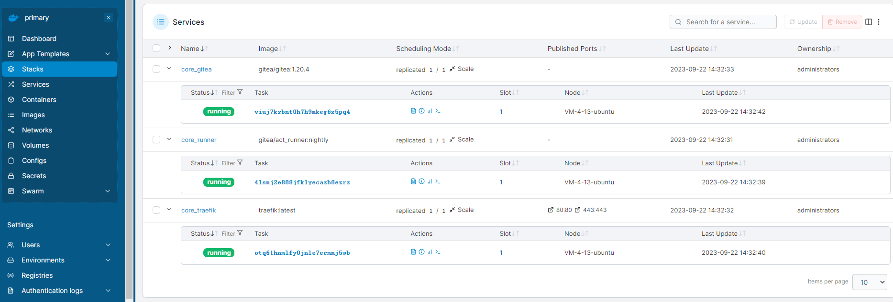

## 配置Gitea Actions

目前 Gitea Actions 还在开发中，默认情况下 Actions 是禁用的，使用上还是需要手动开启。官方文档上介绍有点杂，接下来以我们目前的状态快速配置以下。

### 进入容器

在 Portainer 面板中，提供有进入容器中执行命令的功能，对于日常操作非常方便。当然，对于复杂的修改还是通过直接操作数据卷更方便。在 Portainer 中进入容器步骤如下：

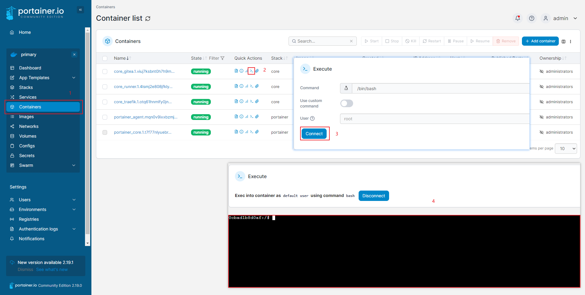

### 添加配置

修改 /data/gitea/conf/app.ini 文件，在文件末尾添加以下配置以启用 Actions 功能。保存并退出后，此时功能尚未生效，还需要到 Services 面板进行重启。

```ini
[actions]
ENABLED=true
```

### 修改Stack配置

TODO

### 跑个示例

TODO

## 使用Gitea事项

TODO

### 访问Github满

TODO

### 镜像问题

TODO

## 结语

TODO