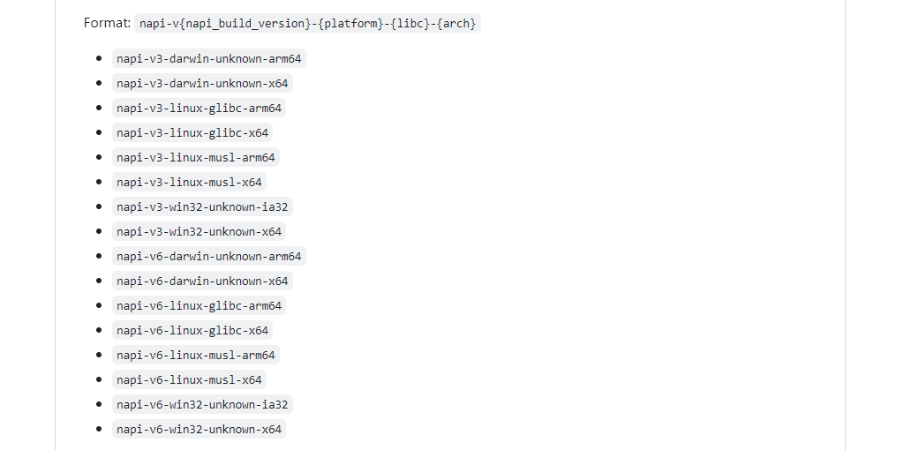
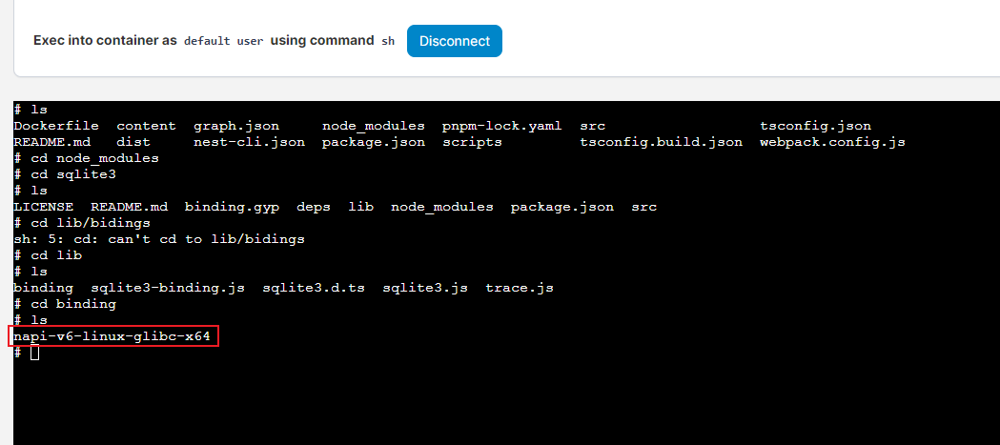
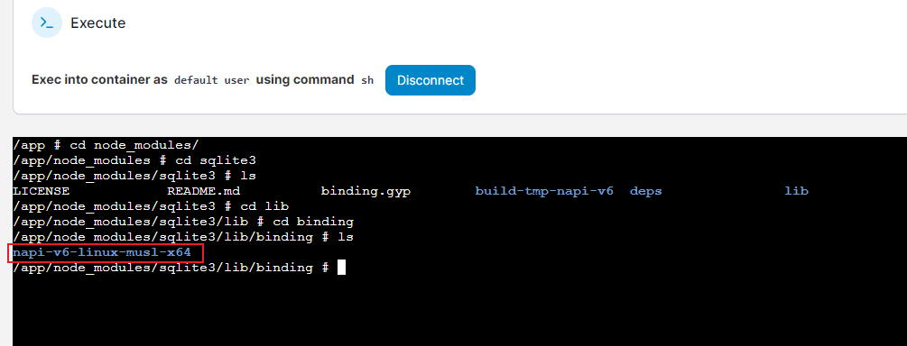
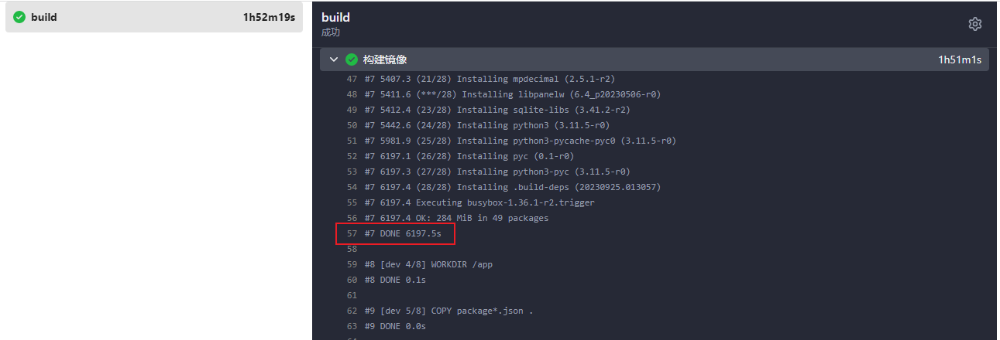
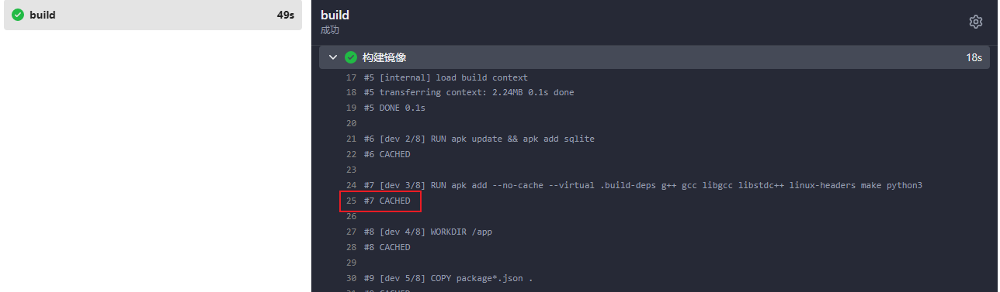
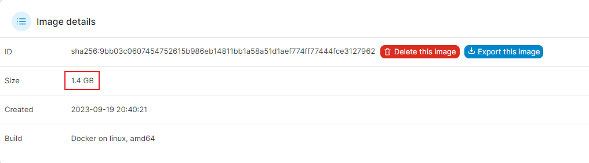
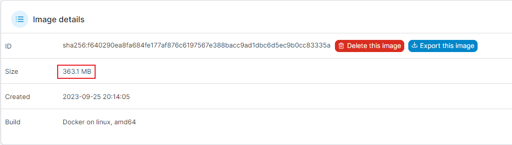

最近在部署 NestJS 容器时，发现基于 node:18 打包出来的镜像有 1G 多，于是抱着节省体积的想法，打算用 node:18-alpine 进行构建。不曾想，打包是成功了但运行时却报错 sqlite3 不存在。在摸索一番后，最终解决这个问题，在这里记录下。

## 问题探究

出问题后首先去查了下 sqlite3 的官方文档，发现 sqlite3 有个二进制依赖，但这个二进制是不随着包下载的，而是下载后包后，在本地打包成对应平台的二进制文件。猜测这样做的原因，是减少安装时的依赖，毕竟把每个操作系统对应的二进制编译文件都放在一起体积会非常大，官方给出的类型如下：



如此多的编译类型，果然还是单独编译比较划算。但编译需要 node-gyp 和 gcc 等依赖，哪个镜像有这些东西呢？

## 尝试多阶段构建

第一反应是 node:18 应该有这些依赖，不然体积不会如此大。于是想能不能使用多阶段构建进行处理，即构建阶段基于 node:18 镜像，而打包阶段使用 node:18-alpine 镜像，试了试最终也是失败告终。后来想了想，node:18 和 node:18-alpine 架构是不一样的，node:18 打包出来的依赖在 node:18-alpine 中不能用。这点后来也证实了，贴一下对比吧。

以下是 node:18 打包出来的镜像，可以看到 sqlite3 构建出来的二进制文件名是 napi-v6-linux-glibc-x64 。



以下是 node:18-alpine 打包出来的镜像，可以看到 sqlite3 构建出来的二进制文件名是 napi-v6-linux-musl-x64 。



以上，两个架构不同导致打包出来的二进制名也不同，不能兼容也在情理之中。

## 安装所需依赖

既然多阶段构建不行，那么只能在 node:18-alpine 安装所需的 gcc 等依赖，谷歌搜索一番后，最后找到安装方法，话不多说直接贴一下关键代码吧。

```dockerfile
FROM node:18-alpine As dev
RUN apk update && apk add sqlite
RUN apk add --no-cache --virtual .build-deps g++ gcc libgcc libstdc++ linux-headers make python3
# ...
RUN npm run build && npm prune --production

FROM node:18-alpine As build
COPY --from=dev /app/xxx ./

EXPOSE 3030
CMD [ "node", "./dist/main.js" ]
```

以上：第一阶段使用 node:18-alpine 作为基础镜像，安装 gcc 等依赖。值得注意的是，新版 alpine 应使用 python3 而不是 python 作为依赖名，后者在新版中找不到。打包完后，清除 node_modules 中不必要的开发依赖。第二阶段，则是单纯把第一阶段构建好的 dist 和 node_modules 等产物复制过来，这样最终的镜像就是非常精简的。

吐槽一下，国内服务器似乎也逃不过墙的命运，不光 Github 访问受限，连从 alpinelinux 下载依赖也受限，首次构建光这个阶段就足足耗费一个小时的时间(如下)。



不过还好 Docker 有缓存机制，第二次构建使用缓存很快就构建了(如下)。



## 前后体积对比

使用多阶段构建配合 alpine 镜像，效果还是非常理想的，接下来来对比下两者间的体积。

首先是使用 node:18 打包出来的镜像，基础镜像 1G 左右(大概?)，配合 node_modules 等未优化内容，体积是惊人的 1.4 G(如下)，看到的时候吓我一跳。



然后是使用 node:18-alpine 打包出来的镜像，基础镜像 60M 左右，加上 node_modules 等文件体积也才 300 多M，可以说是非常理想。



以上，合理使用镜像带来的效果非常不错。不过还是要吐槽下，这个镜像体积也不太小，普通的 vue 前端配合 nginx:alpine 打包出来也就 40M 左右，这 300M 属于大体积了。当然了，如果没有二进制和路径等其他要求，打包成单文件应用也是可以的，但这样容易产生其他问题。

## 结语

以上，使用带二进制依赖的包时，需要注意构建环境，不然即使打包成功也运行不起来。这里其实还有点，国内下载依赖由于神秘力量的原因通常都比较慢，可以配置镜像源进行加速，有兴趣的可以自行研究下，这里暂不做研究。