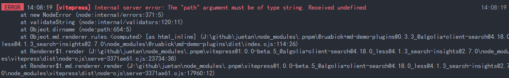
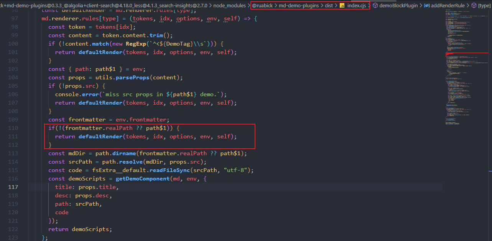
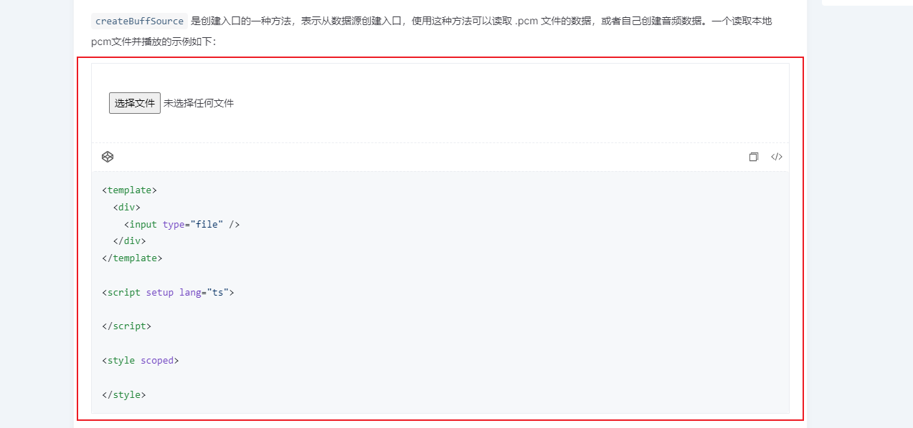
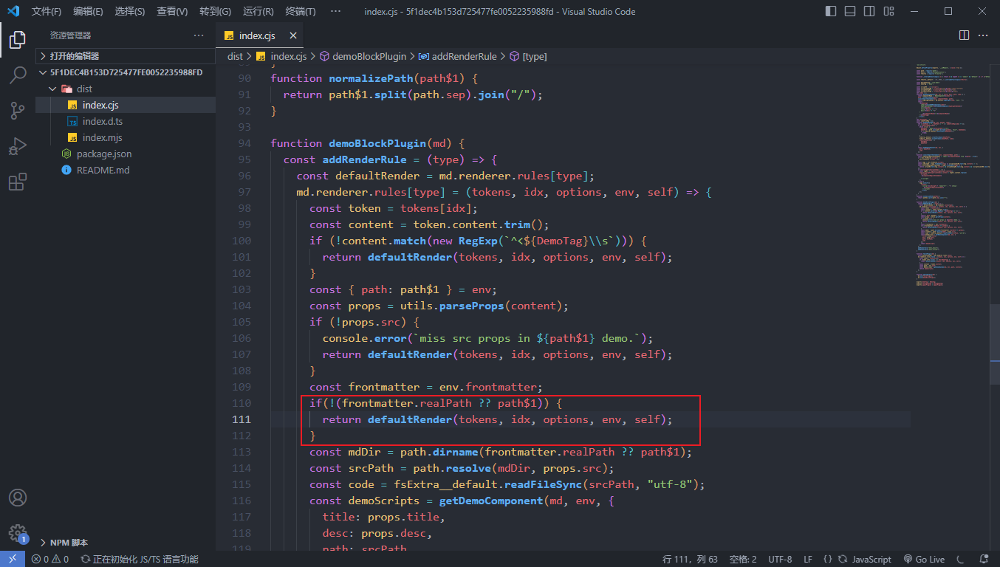
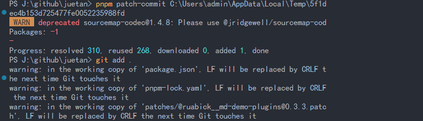
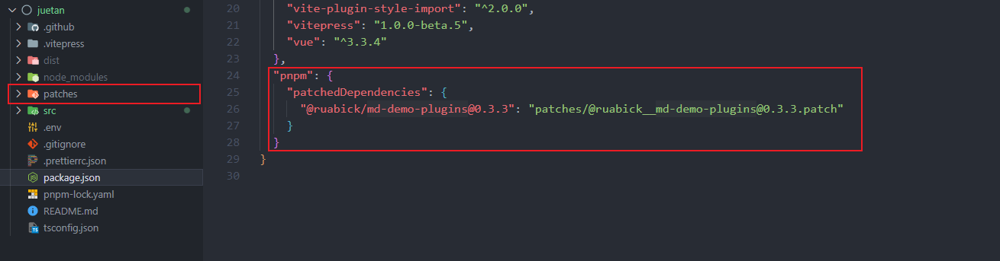

目前的博客需要一个能展示demo的功能，在调研一番后决定使用 [@ruabick/md-demo-plugins](https://github.com/dewfall123/ruabick) 插件。但安装后却报错如下：



## 问题修复

于是debug一番后，猜测 Vitepres 内部有部分调用里没有传路径参数，于是尝试修改包里面的代码如下：



清空缓存然后重新启动，顺利用上了，效果如下：



## 打上补丁

问题解决后在原 Github 仓库提了issue，但这是要部署上GitHub Pages的，还得给它打个补丁。于是，很自然想起了 pnpm 的一个功能：patch，这是类似 patch-package 库的一个功能，能够临时给第三方库打补丁。

1. 运行补丁命令

```bash
pnpm patch @ruabick/md-demo-plugins@0.3.3
```

结果如下：


2. 打开如上的链接，编辑并保存



3. 保存补丁，参数为第一步的路径

```bash
pnpm patch-commit C:\Users\admin\AppData\Local\Temp\5f1dec4b153d725477fe0052235988fd
```

执行结果：



最后，你应该能看见多出这两个东西



## 最后

如果你依赖的某个第三方库，因为BUG或版本滞后导致无法正常使用时，可以考虑自己解决并使用 `pnpm patch` 临时打个补丁。