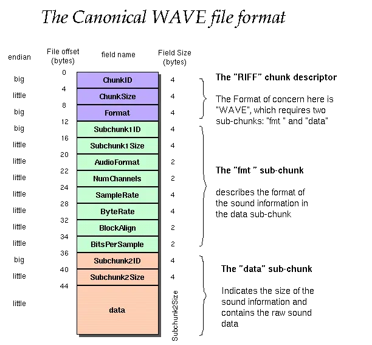

最近遇到了一个需求，使用电脑外接的话筒推流发广播，这里面涉及到了 Web RTC 的一些功能以及音频数据的处理。以前做过监听功能，接收 pcm 流并实时播放，因此对音频数据流略有了解，但如何从麦克风接流还不太了解。做了几天，最终完成了，这里简单回顾下并做个小 demo。

## 声音的采集

当我们说话时，录音设备是如何采集的呢？首先，录音设备根据声音产生震动采集到波形信号(即模拟信号)；然后，需要将模拟信息转为数字信号，常见的方法是 PCM（脉冲编码调制，Pulse-Code Modulation）。

在 PCM 转换中，有几个重要概念：

- 采样率，每秒采集多少个样本，常见的有 44.1KHz 即每秒钟采集 441000 个样本
- 位深，声音的高低，常见的有 16 位
- 声道，常见的有单声道、双声道

PCM 是一种编码格式，将模拟信号格式转换位数字信号格式，其他的编码格式还有 ACC-LC 、 ACC-LD 等。转换后的数据通常比较大，此时需要通过另一种编码格式将其压缩，这种编码格式也称为容器格式，常见的有 wav、MP3、ogg 等。其中，wav 是最简单的，只在 pcm 数据的前面加了 44 位字符。



## Audio API

除了常见的 `<audio>` 和 `<video>` 标签可以播放音频外，使用 JS 播放也是可以的。这里就涉及到了 Audio API，示例如下：

```ts
const audioContext = new AudioContext();

const source = audioContext.createBuffSource();

source.connect(audioContext.destination);
```

其中，`AudioContext` 是处理音频的上下文，通常可以包含任意多个入口节点，任意多个出口节点，中间可以包含任意多个处理节点，每个节点都可以使用 `connect` 方法连接到下一个节点。

### createBuffSource

`createBuffSource` 是创建入口节点的一种方法，表示手动创建数据，其属性 `buff` 为从容器格式解码后的 PCM 数据。举个例子，用户选择 .mp3 或 .wav 文件后，使用 Audio API 解码后得到 PCM 数据，此时赋值给 buff 属性就可以播放了，完全不需要 `<audio>` 标签，示例如下：

<demo src="./demo-createBufferSource.vue" ></demo>


### createMediaElementSource

这也是创建入口节点的一种方法，控制 `<audio>` 标签的播放，例如接入一个音量调节器：

<demo src="./demo-createMediaElement.vue" />

### createMediaStreamSource


创建入口节点的一种方法，表示从媒体流中获取数据，一个常见的例子是从麦克风/话筒获取音频流。