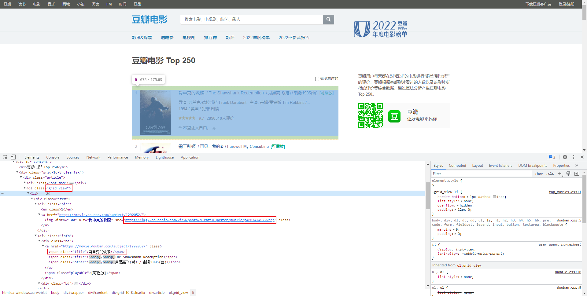
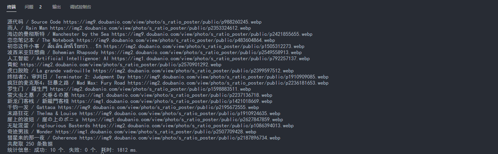

在做 [前端驿站](https://juetan.cn/nav) 这个导航网站时，收集到的每个网站都是有图标的，但部分网站由于某墙的原因，直接用源站图标URL会导致加载失败。谷歌一番后，最终用 [Crawlee](https://crawlee.dev/) 将所有图标都爬取回来了，直接打包到项目里，这里记录下这个库的一些基本用法。

今天实现一个小目标，爬取 [豆瓣电影 Top 250](https://movie.douban.com/top250) 的数据，页面如下：


最终整理成如下的 JSON 数据，并把图片也下载下来：

```json
[
  {
    "name": "xxx",
    "cover": "./xxx.png"
  }
  ...
]
```

## Crawlee

[Crawlee](https://crawlee.dev/) 是从 Apify 里面独立出来的爬虫模块，支持 Cheerio 、Puppeteer 和 Playwright 的无缝集成。内置支持的爬取类有：

- BasicCrawler：基类
- HttpCrawler：基于 [got](https://github.com/apify/got-scraping) 请求库，用于执行原生请求，例如下载图片。
- CheerioCrawler：基于 [Cheerio](https://github.com/cheeriojs/cheerio/wiki/Chinese-README) 库(类似于 JQuery 但可以在 NodeJS 中使用)，用于解析DOM获取链接、文字等内容。
- PuppeteerCrawler：基于 [Puppeteer](https://pptr.dev/) 库(谷歌出品)，通过协议操作无头浏览器，实现截图、点击按钮等复杂功能
- PlaywrightCrawler：基于 [Playwright](https://playwright.dev/) 库(类似 Puppeteer但倾向测试，微软出品)

我们的目标比较简单，因此使用 CheerioCrawler 和 HttpCrawler 就足够。

## 初始化新项目

1. 新建个项目

```bash
npm init -y
```

2. 安装 Crawlee

```bash
npm install crawlee
```

3. 在根目录下，新建 `./data/images` 目录、`./data/movies.json` 文件 和  `./index.js` 文件。

```ts
// index.js

// TODO
```

## 实现数据的爬取

首先分析下页面爬取的元素：



可编写代码如下：

```ts
import { CheerioCrawler, RequestList } from 'crawlee';

const run = async () => {
  const data = [];
  const urls = [];
  for (let i = 0; i < 10; i += 1) {
    urls.push(`https://movie.douban.com/top250?start=${i * 25}&filter=`);
  }
  const crawler = new CheerioCrawler({
    requestList: await RequestList.open('list', urls),
    async requestHandler({ $ }) {
      const $list = $('.grid_view');
      for (const item of $list.children().get()) {
        const $item = $(item);
        const cover = $item.find('.pic img').attr('src') || '';
        const title = $item.find('.hd .title').text();
        data.push({ cover, title });
      }
    },
  });
  const stat = await crawler.run();
  for (const item of data) {
    console.log(item.title, item.cover);
  }
  const { requestsFinished, requestsFailed, crawlerRuntimeMillis } = stat;
  console.log(`共爬取 ${data.length} 条数据`);
  console.log(`统计信息: 成功: ${requestsFinished} 个, 失败: ${requestsFailed} 个, 耗时: ${crawlerRuntimeMillis} ms.`);
};

run();
```

以上代码逻辑大致如下：

- 通过 ` RequestList.open()` 构建一个请求列表，这里我们根据目标URL的格式，构建了包含10个请求的列表。
- 通过 `new CheerioCrawler()` 构建一个爬取实例，requestList为请求列表，requestHandler为请求处理函数。
- 通过 `run()` 方法运行，返回统计信息

由于我们使用的是 CheerioCrawler，因此 requestHandler 的参数里有一个 `$` 参数(cheerio实例)，此时通过熟悉的JQuery调用方式，就能拿到所需的数据。不出意外的话，我们应该能得到如下的结果：



## 实现图片的爬取

以上拿到了图片地址，但还没有下载下来，接下来实现下载。

