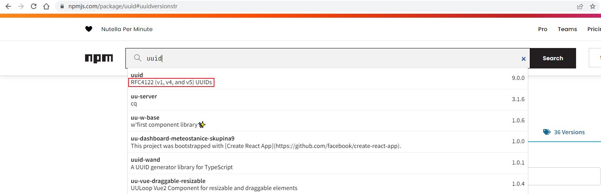
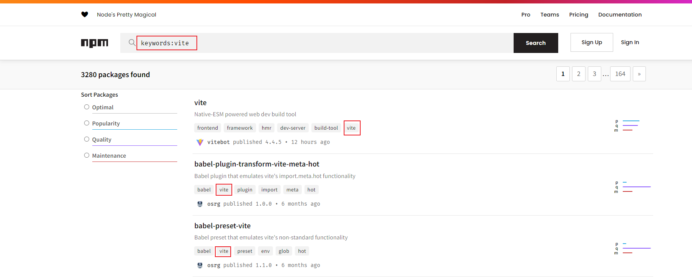
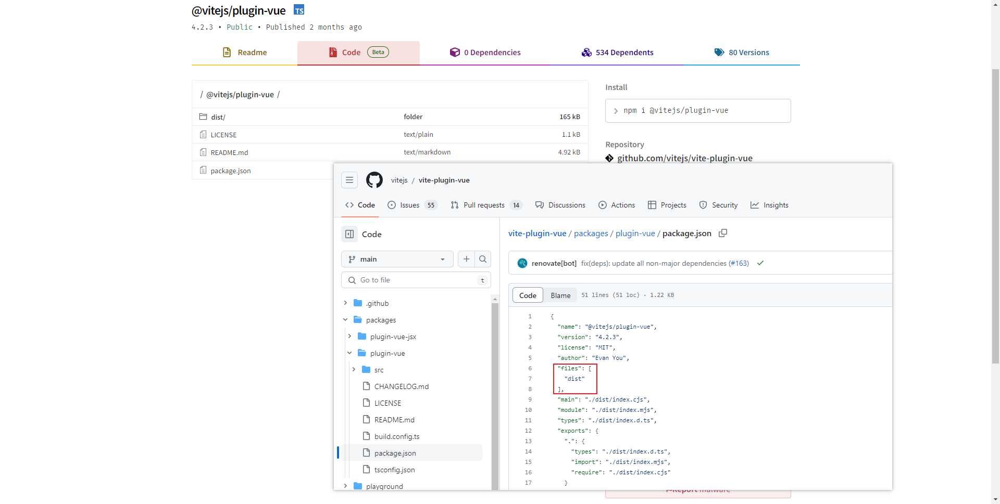

如果你要发布一个包到npm上面，package.json 是你不能忽视的配置。除了最基本的 name 和 version 字段，与打包发布相关的字段其实有不少，很多人可能不太关注，本文将试着解说下这些字段。

## 发布相关

先说说发布相关的字段：

### name

必须的字段，看起来比较简单，但也有一定的命名限制：

- 不允许有大写字母，因此常见的只有小写
- 不能大于214个字符
- 需要符合URL的规范，因为在nodejs会加入到路径中

举几个合法的名称：
- appnify
- vue-starter

可以是 `@<scope>/<name>` 的格式，scope 表示某个组织或范围，name 表示具体的名字，引入的时候必须

### version

遵循 [Semver](https://semver.org/lang/zh-CN/) 规范，通常是 `<major>.<minor>.<patch>` 的格式。其中，major表示不兼容的版本变更，minor 表示向下兼容的功能新增，patch 表示向下兼容的问题修复。

### description

描述信息，比较常见的用处是在 npm 上搜索时，可以很好地辅助描述包的功能，如下：



### keywords

关键字，光靠名字可能不是很容易传播出去，但可以让别人根据关键字搜索时传播出去，在 npm 上搜索时的效果如下：



### files

包含的文件，我们在发布时除了 package.json 等默认文件，可能只想发布 dist 目录，此时可以这样指定：

```json
{
  "files": [
    "dist"
  ]
}
```

举个例子，@vitejs/plugin-vue 只指定了 dist 目录，因此 src 目录没有被上传，如下：



## 联系相关

### author