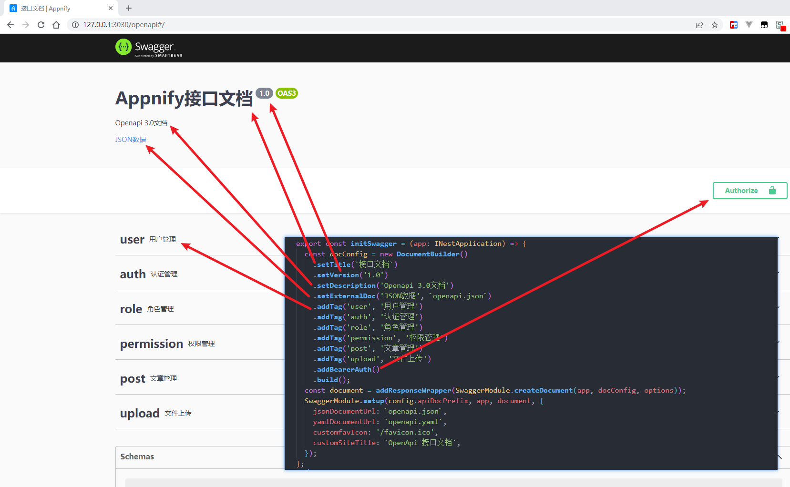
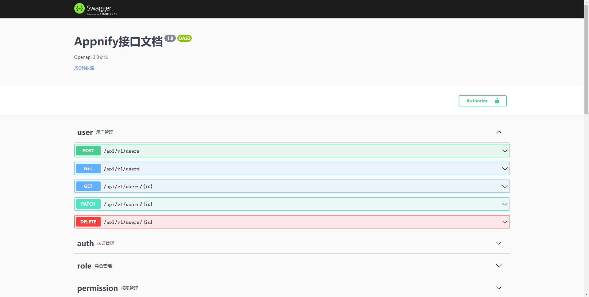

在 NestJS 中用上 Swagger 是比较简单的，但搜了一圈下来讲进阶用法的好像没多少，最近在用这个时发现了一些好玩的功能，在这里记录下。

## 安装

NestJS 提供有 swagger 模块，按官方文档安装就行。

1. 安装依赖

```bash
pnpm i @nestjs/swagger
```

2. 新增 `src/common/swagger/index.ts` 文件(个人习惯，直接在 `src/main.ts` 文件中使用也行)

```ts
export const initSwagger = (app: INestApplication) => {
  const docConfig = new DocumentBuilder()
    .setTitle(`接口文档`)
    .setVersion('1.0')
    .setDescription('Openapi 3.0文档')
    .setExternalDoc('JSON数据', `openapi.json`)
    .addTag('user', '用户管理')
    .addTag('auth', '认证管理')
    .addTag('role', '角色管理')
    .addTag('permission', '权限管理')
    .addTag('post', '文章管理')
    .addTag('upload', '文件上传')
    .addBearerAuth()
    .build();
  const document = addResponseWrapper(SwaggerModule.createDocument(app, docConfig, options));
  SwaggerModule.setup(config.apiDocPrefix, app, document, {
    jsonDocumentUrl: `openapi.json`,
    yamlDocumentUrl: `openapi.yaml`,
    customfavIcon: '/favicon.ico',
    customSiteTitle: `OpenApi 接口文档`,
  });
};
```
其中，`new DocumentBuilder` 是构建 OpenApi 文档对象的基本参数，基本的对应如下：



在 `SwaggerModule.setup` 函数中，我们传入了一些自定义参数，主要是定义页面的一些样式和路径：

- jsonDocumentUrl: 默认访问json格式数据的路径是 openapi-json, 这里修改为 openapi.json 更易于理解些
- yamlDocumentUrl: 访问 YAML 格式数据的路径，同上
- customfavIcon: 站点图标
- customSiteTitle: 站点标题

3. 在 `src/main.ts` 中引用即可

```ts

const app = NestFactory.create();

initSwagger(app);
```

3. 在 `src/app.controller.ts` 中，使用装饰器试下

```ts
TODO
```

4. 等待重启后，就能看到访问效果如下：



## 命令行插件

如果想用得好一点，基本都要在控制器方法周围写满 `@ApiXxx` 等装饰器，明明已经有 Typescript 类型，还要再写一遍，例如：

```ts
class AppController {
  @ApiResponse({ type: String })
  home(): string {
    return 'hello, world'
  }
}
```

`home` 方法已经用 Typescript 标注返回的是 string，我们还要用 `@ApiResponse` 再标注一遍，显然有点重复。

好在官方提供了一个脚手架插件，能在 typescript 编译为 JavaScript 时，使用 TypeScript 的元数据反射系统帮助我们收集这些类型数据，从而转为 swagger 文档的数据。

这个插件，大致提供了以下功能：

- 自动搜集控制器/方法的 `@Query` 、 `@Body` 等装饰器目标的类型，需要注意的是，由于 typescript 会在编译后擦除类型，因此装饰目标不能使用 `type`/`interface` 等编译后不存在的类型，而需要使用基本类型(如 `string`/`number`)或类(`class`)。
- 根据注释提取为某些字段的值，对于参数，目前注释只支持两部分：描述 和 `@example` 标签，对于控制器方法，目前支持描述。

1. 编辑根目录下的 `nest-cli.json` 文件

```json
{
  "compilerOptions": {
    "plugins": [
      {
        "name": "@nestjs/swagger",
        "options": {
          "dtoFileNameSuffix": [".vo.ts", ".dto.ts", ".entity.ts"],
          "introspectComments": true
        }
      }
    ],
  },
}

```

2. 去掉 `src/app.controller.ts` 中的 `@ApiResponse`