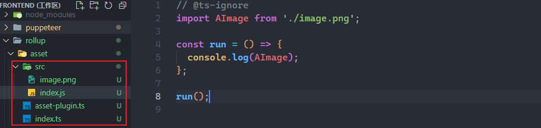
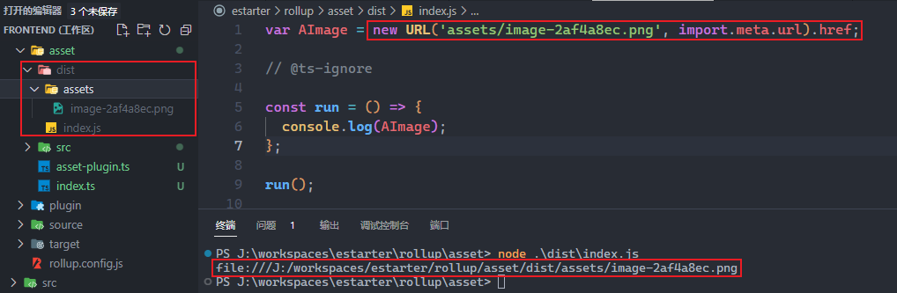
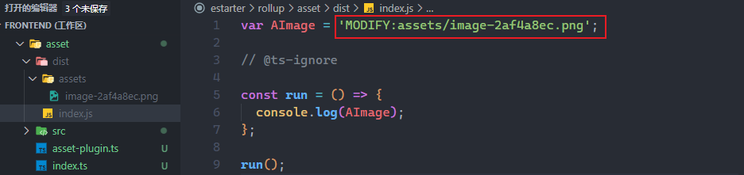

自从 Vite 3 发布起，就开始用它做了不少实践和项目，Vite 的底层是 Rollup 和 Esbuild。Rollup 主要用在打包阶段，今天记录下 Rollup 对于静态资源是如何处理，以及 resolveImportMeta 和 resolveFileUrl 两个钩子的使用。

## 准备工作

新建个项目，安装 rollup 和 tsx 作为开发依赖即可，其中 tsx 是个命令行工具(类似ts-node)，可以运行 .ts 文件。此外，创建目录结构如下：



其中：

| 文件 | 说明
| --   | --
| index.ts | 作为 Rollup 打包的入口
| asset-plugin.ts | 我们编写的 Rollup 插件
| src/index.js | 打包入口文件，会引用到 image.png 文件
| src/image.png | 图片文件

## 入口代码

修改 src/index.ts 文件，引入 .png 并打印其内容，如下：

```ts
// @ts-ignore
import AImage from './image.png';

const run = () => {
  console.log(AImage);
};

run();
```

## 小小插件

修改 asset-plugin.ts 文件写个生成静态产物的小插件，主要将 .png 文件用作 URL 使用，如下：

```ts
import { Plugin } from 'rollup';
import path from 'path';
import fs from 'fs';

export const assetPlugin = (): Plugin => {
  return {
    name: 'rollup:asset',
    resolveId(id, importer) {
      if (id.endsWith('.png')) {
        const filePath = path.resolve(path.dirname(importer), id);
        return filePath;
      }
    },
    load(id) {
      if (id.endsWith('.png')) {
        const assetId = this.emitFile({
          type: 'asset',
          name: path.basename(id),
          source: fs.readFileSync(id),
        });
        const key = `ROLLUP_FILE_URL_${assetId}`;
        return `export default import.meta.${key};`;
      }
    },
  };
};
```

以上，在解析(resolveId)到 .png 结尾的模块时返回文件路径，在加载(load)时产出一个静态资源文件，并通过特殊的 ROLLUP_FILE_URL_ID 告诉 Rollup 当作文件URL处理。

## 打包代码

修改 index.ts 文件，以 api 的形式调用 rollup 进行打包，记得引入写好的插件和指定正确的入口路径，如下：

```ts
import { rollup } from 'rollup';
import { assetPlugin } from './asset-plugin.ts';

const run = async () => {
  const bundle = await rollup({
    input: 'src/index.js',
    output: {},
    plugins: [assetPlugin()],
  });
  await bundle.write({ dir: 'dist' });
};

run();
```

## 运行打包

运行 `npx tsx ./index.ts` 命令，不出意外的话会能看到生成产物和执行结果如下：



## 钩子：resolveFileUrl

以上，默认生成的是 new URL 形式的内容，我们可以通过 resolveFileUrl 钩子进行重写，修改 asset-plugin.ts 文件添加钩子如下：

```ts
export const assetPlugin = (): Plugin => {
  return {
    // ...
    resolveFileUrl({ fileName }) {
      return `'MODIFY:${fileName}'`;
    },
  };
};
```

重新打包，最终产物如下：



## 钩子：resolveImportMeta

前面可以看到 export 的是 import.meta.xx 格式，除了 Rollup 内置的 File URL，我们也可以自定义 import.meta.xx 的内容，同样修改 asset-plugin.ts 文件添加钩子如下：

```ts
export const assetPlugin = (): Plugin => {
  return {
    // ...
    resolveImportMeta(property) {
      if (property === 'demo') {
        return `'MODIFY:demo'`;
      }
    },
  };
};
```

然后修改 src/index.js 文件，添加额外的内容如下：

```js
// @ts-ignore
import AImage from './image.png';
// @ts-ignore
const demo = import.meta.demo;

const run = () => {
  console.log(AImage);
  console.log(demo);
};

run();
```

重新打包，最终如下：


## 最后

以上。