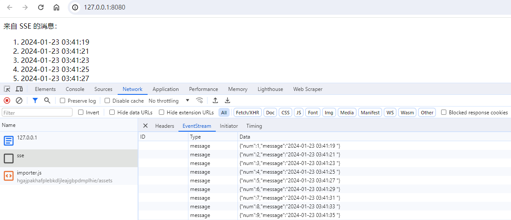

SSE，即 Server-Sent Events(服务器发送事件)，是一项用于服务端向客户端推送消息的技术。目前，接收服务器消息比较常用的技术是 HTTP 轮询 和 WebSocket，SSE 少被使用的原因猜测是 IE 浏览器不支持。

关注到这个技术，主要是之前做推送的时候用的都是 WebSocket，但目的也仅仅是接收更新通知，调用接口接收更新数据。于是想搜下有哪些可以接收消息的技术。SSE 看起来正好符合需求，于是学习下说不定日后能用上，这里记录下。

## 基本原理

本质上基于 HTTP 协议实现，HTTP 在 1.1 版本实现了长连接(keep-alive)，利用该能力可以长时间推送流而不断开连接。

SSE 推送的是文本流，且只能服务端向客户端推送，客户端无法向服务端发消息，文本流遵循一定格式。浏览器对 SSE 做了特殊处理，支持自动重连，这是 websocket 所不具备的能力。

接下来，使用 express 写个 demo 实践一下，主要包含以下两个文件：

```
.
├── index.html
└── server.js
```

## 服务端

服务端代码写在 server.js 文件中，比较简单，直接贴上来。

```ts
import express from 'express';
import fs from 'fs';

const app = express();

app.get('/', (req, res) => {
  const html = fs.readFileSync('./index.html', { encoding: 'utf8' });
  res.header('content-type', 'text/html');
  res.end(html);
});

app.get('/sse', async (req, res) => {
  res.header('connection', 'keep-alive');
  res.header('content-type', 'text/event-stream');
  res.header('cache-control', 'no-cache');

  let num = 0;
  setInterval(() => {
    num += 1;
    const time = new Date().toISOString();
    const data = { num, message: time };
    const text = `data: ${JSON.stringify(data)}\n\n`;
    res.write(text);
    console.log(`[${num}]: 已发送消息`);
  }, 2000);
});

app.listen(8080, () => {
  console.log(`listening on: http://127.0.0.1:8080`);
});
```

以上，服务端有一些规则，如下：

### 响应头

有 3 个响应头是固定且必须的：

- connect：使用长连接
- content-type: 表示内容为文本流
- cache-control: 不缓存

### 文本流格式

每次发送的都是文本，文本遵循一定格式：

```
<field>:<content>\n
<field>:<content>\n\n
```

可以单行或多行，每行以 `\n` 结尾，最后一行以 `\n\n` 结尾。其中 field 有以下几个值可选：

- data
- event
- id
- retry

content 需为 utf8 格式的文本。代码中，我们将包含 num 和 message 的对象序列化后发送。

### 发送流

使用 res.write 方法，而不是 res.send 或 res.end 方法，前者会写入流而不关闭，后者会关闭连接。

## 客户端

客户端代码写在 index.html 中，代码也比较简单，直接贴上来。

```html
<!DOCTYPE html>
<html lang="en">
  <head>
    <meta charset="UTF-8" />
    <meta http-equiv="X-UA-Compatible" content="IE=edge" />
    <meta name="viewport" content="width=device-width, initial-scale=1.0" />
    <title>SSE</title>
  </head>
  <body>
    来自 SSE 的消息：
    <ol id="list"></ol>
  </body>
  <script>
    const source = new EventSource('/sse');

    source.onopen = function (event) {
      console.log('打开连接');
    };

    source.onmessage = function (event) {
      const data = JSON.parse(event.data);
      let li = document.createElement('li');
      li.innerHTML = data.message;
      document.getElementById('list').appendChild(li);
    };

    source.onerror = function (event) {
      console.log(`生成异常，状态：${source.readyState}`);
    };
  </script>
</html>
```

以上，使用方式类似于 websocket。

## 运行效果

使用 `node ./server.js` 启动服务后，访问效果如下：



## 结语

ChatGPT 网页版使用的就是 SSE 进行对话，验证了 SSE 尚有一定的使用场景。相比于 WebSocket，SSE 适合一些比较轻量的使用场景，后续会看看有没有机会用上。