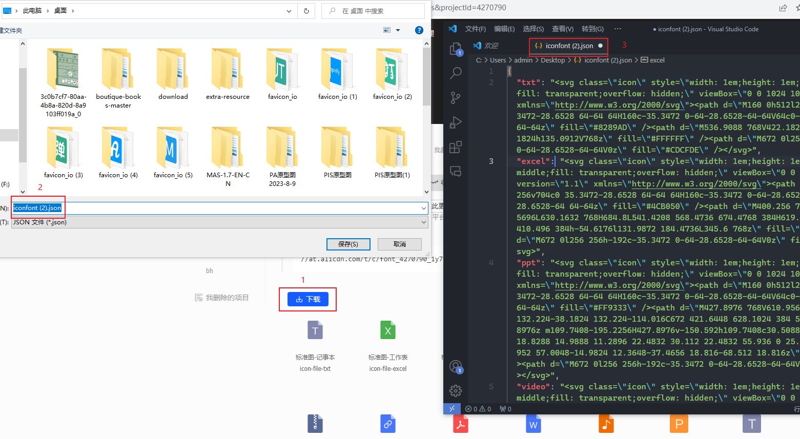
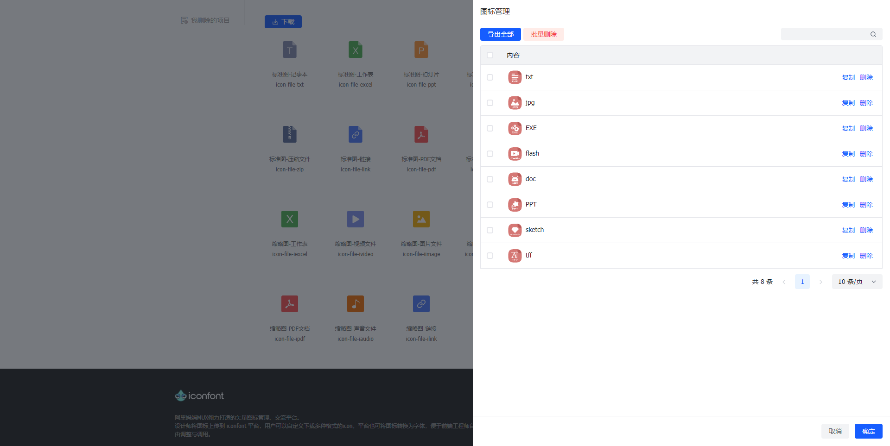

Tampermonkey(油猴，最近插件的名字好像改为篡改猴)，是一款浏览器插件。其主要功能在于管理和应用社区中的脚本，使用油猴而不是浏览器插件，主要在于便利性和自由性。

举个例子，在谷歌浏览器中使用开发者身份上架插件是要收费的(5 刀)，使用油猴就完全不用担心。此外，插件包含敏感功能很容易被举报下架，使用油猴可以不用担心。事实上油猴相关的社区，包含非常多容易被和谐的功能，例如 CSDN 去广告去限制，B 站会员视频破解等功能。

## 起因

最近在做素材管理的功能，想找个文件的图标集，在 iconify 中搜了一圈没找到满意的，然后在 iconfont 中找到一套不错的，于是想着下载下来作为 unocss 的自定义图标集。但 iconfont 并没有提供类似的服务，搜索一番后谷歌到一套方案(https://github.com/yee94/tampermonkey-iconfont-iconify)，遗憾的是效果不太理想。不过翻看源码后，发现实现起来比较简单，于是决定自己重新写个脚本。

## 油猴脚本

先简单了解下油猴的概念：一个油猴脚本是以 .user.js 结尾的 JavaScript 文件，里面包含顶部注释和主体代码两部分内容，示例如下：

```js
// ==UserScript==
// @name         server:Appnify
// @version      0.0.0
// @description  A vite based tampermonkey starter
// @match        *://*/*
// @grant        GM.openInTab
// @resource     mycss  https://a.com/a.css
// ==/UserScript==

;(() => {
 console.log('hello, world')
})();

```

以上，顶部注释遵循特殊格式，充当配置的功能，name/version/description 这类常见的配置就不详细介绍了，主要说说几个特殊的注释：

- @match 匹配的地址，该脚本仅在匹配的地址中生效
- @grant 申请的权限，部分功能需要线申请才能使用，例如打开新的选项卡
- @resorce 依赖的资源，资源可以是图片、样式或视频，每个资源都需要有名字，然后在脚本中可以通过 GM.getResourceUrl 等方法拿到
- @require 依赖的脚本，脚本指其他 .js 文件，可以在脚本之前加载，例如 jquery

主体代码，运行在沙箱环境中，可以访问 document 和其他原生接口。值得注意的是：window 变量是特殊的沙箱变量，不是页面中的全局对象；如果要访问页面的全局变量，需先通过 `@grant unsafeWindow` 获取到权限，然后在脚本中通过 `unfaseWindow` 变量使用，如下：

```js
// ==UserScript==
// @grant        unsafeWindow
// ==/UserScript==

;(() => {
  // __APP_USERNAME__ 是页面中的全局变量
  const username = unsafaeWindow.__APP_USERNAME__;
  console.log(username)
})();
```

沙箱有很好的隔离作用，同时也有不少好处。例如，在页面中使用 Xhr/Fetch 发起跨域请求通常会被浏览器拦截，通过 `@grant GM.xmlHttpRequest` 申请到的方法，就可以利用插件的作用域避开这个问题。

此外，在浏览器中打开任意以 .user.js 结尾的 URL(当然，格式要符合) 都会自动跳转到油猴的安装页面。而 vite-plugin-monkey 也正是利用这点来启动开发，截个图如下：


## 创建项目

开发油猴可以手搓但没有必要，使用 vite-plugin-monkey 插件可以达到很好的开发体验。

1. 创建项目，基于 vite-plugin-monkey 提供的命令行工具创建一个项目，我这里选的是 vue-ts 模板。

```bash
npm create monkey
```

2. 安装必要的依赖(如下)。注意：这些依赖仅作为开发使用，打包使用的还是 CDN 资源，这样做是为了减少脚本的体积。

```bash
npm install @vitejs/plugin-vue-jsx @arco-design/web-vue -D
```

2. 其他配置就不多说了，这里主要说下第三方库的外置。例如下面，主要用到了 Vue 和 @arco-design/web-vue 库，打包时没必要加入到产物中，可以使用油猴的 @resource/@require 进行CDN加速。

```ts
// vite.config.ts
export default defineConfig({
  plugins: [
    monkey({
      build: {
        externalGlobals: {
          vue: cdn.unpkg('Vue', 'dist/vue.global.prod.js').concat(
            await util.fn2dataUrl(() => {
              // @ts-ignore
              window.Vue = Vue;
            })
          ),
          '@arco-design/web-vue': cdn.unpkg('ArcoVue', 'dist/arco-vue.min.js'),
        },
        externalResource: {
          '@arco-design/web-vue/dist/arco.css': 'https://unpkg.com/@arco-design/web-vue@2.52.0/dist/arco.css',
        },
      },
    }),
  ],
});
```

最终会生成的如下的油猴注释，其中包的版本跟随 package.json 中对应包的版本。值得注意的是：arco-design 依赖 Vue，但 Vue 的 iife 版本在油猴中导入时无法成为全局变量，于是需要通过 `window.Vue = Vue` 进行手动补全。

```ts
// @require      https://unpkg.com/vue@3.3.4/dist/vue.global.prod.js
// @require      data:application/javascript,window.Vue%3DVue%3B
// @require      https://unpkg.com/@arco-design/web-vue@2.52.0/dist/arco-vue.min.js
// @resource     @arco-design/web-vue/dist/arco.css  https://unpkg.com/@arco-design/web-vue@2.52.0/dist/arco.css
```

## 开发脚本

在 Iconfont 的项目管理页面，当前 URL 中有个名为 projectId 的查询参数，通过接口 `api/project/detail.json?pid=${projectId}` 可以拿到具体的JSON数据，拿到后做数据转换即可，主要如下：

```ts
const getDetailJSON = async () => {
  const pid = new URLSearchParams(location.search).get("projectId");
  if(!pid) {
    throw new Errot('项目ID不存在')
  }
  const url = `/api/project/detail.json?pid=${pid}`;
  const res = await fetch(url);
  const data = await res.json();
  if (data.code !== 200) {
    throw new Error(data.message);
  }
  const result = {};
  for (let { show_svg, font_class } of data.data.icons) {
    show_svg = show_svg.replace("currentColor", "transparent");
    result[font_class] = show_svg;
  }
  return result;
};
```

拿到数据之后，可以导出为JSON文件，主要思路如下：对象通过 JSON.stringnify 转为字符串，然后通过 encodeURIComponent 进行编码，再添加前缀补全为 dataurl 的格式，模拟 a 链接点击进行下载，如下：

```ts
const exportJSON = (json) => {
  const content = encodeURIComponent(JSON.stringify(json));
  const dataurl `data:text/json;charset=utf-8,${content}`;
  const a = document.createElement("a");
  a.href = dataurl;
  a.download = 'iconfont.json';
  a.click();
  a.remove();
}
```

以上，就是主要逻辑，目的是将当前项目的图标导出为符合 Unocss presetIocns 自定义图标集的JSON文件。其他边缘细节就不具体展示了，最后贴个效果图如下：



除以上外，也可以根据自身喜好进行扩展，例如做个内置的管理弹窗，方便整合不同项目间的图标集，以下示例作参考：



## 最后

油猴在日常非常实用，例如有个叫 [东方永页机](https://greasyfork.org/zh-CN/scripts/438684-pagetual) 的油猴脚本，在看小说时或逛论坛时能根据滚轮自动加载下一页，体验非常丝滑。此外，在工作时油猴也能有很好的帮助作用(例如以上的示例)。