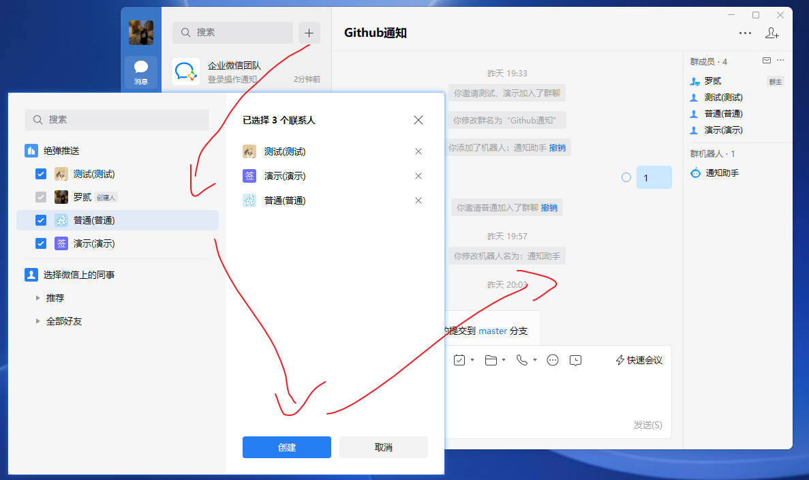

最近在用青龙面板搞 B 站自动签到的事，了解到可以使用钉钉/企业微信等工具接收签到结果。于是想着能不能用于接收 Github 的推送通知，试了一番最终也跑通了，这里记录下过程。

如果要使用微信接收通知，大体有 2 条路：

- 一个是使用微信公众号，但普通的公众号没有这个权限，可以使用 PushPlus 这类已有认证公众号的平台进行转发，不可避免的是隐私和费用(免费的体验一般)。
- 另一个使用企业微信自建企业，在普通微信上接收企业微信的信息，目前在企业微信创建企业不需要认证，这条路是可行的。下面就用这种办法。

在企业微信上接收消息也有两种方式：

- 企业微信应用：使用类似与公众号，可以发送和接收消息，不过最近使用应用需要实名的域名验证和IP范围，有一小点难度。
- 企业微信机器人：其实指的是群聊机器人，在企业微信创建的群聊中可以添加机器人，通过机器人的 webhook 地址发起 POST 请求就可以向群里发消息，用起来非常方便。

## 企业微信通知

企业微信应用，类似与公众号，可以发送和接收消息，不过最近使用应用需要实名的域名验证和IP范围，有一小点难度。

### 创建企业

打开企业微信的 [注册页面](https://work.weixin.qq.com/wework_admin/register_wx?from=loginpage) 进行注册，注意管理员姓名不要乱填，最好填自己名字，不然有验证的话会比较麻烦。


### 创建应用

打开企业微信的 [登陆页面](https://work.weixin.qq.com/wework_admin/loginpage_wx)，使用注册时的微信进行扫码登陆。按如下步骤创建一个应用：


### 添加可信域名

进入创建好的应用，划到底部，按如下步骤添加可行域名并验证：


### 添加可信IP

还是刚才的应用管理页面，划到底部，按如下步骤添加可行IP：


### 记录凭证

使用应用发消息需要几个重要的凭证，如下：

- 企业ID


- 应用的 AgentID 和 Secret，其中 Secret 需要下载企业微信才能接收


### 使用凭证

如果是自定义发送可翻下官方文档，我这里使用的青龙面板，按如下格式填写即可：


### 接收消息

以下是接收的消息效果：


## 企业微信机器人

企业微信机器人，其实指的是群聊机器人，在企业微信创建的群聊中可以添加机器人，向机器人的 webhook 地址发起 POST 请求就可以向群里发消息，用起来非常方便。接下来完成一个 Github 仓库的推送通知。

### 下载企业微信

群聊机器人需要 PC 版的企业微信才能操作，打开 [下载页面](https://work.weixin.qq.com/#indexDownload) 进行下载安装。


### 创建群聊

登陆企业微信，随便创建一个群聊:



### 添加群机器人

按如下步骤添加一个群聊机器人：


### 记录地址

打开机器人信息页，复制 webhook 地址，后面会用到。


### 添加 Action 仓库

使用 Github Actions 通常会用 Action 进行推送，但通常不能使用非认证的第三方 Action，不过我们可以 fork 一份这样就不会有问题了。这里使用 fork [WeChat Work for GitHub Actions](https://github.com/chf007/action-wechat-work) 这个仓库，看下了代码非常容易理解。


### 添加工作流任务

在需要通知的仓库里，添加具体的工作流任务，以我自己的 starter-vue 为例，修改 .github/workflows/deploy.yaml 文件，如下：

```yaml
name: 自动部署

on:
  push:
    branches: [ master ]

jobs:
  send:
    runs-on: ubuntu-latest

    steps:
      - name: 克隆代码
        uses: actions/checkout@v2

      - name: 构建消息
        id: exec_cmd
        run: |
          MSG=$(git log --format=%B -n 1 ${{ github.sha }})
          echo "msg=$MSG" >> "$GITHUB_OUTPUT"
        shell: bash

      - name: 推送到企微
        uses: appnify/action-wechat-work@master
        env:
          WECHAT_WORK_BOT_WEBHOOK: ${{secrets.WECHAT_WORK_BOT_WEBHOOK}}
        with:
          msgtype: text
          content: "推送通知\n\n仓库名称：${{ github.repository }}\n提交用户：${{ github.actor }}\n提交消息：${{ steps.exec_cmd.outputs.msg }}\n提交哈希：${{ github.sha }}\n\n提醒：已有提交推送到仓库，请留意构建结果。"
```

### 添加 Webhook 密钥

上面的的代码代码中用到 secrets.WECHAT_WORK_BOT_WEBHOOK 这个密钥，里面是我们群聊机器人的 webhook 地址。但这个密钥还没有，接下来到仓库设置里添加这个密钥：


### 推送效果

以下是文本格式的推送效果(企业微信)，其他效果自行探索，：


微信效果(如下)，注意：微信不支持 Markdown 格式的消息。


## 结语

使用下来感觉还是非常不错的，不过网上关于企业微信通知相关的文章并不是很多，可能钉钉/飞书/Telegram用得更多一点吧。如果想要获取天气，新闻之类的消息，配合 serverless/云函数之类的服务会有不错的效果，暂时先到这里，后续有想法再说。