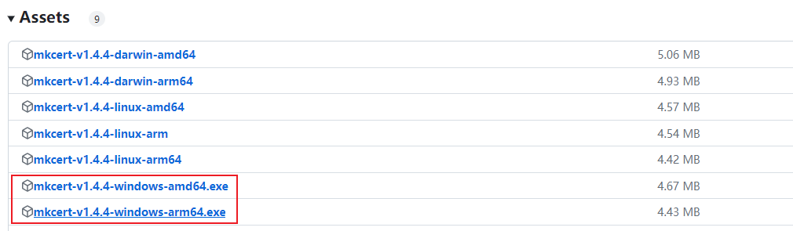
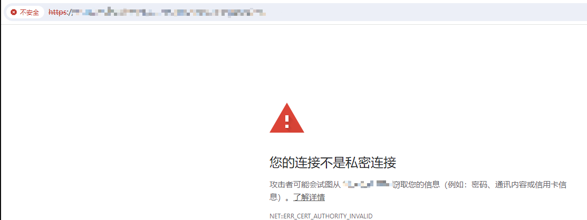
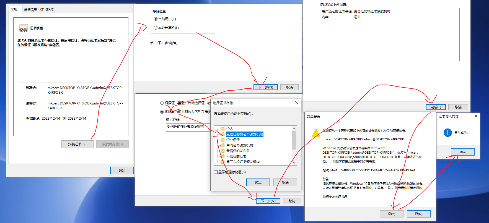

部署在公网上的 WEB 应用，通常都会申请一个域名和其对应的 HTTPS 证书，但 HTTPS 证书通常是为域名颁发的(有IP的但不容易申请)，我们在局域网内使用的是 IP，因此申请一个 HTTPS 证书这条路不太行。但使用自签证书是个不错的选择。

## Mkcert 生成证书

使用 OPENSSL 生成 HTTPS 证书比较繁琐，我们可以使用 mkcert 这个开源工具，非常小巧且方便。

1. 下载 [Mkcert](https://github.com/FiloSottile/mkcert/releases/tag/v1.4.4) 工具，下面均称呼为 mkcert.exe。



2. 使用以下命令安装根证书到本系统

```
./mkcert.exe -install
```

3. 使用以下命令查看根证书的保存位置，进入该目录，将 rootCA.pem 另存为 rootCA.crt，保存该文件，后面会用到。

```
./mkcert.exe -CAROOT
```

3. 使用以下命令生成域名证书

```
./mkcert.exe -key-file key.pem -cert-file cert.pem 192.168.1.23
```

其中：

- -key-file 指定保存证钥的位置，示例中表示保存在同一目录下的 key.pem 文件中, 名字可自取
- -cert-file 指定保存证书的位置，同上。
- 192.168.1.23 关联的域名或IP

保存 key.pem 和 cert.pem 两个文件，后面会用到。

## Nginx 安装 SSL 模块

不用 Nginx 的可以跳过， 先使用以下命令查看 Nginx 是否启用 SSL 模块:

```
./nginx -V
```

如果输出中含 --with-http_ssl_module 字样则标识已安装有 SSL 模块，后续步骤可以跳过，安装步骤：

1. 进入 nginx 源码目录：

```
cd /opt/data/nginx
```

2. 执行以下命令进行配置

```bash
./configure --prefix=/opt/data/nginx --with-http_ssl_module --with-openssl=/usr/local/openssl
```

其中：
- --prefix：指定 nginx 运行位置，配置相关路径会用到
- --with-http_ssl_module 安装 ssl 模块
- --with-openssl=/usr/local/openssl 指定 openssl 的位置，注意是源码位置不是命令所在的位置，该参数可以先不带试试，失败了再指定

3. 执行以下命令进行编译：

```
make
```

注意：如果提示 `./config：没有那个文件或目录` 错误，则需要修改 nginx 源码目录的 auto/lib/openssl/conf 文件，如下：

```
# before:
CORE_INCS="$CORE_INCS $OPENSSL/.openssl/include"
CORE_DEPS="$CORE_DEPS $OPENSSL/.openssl/include/openssl/ssl.h"
CORE_LIBS="$CORE_LIBS $OPENSSL/.openssl/lib/libssl.a"
CORE_LIBS="$CORE_LIBS $OPENSSL/.openssl/lib/libcrypto.a"

# after: 均去掉 .openssl 字样
CORE_INCS="$CORE_INCS $OPENSSL/include"
CORE_DEPS="$CORE_DEPS $OPENSSL/include/openssl/ssl.h"
CORE_LIBS="$CORE_LIBS $OPENSSL/lib/libssl.a"
CORE_LIBS="$CORE_LIBS $OPENSSL/lib/libcrypto.a"
```

修改完需重新执行第 2 步，再执行 make 命令。

4. 备份原有的 nginx ，将 nginx 源码目录下的 objs/nginx 复制到对应地方并重新启动：

```
cp <nginx-src>/objs/nginx <target>
```

## Nginx 添加 SSL 配置

安装完 SSL 模块后，下面针对具体服务进行配置：

1. 将前面保存好的 key.pem 和 cert.pem 上传到服务器，位置可自定义(例如：/usr/data/nginx/ssl)

```
# 示例：使用 ssh 上传
scp ./key.pem root@10.10.10.10:/xxx
```

2. 修改 nginx 配置

```nginx
server {
  # 标注为 ssl
  listen 3000 ssl;

  # 指定证钥和证书的位置
  ssl_certificate /usr/data/nginx/ssl/cert.pem;
  ssl_certificate_key /usr/data/nginx/ssl/key.pem;

  # 301 重定向 http 到 https
  error_page 497 =301 https://$host:$server_port$request_uri;
}
```

3. 重新启动 nginx

```
./nginx -s reload
```

## Mkcert 安装根证书

以上完成后，已经可以访问页面，但通常都会告警使用的是未信任的证书，如下：



这需要将前面保存好的 rootCA.crt 文件复制到客户端电脑，双击打开安装根证书，如下：



清理下浏览器缓存或使用无痕模式打开，再访问页面即可：


## 结语

以上，适用于局域网内使用或开发用途，真部署在外网还是申请 HTTPS 证书比较安全。此外，Mkcert 在每个操作系统中生成的根证书都是不同的，请不要在别的电脑上随便生成，而是复制源证书的根证书进行安装。