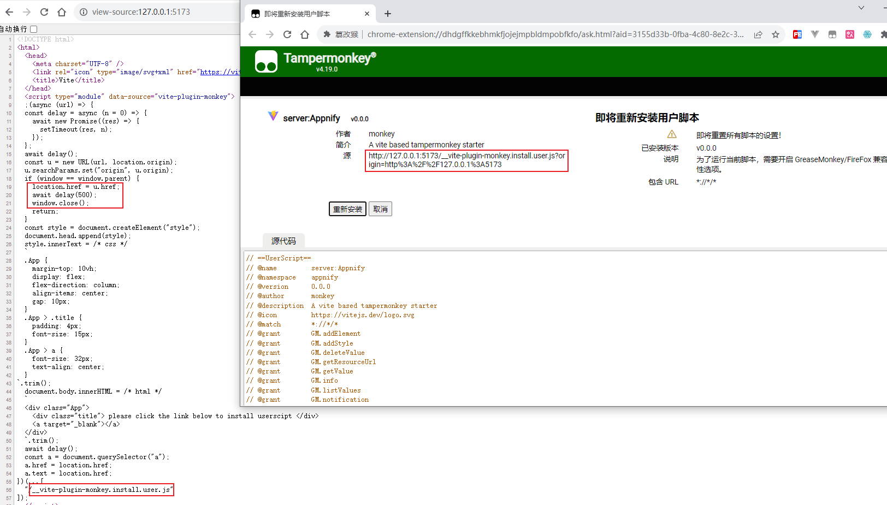
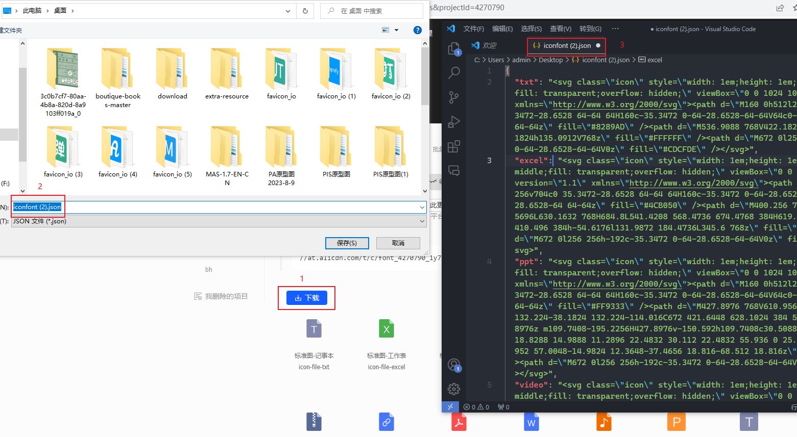
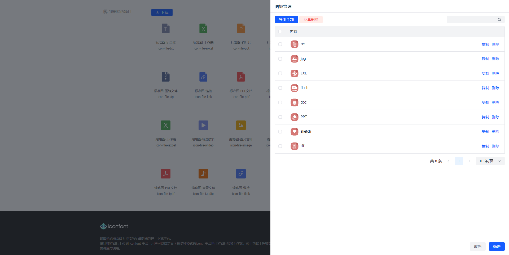

Tampermonkey(油猴，最近插件的名字好像改为篡改猴)，是一款浏览器插件。其主要功能在于管理和应用社区中的脚本，使用油猴而不是浏览器插件，主要在于便利性和自由性。

举个例子，在谷歌浏览器中使用开发者身份上架插件是要收费的(5 刀)，使用油猴就完全不用担心。此外，插件包含敏感功能很容易被举报下架，使用油猴可以不用担心。事实上油猴相关的社区，包含非常多容易被和谐的功能，例如 CSDN 去广告去限制，B 站会员视频破解等功能。

## 起因

最近在做素材管理的功能，想找个文件的图标集，在 iconify 中搜了一圈没找到满意的，然后在 iconfont 中找到一套不错的，于是想着下载下来作为 unocss 的自定义图标集。但 iconfont 并没有提供类似的服务，搜索一番后谷歌到一套方案(https://github.com/yee94/tampermonkey-iconfont-iconify)，遗憾的是效果不太理想。不过翻看源码后，发现实现起来比较简单，于是决定自己重新写个脚本。

## 油猴脚本

先简单了解下油猴的概念：一个油猴脚本是以 .user.js 结尾的 JavaScript 文件，里面包含顶部注释和主体代码两部分内容，示例如下：

```js
// ==UserScript==
// @name         server:Appnify
// @version      0.0.0
// @description  A vite based tampermonkey starter
// @match        *://*/*
// @grant        GM.openInTab
// @resource     mycss  https://a.com/a.css
// ==/UserScript==

;(() => {
 console.log('hello, world')
})();

```

以上，顶部注释遵循特殊格式，充当配置的功能，name/version/description 这类常见的配置就不详细介绍了，主要说说几个特殊的注释：

| 配置 | 说明
| --  | --
| @match   | 匹配的地址，该脚本仅在匹配的地址中生效
| @grant   | 申请的权限，特殊功能需要线申请才能使用，例如打开新的选项卡
| @resorce | 依赖的资源，资源可以是图片、样式或视频，资源都需要有名字，在脚本中通过 GM.getResourceUrl 等方法拿到
| @require | 依赖的脚本，脚本指其他 .js 文件，可以在脚本之前加载，例如 jquery

主体代码，运行在沙箱环境中，可以访问 document 和其他原生接口。值得注意的是：window 变量是特殊的沙箱变量，不是页面中的全局对象；如果要访问页面的全局变量，需先通过 `@grant unsafeWindow` 获取到权限，然后在脚本中通过 `unfaseWindow` 变量使用，如下：

```js
// ==UserScript==
// @grant        unsafeWindow
// ==/UserScript==

;(() => {
  // __APP_USERNAME__ 是页面中的全局变量
  const username = unsafaeWindow.__APP_USERNAME__;
  console.log(username)
})();
```

沙箱有很好的隔离作用，同时也有不少好处。例如，在页面中使用 Xhr/Fetch 发起跨域请求通常会被浏览器拦截，通过 `@grant GM.xmlHttpRequest` 申请到的方法，就可以利用插件的作用域避开这个问题。

此外，在浏览器中打开任意以 .user.js 结尾的 URL(当然，格式要符合) 都会自动跳转到油猴的安装页面。而 vite-plugin-monkey 也正是利用这点来启动开发，截个图如下：



## 创建项目

开发油猴可以手搓但没有必要，使用 [vite-plugin-monkey](https://www.npmjs.com/package/vite-plugin-monkey) 插件可以有很好的开发体验。

1. 创建项目，基于 vite-plugin-monkey 提供的命令行工具创建一个项目，我这里选的是 vue-ts 模板。

```bash
npm create monkey
```

2. 安装必要的依赖(如下)。注意：这些依赖仅作为开发使用，打包使用的还是 CDN 资源，这样做是为了减少脚本的体积。

```bash
npm install @vitejs/plugin-vue-jsx @arco-design/web-vue -D
```

2. 其他配置就不多说了，这里主要说下第三方库的外置。例如下面，主要用到了 Vue 和 @arco-design/web-vue 库，打包时没必要加入到产物中，可以使用油猴的 @resource/@require 进行CDN加速。

```ts
// vite.config.ts
export default defineConfig({
  plugins: [
    monkey({
      build: {
        externalGlobals: {
          vue: cdn.unpkg('Vue', 'dist/vue.global.prod.js').concat(
            await util.fn2dataUrl(() => {
              // @ts-ignore
              window.Vue = Vue;
            })
          ),
          '@arco-design/web-vue': cdn.unpkg('ArcoVue', 'dist/arco-vue.min.js'),
        },
        externalResource: {
          '@arco-design/web-vue/dist/arco.css': 'https://unpkg.com/@arco-design/web-vue@2.52.0/dist/arco.css',
        },
      },
    }),
  ],
});
```

最终会生成的如下的油猴注释，其中包的版本跟随 package.json 中对应包的版本。值得注意的是：arco-design 依赖 Vue，但 Vue 的 iife 版本在油猴中导入时无法成为全局变量，于是需要通过 `window.Vue = Vue` 进行手动补全。

```ts
// @require      https://unpkg.com/vue@3.3.4/dist/vue.global.prod.js
// @require      data:application/javascript,window.Vue%3DVue%3B
// @require      https://unpkg.com/@arco-design/web-vue@2.52.0/dist/arco-vue.min.js
// @resource     @arco-design/web-vue/dist/arco.css  https://unpkg.com/@arco-design/web-vue@2.52.0/dist/arco.css
```

## 开发脚本

在 Iconfont 的项目管理页面，当前 URL 中有个名为 projectId 的查询参数，通过接口 `api/project/detail.json?pid=${projectId}` 可以拿到具体的JSON数据，拿到后做数据转换即可，主要如下：

```ts
const getDetailJSON = async () => {
  const pid = new URLSearchParams(location.search).get("projectId");
  if(!pid) {
    throw new Errot('项目ID不存在')
  }
  const url = `/api/project/detail.json?pid=${pid}`;
  const res = await fetch(url);
  const data = await res.json();
  if (data.code !== 200) {
    throw new Error(data.message);
  }
  const result = {};
  for (let { show_svg, font_class } of data.data.icons) {
    show_svg = show_svg.replace("currentColor", "transparent");
    result[font_class] = show_svg;
  }
  return result;
};
```

拿到数据之后，可以导出为JSON文件，主要思路如下：对象通过 JSON.stringnify 转为字符串，然后通过 encodeURIComponent 进行编码，再添加前缀补全为 dataurl 的格式，模拟 a 链接点击进行下载，如下：

```ts
const exportJSON = (json) => {
  const content = encodeURIComponent(JSON.stringify(json));
  const dataurl `data:text/json;charset=utf-8,${content}`;
  const a = document.createElement("a");
  a.href = dataurl;
  a.download = 'iconfont.json';
  a.click();
  a.remove();
}
```

以上，就是主要逻辑，目的是将当前项目的图标导出为符合 Unocss presetIocns 自定义图标集的JSON文件。其他边缘细节就不具体展示了，最后贴个效果图如下：



除以上外，也可以根据自身喜好进行扩展，例如做个内置的管理弹窗，方便整合不同项目间的图标集，以下示例作参考：



## 最后

油猴在日常非常实用，例如有个叫 [东方永页机](https://greasyfork.org/zh-CN/scripts/438684-pagetual) 的油猴脚本，在看小说时或逛论坛时能根据滚轮自动加载下一页，体验非常丝滑。此外，在工作时油猴也能有很好的帮助作用(例如以上的示例)。

## 补充

以下是打包好的代码，创建一个油猴脚本导入就能用。PS：写的有点乱，主要是想试试 vue 和 arco-design 在油猴上的体验。

```js
// ==UserScript==
// @name         Appnify
// @namespace    appnify
// @version      0.0.0
// @author       monkey
// @description  A vite based tampermonkey starter
// @icon         https://vitejs.dev/logo.svg
// @match        *://*/*
// @require      https://unpkg.com/vue@3.3.4/dist/vue.global.prod.js
// @require      data:application/javascript,window.Vue%3DVue%3B
// @require      https://unpkg.com/@arco-design/web-vue@2.52.0/dist/arco-vue.min.js
// @resource     @arco-design/web-vue/dist/arco.css  https://unpkg.com/@arco-design/web-vue@2.52.0/dist/arco.css
// @grant        GM_getResourceText
// ==/UserScript==

(r=>{const n=document.createElement("style");n.dataset.source="vite-plugin-monkey",n.textContent=r,document.head.append(n)})(` html body{--border-radius-small: 4px}.arco-table table td,.arco-table table th{border-top:none;border-right:none;border-left:none;padding:0}*,:before,:after{--un-rotate:0;--un-rotate-x:0;--un-rotate-y:0;--un-rotate-z:0;--un-scale-x:1;--un-scale-y:1;--un-scale-z:1;--un-skew-x:0;--un-skew-y:0;--un-translate-x:0;--un-translate-y:0;--un-translate-z:0;--un-pan-x: ;--un-pan-y: ;--un-pinch-zoom: ;--un-scroll-snap-strictness:proximity;--un-ordinal: ;--un-slashed-zero: ;--un-numeric-figure: ;--un-numeric-spacing: ;--un-numeric-fraction: ;--un-border-spacing-x:0;--un-border-spacing-y:0;--un-ring-offset-shadow:0 0 rgba(0,0,0,0);--un-ring-shadow:0 0 rgba(0,0,0,0);--un-shadow-inset: ;--un-shadow:0 0 rgba(0,0,0,0);--un-ring-inset: ;--un-ring-offset-width:0px;--un-ring-offset-color:#fff;--un-ring-width:0px;--un-ring-color:rgba(147,197,253,.5);--un-blur: ;--un-brightness: ;--un-contrast: ;--un-drop-shadow: ;--un-grayscale: ;--un-hue-rotate: ;--un-invert: ;--un-saturate: ;--un-sepia: ;--un-backdrop-blur: ;--un-backdrop-brightness: ;--un-backdrop-contrast: ;--un-backdrop-grayscale: ;--un-backdrop-hue-rotate: ;--un-backdrop-invert: ;--un-backdrop-opacity: ;--un-backdrop-saturate: ;--un-backdrop-sepia: }::backdrop{--un-rotate:0;--un-rotate-x:0;--un-rotate-y:0;--un-rotate-z:0;--un-scale-x:1;--un-scale-y:1;--un-scale-z:1;--un-skew-x:0;--un-skew-y:0;--un-translate-x:0;--un-translate-y:0;--un-translate-z:0;--un-pan-x: ;--un-pan-y: ;--un-pinch-zoom: ;--un-scroll-snap-strictness:proximity;--un-ordinal: ;--un-slashed-zero: ;--un-numeric-figure: ;--un-numeric-spacing: ;--un-numeric-fraction: ;--un-border-spacing-x:0;--un-border-spacing-y:0;--un-ring-offset-shadow:0 0 rgba(0,0,0,0);--un-ring-shadow:0 0 rgba(0,0,0,0);--un-shadow-inset: ;--un-shadow:0 0 rgba(0,0,0,0);--un-ring-inset: ;--un-ring-offset-width:0px;--un-ring-offset-color:#fff;--un-ring-width:0px;--un-ring-color:rgba(147,197,253,.5);--un-blur: ;--un-brightness: ;--un-contrast: ;--un-drop-shadow: ;--un-grayscale: ;--un-hue-rotate: ;--un-invert: ;--un-saturate: ;--un-sepia: ;--un-backdrop-blur: ;--un-backdrop-brightness: ;--un-backdrop-contrast: ;--un-backdrop-grayscale: ;--un-backdrop-hue-rotate: ;--un-backdrop-invert: ;--un-backdrop-opacity: ;--un-backdrop-saturate: ;--un-backdrop-sepia: }.i-icon-park-outline-download{--un-icon:url("data:image/svg+xml;utf8,%3Csvg viewBox='0 0 48 48' display='inline-block' vertical-align='-2px' width='1em' height='1em' xmlns='http://www.w3.org/2000/svg' %3E%3Cg fill='none' stroke='currentColor' stroke-linecap='round' stroke-linejoin='round' stroke-width='4'%3E%3Cpath d='M6 24.008V42h36V24'/%3E%3Cpath d='m33 23l-9 9l-9-9m8.992-17v26'/%3E%3C/g%3E%3C/svg%3E");-webkit-mask:var(--un-icon) no-repeat;mask:var(--un-icon) no-repeat;-webkit-mask-size:100% 100%;mask-size:100% 100%;background-color:currentColor;color:inherit;display:inline-block;vertical-align:-2px;width:1em;height:1em}.ml-2{margin-left:.5rem} `);

(function (vue, webVue) {
  'use strict';

  const useComponent = (component, props = {}) => {
    const box = document.createElement("span");
    const vnode = vue.createVNode(component, props);
    vue.render(vnode, box);
    return box;
  };
  const sleep = (ms) => new Promise((resolve) => setTimeout(resolve, ms));
  const download = (url, filename) => {
    const a = document.createElement("a");
    a.href = url;
    a.download = filename;
    a.click();
    a.remove();
  };
  const json2DataUrl = (json) => {
    const content = encodeURIComponent(JSON.stringify(json));
    return `data:text/json;charset=utf-8,${content}`;
  };
  const definePage = (page) => {
    return page;
  };
  const DownloadButton = /* @__PURE__ */ vue.defineComponent({
    name: "DownloadButton",
    setup() {
      const loading = vue.ref(false);
      const getDetailJSON = async (pid) => {
        const url = `/api/project/detail.json?pid=${pid}`;
        const res = await fetch(url);
        const data = await res.json();
        if (data.code !== 200) {
          throw new Error(data.message);
        }
        const result = {};
        for (let {
          show_svg,
          font_class
        } of data.data.icons) {
          show_svg = show_svg.replace("currentColor", "transparent");
          result[font_class] = show_svg;
        }
        return result;
      };
      const onConfirm = async () => {
        const pid = new URLSearchParams(location.search).get("projectId");
        try {
          loading.value = true;
          const data = await getDetailJSON(pid);
          const dataurl = json2DataUrl(data);
          download(dataurl, "iconfont.json");
        } catch (e) {
          webVue.Message.error(e == null ? void 0 : e.message);
        } finally {
          loading.value = false;
        }
      };
      return () => vue.createVNode(webVue.Button, {
        "type": "primary",
        "size": "small",
        "class": "ml-2",
        "loading": loading.value,
        "onClick": onConfirm
      }, {
        icon: () => vue.createVNode("i", {
          "class": "i-icon-park-outline-download"
        }, null),
        default: () => "下载"
      });
    }
  });
  const __vite_glob_0_0 = definePage({
    when: (url) => {
      const target = new URL(url);
      const isHost = target.hostname === "www.iconfont.cn";
      const params = new URLSearchParams(target.search);
      const isType = params.get("manage_type") === "myprojects";
      return isHost && isType;
    },
    work: async () => {
      await sleep(2e3);
      const box = document.querySelector(".project-iconlist");
      const btn = useComponent(DownloadButton);
      if (box) {
        box.prepend(btn);
      }
    }
  });
  const files = /* @__PURE__ */ Object.assign({ "./iconfont/index.tsx": __vite_glob_0_0 });
  const run = async () => {
    const pages = Object.values(files);
    for (const page of pages) {
      if (page.when(location.href)) {
        page.work();
      }
    }
  };
  const cssLoader = (e) => {
    const t = GM_getResourceText(e), o = document.createElement("style");
    return o.innerText = t, document.head.append(o), t;
  };
  cssLoader("@arco-design/web-vue/dist/arco.css");
  run();

})(Vue, ArcoVue);
```