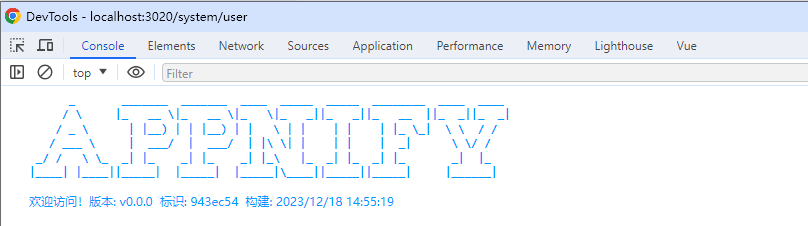

在日常开发中，输出版本号和构建时间会是个常见需求，有利用于定位到具体代码中。有时也想根据文件后缀进行打包，毕竟有时候 2 个项目间只有部分页面不同。以上，开发个 vite 插件可以很好地满足需要，过程就不具体说了，贴下主要代码。

## 输出版本号和构建时间

以下代码，输出 LOGO、Git 提交哈希值、版本(优先使用 git 标签，回退至 package.json 的 version 字段)，构建时间信息，如下：

```ts
import { spawn } from "child_process";
import fs from "fs";
import { Plugin, ResolvedConfig } from "vite";
import pkg from "../../package.json";

const LOGO = `      _       _______  _______  ____  _____  _____  ________  ____  ____
     / \\\\     |_   __ \\\\|_   __ \\\\|_   \\\\|_   _||_   _||_   __  ||_  _||_  _|
    / _ \\\\      | |__) | | |__) | |   \\\\ | |    | |    | |_ \\\\_|  \\\\ \\\\  / /
   / ___ \\\\     |  ___/  |  ___/  | |\\\\ \\\\| |    | |    |  _|      \\\\ \\\\/ /
 _/ /   \\\\ \\\\_  _| |_    _| |_    _| |_\\\\   |_  _| |_  _| |_       _|  |_
|____| |____||_____|  |_____|  |_____|\\\\____||_____||_____|     |______|
`;

const exec = (cmd: string) => {
  return new Promise<string | void>((resolve) => {
    if (!cmd) {
      return resolve();
    }
    const child = spawn(cmd, [], { shell: true });
    child.stdout.once("data", (data) => {
      resolve(data.toString().replace(/"|\n/g, ""));
    });
    child.stderr.once("data", () => {
      resolve();
    });
  });
};

const getBuildInfo = async () => {
  const hash = await exec("git log --format=%h -n 1");
  const time = new Date().toLocaleString("zh-Hans-CN");
  const latestTag = await exec("git describe --tags --abbrev=0");
  const commits = await exec(`git rev-list --count ${latestTag}..HEAD`);
  const version = commits ? `${latestTag}.${commits}` : `v${pkg.version}`;
  const content = `欢迎访问！版本: ${version}  标识: ${hash}  构建: ${time}`;
  const style = `"color: #09f; font-weight: 900;", "font-size: 12px; color: #09f; font-family: ''"`;
  const script = `console.log(\`%c${LOGO} \n%c${content}\n\`, ${style});\n`;
  return script;
};

export default function plugin(): Plugin {
  return {
    name: "vite:customizer",
    async transformIndexHtml() {
      const script = await getBuildInfo();
      return [
        {
          tag: "script",
          injectTo: "body",
          children: script,
        },
      ];
    },
  }
}
```

以上代码会向 index.html 注入 script 标签，并输出相关信息，最终效果如下：



## 按条件加载

主要利用 load 钩子拦截内容的加载，如果存在具体后缀的文件则优先加载，值得注意的是路径仍是原来的路径，只是内容改成其他文件的内容，如下：

```ts
export default function plugin(): Plugin {
  let config: ResolvedConfig;
  let extension: string;

  return {
    name: "vite:customizer",
    enforce: "pre",

    configResolved(resolvedConfig) {
      config = resolvedConfig;
      extension = config.env.VITE_EXTENTION ?? config.isProduction ? "prod" : "dev";
    },

    load(id) {
      if (!extension || !id.includes("src")) {
        return;
      }
      if (id.includes("?vue")) {
        return;
      }
      const targetPath = id.replace(/\.([^.]*?)$/, `.${extension}.$1`);
      if (targetPath && fs.existsSync(targetPath)) {
        return fs.readFileSync(targetPath, "utf-8");
      }
    },
  };
}
```

以上，会读取环境变量中的 VITE_EXTENSION 变量，可以在项目根目录下的 .env 文件中配置：

```
VITE_EXTENSION = wx
```

在加载 index.vue 文件时，如果存在 index.wx.vue 文件，则返回 index.wx.vue 文件的内容，否则返回 index.vue 文件的内容。

## 结语

以上，使用 vite 插件有时可以做一些不错的事情。例如 unplugin 系列的插件，就能在编译时做很多事，减少工作量和运行时的消耗。