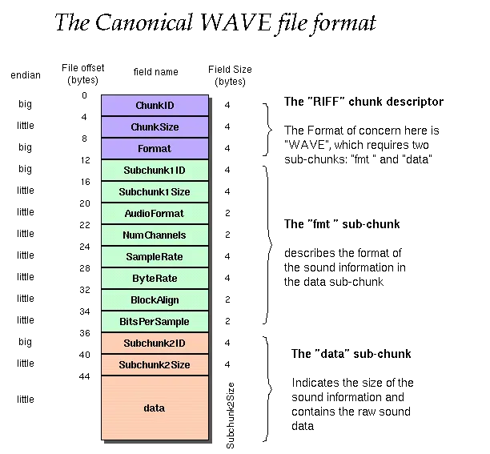

最近遇到了一个需求，使用电脑外接的话筒推流发广播，这里面涉及到了 Web RTC 的一些功能以及音频数据的处理。以前做过监听功能，接收 pcm 流并实时播放，因此对音频数据流略有了解，但如何从麦克风接流还不太了解。做了几天，最终完成了，这里简单回顾下并做个小 demo。

## 声音的采集

深的概念我们暂不讨论，先来说说：假如我们需要采集声音得到一个音频文件，这中间过程会发生什么呢？大致会如下：

- 采集：声音产生震动，录音设备据此采集到波形信号(即模拟信号)
- 编码：采集设备将波形转为数值(即数字信号)，常见的方法是 PCM，转换后得到 .pcm 或 .raw 等格式文件
- 压缩：PCM 转换的数据体积比较大，不利于传输，通常会再进行压缩得到 .mp3 或 .ogg 等格式文件

PCM，即脉冲编码调制(Pulse-Code Modulation)，其中有 3 个比较重要的概念：

| 参数   | 描述                                                            |
| ------ | --------------------------------------------------------------- |
| 采样率 | 每秒采集多少个样本，常见的有 44.1KHz 即每秒钟采集 441000 个样本 |
| 位深   | 声音的高低，常见的有 16 位                                      |
| 声道   | 常见的有单声道、双声道                                          |

PCM 是一种编码格式，将模拟信号格式转换位数字信号格式，其他的编码格式还有 ACC-LC 、 ACC-LD 等。PCM 转换后的数据，通常称为裸数据(raw)，体积比较大因而会进行压缩。压缩格式也称为容器格式，常见的有 wav、MP3、ogg 等。

其中，wav 是最简单的，只在 pcm 数据的前面加了 44 位字符(等于没压缩)，贴一张图如下：



## Web Audio API

[Web API](https://developer.mozilla.org/zh-CN/docs/Web/API) 是一套关于Web的规范集，而 [Web Audio API](https://developer.mozilla.org/zh-CN/docs/Web/API/Web_Audio_API) 是关于如何控制音频的规范，其允许开发者选择不同的音频源，进行添加特效、可视乎音频等操作。

在 Web Audio API 中，[AudioContext](https://developer.mozilla.org/zh-CN/docs/Web/API/AudioContext) 是处理音频的上下文。里面可以包含多个输入节点，多个中间节点和多个输出节点。每个节点使用 [connect](https://developer.mozilla.org/zh-CN/docs/Web/API/AudioNode/connect) 方法连接到下一个节点。示例如下：

```ts
// 创建音频上下文
const audioContext = new AudioContext();
// 创建输入节点
const source = audioContext.createBuffSource();
// 连接到输出节点
source.connect(audioContext.destination);
```


## 输入节点

输入，即数据源。可以从页面元素获取，也可以手动生成，常见的方式有如下几种：

### createBufferSource

[createBufferSource](https://developer.mozilla.org/zh-CN/docs/Web/API/BaseAudioContext/createBufferSource) 方法，用于创建缓冲区数据源(手动)。其 `buff` 属性为音频数据([AudioBuffer](https://developer.mozilla.org/zh-CN/docs/Web/API/AudioBuffer) 类型)，该数据可以用 [createBuffer](https://developer.mozilla.org/zh-CN/docs/Web/API/BaseAudioContext/createBuffer) 创建或 [decodeAudioData](https://developer.mozilla.org/zh-CN/docs/Web/API/BaseAudioContext/decodeAudioData) 解码得到。

AudioBuffer 是一个对象，包含一小段音频数据(缓存形式，因此不应太大，推荐是小于45秒)。每段音频具体点就是：32位(IEEE754格式)、-1 到 1之间的数组。如果AudioBuffer有不同的通道，他们通常被保存在不同的地方。

手动创建难度比较大，更常见的例子是：用户选择 .mp3 或 .wav 文件后，使用 decodeAudioData 解码后得到 audioBuffer，赋值给 buff 属性播放，示例如下：

```vue
<template>
  <div>
    <input type="file" accept=".wav,.mp3" @change="onFileChange" />
  </div>
</template>

<script setup lang="ts">
const onFileChange = (e: Event) => {
  const file = (e.target as HTMLInputElement)?.files?.[0];
  if (!file) {
    return;
  }
  const reader = new FileReader();
  reader.onload = (e) => {
    const buffer = e.target?.result as ArrayBuffer;
    const audioCtx = new AudioContext();
    const source = audioCtx.createBufferSource();
    audioCtx.decodeAudioData(buffer, (buffer) => {
      source.buffer = buffer;
      source.connect(audioCtx.destination);
      source.start();
    });
  };
  reader.readAsArrayBuffer(file);
};
</script>
```

<demo src="./demo-createBufferSource.vue" ></demo>

### createMediaElementSource

[createMediaElementSource](https://developer.mozilla.org/zh-CN/docs/Web/API/AudioContext/createMediaElementSource) 方法，创建媒体元素数据源，媒体元素指 `<audio>` 和 `<video>` 等HTML元素，示例如下：

```vue
<template>
  <div class="flex gap-4 items-center">
    <audio id="music" src="./NeverGonnaGiveYouUp.mp3" controls></audio>
    <Button @click="onClick">播放</Button>
  </div>
</template>

<script setup lang="ts">
import { Button } from '@arco-design/web-vue';
const onClick = () => {
  const audio = document.querySelector('#music') as HTMLAudioElement;
  const audioCtx = new AudioContext();
  const source = audioCtx.createMediaElementSource(audio!);
  source.connect(audioCtx.destination);
};
</script>
```

<demo src="./demo-createMediaElement.vue" />

### createMediaStreamSource

[createMediaStreamSource](https://developer.mozilla.org/zh-CN/docs/Web/API/AudioContext/createMediaStreamSource) 方法，用于创建媒体流数据源，媒体流通常指的是从麦克风/话筒获取到的音频流。示例如下：

```ts
const audioContext = new AudioContext();
const destination = audioContext.createMediaStreamDestination();
const mediaRecorder = new MediaRecorder(destination.stream);

audioArray.forEach(audio => {
  let stream = audioContext.createMediaStreamSource(audio.captureStream());
  stream.connect(destination);
})

mediaRecorder.start();
```

## 中间节点

中间节点，主要对数据源进行加工。例如设置音量，添加背景音，常见的中间节点有如下：

### createGain

[createGain](https://developer.mozilla.org/en-US/docs/Web/API/BaseAudioContext/createGain) 方法，用于创建增益节点(控制音量大小)。

```html
<div>
  <button class="mute">Mute button</button>
</div>
<script>
const audioCtx = new AudioContext();
const gainNode = audioCtx.createGain();
let source;

if (navigator.mediaDevices.getUserMedia) {
  navigator.mediaDevices.getUserMedia(
    {
      audio: true,
    },
    (stream) => {
      source = audioCtx.createMediaStreamSource(stream);
    },
    (err) => {
      console.error(`麦克风异常: ${err}`);
    },
  );
} else {
  console.error("浏览器不支持!");
}

source.connect(gainNode);
gainNode.connect(audioCtx.destination);
</script>
```

## 输出节点

通常指的是扬声器，播放处理过的音频。