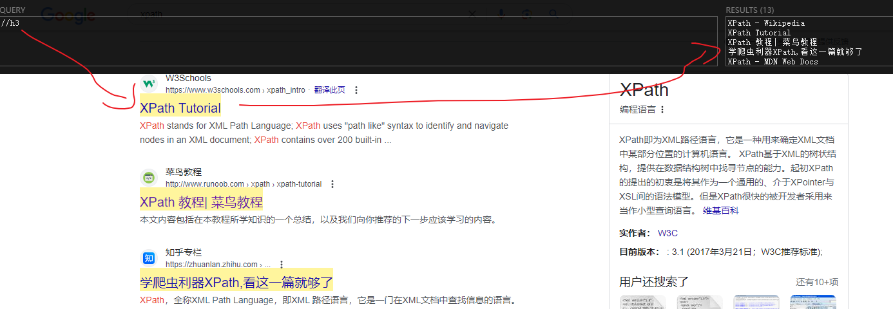

XPath，全称 XML Path Language，是一种用于在 XML 文档中选择节点或节点集的表达式语言。HTML 与 XML 格式相似，因此 XPath 也能作用在 HTML 上。相比于 CSS 选择器，XPath 可以执行更复杂的选择，例如根据元素是否包含文本，属性值是否大于特定值等等。以下，记录下学习到的一些语法。

## 基本语法

XPath 采用路径式的查找方法，整个 XML 作为树级结构从根节点往下查找，示例如下：

```
/div/a[@target="_blank"]
```

以上表示：查找根元素下的直接子元素 div 下，属性 target 为 \_blank 的直接子元素 a。其中开头的 / 表示从根元素开始查找，后面的 / 表示直接子元素，而 div 和 a 则为标签名。

## 路径过滤

选择路径时不必一层层往下指定，可以跳过某些中间路径，相关的语法有：

- / 直接子元素，以 / 开头表示根节点，类似于 CSS 的 > 选择器
- // 后辈子元素，非直接子元素也可以，类似于 CSS 的 <空格> 选择器
- :: 兄弟元素，类似于 CSS 的 ~ 选择器
- . 当前节点
- .. 父节点
- \* 所有节点

## 节点过滤

每个节点都可以使用 [condition] 进行过滤，可以根据文本包含、属性值等内容进行过滤，[] 内可以使用内置函数。

- [@id="box"]： 使用 @ 表示属性(可以省略)，这里匹配 id 属性为 box 的元素。
- [@count > 1]: 匹配 count 属性值大于 1 的元素
- [contains(text(), 'xx')]：匹配文本包含 xx 的元素，contains 和 text 皆为内置函数。

## 内置函数

以上只是介绍概念和用法，关于更多过滤方法和内置函数可查阅菜鸟教程的 [XPath 文档](https://www.runoob.com/xpath/xpath-functions.html)。

## 在浏览器

在浏览器可以使用 `document.evaluate` 方法根据 XPath 选择元素，具体用法可查阅 MDN 的 [文档](https://developer.mozilla.org/zh-CN/docs/Web/API/Document/evaluate)。此外，还可以安装 [XPath Helper](https://chromewebstore.google.com/detail/xpath-helper/hgimnogjllphhhkhlmebbmlgjoejdpjl) 插件，有了此插件基本上可以不用上面的方法。安装好后，使用效果如下：



## 结语

语法总体不太复杂，使用类似文件夹路径的方式选择元素，可以过滤路径，也可以过滤节点。有过 CSS 经验的应该上手很快，值得注意的就是内置函数的使用，很多强大的匹配规则都需要它们来完成。
